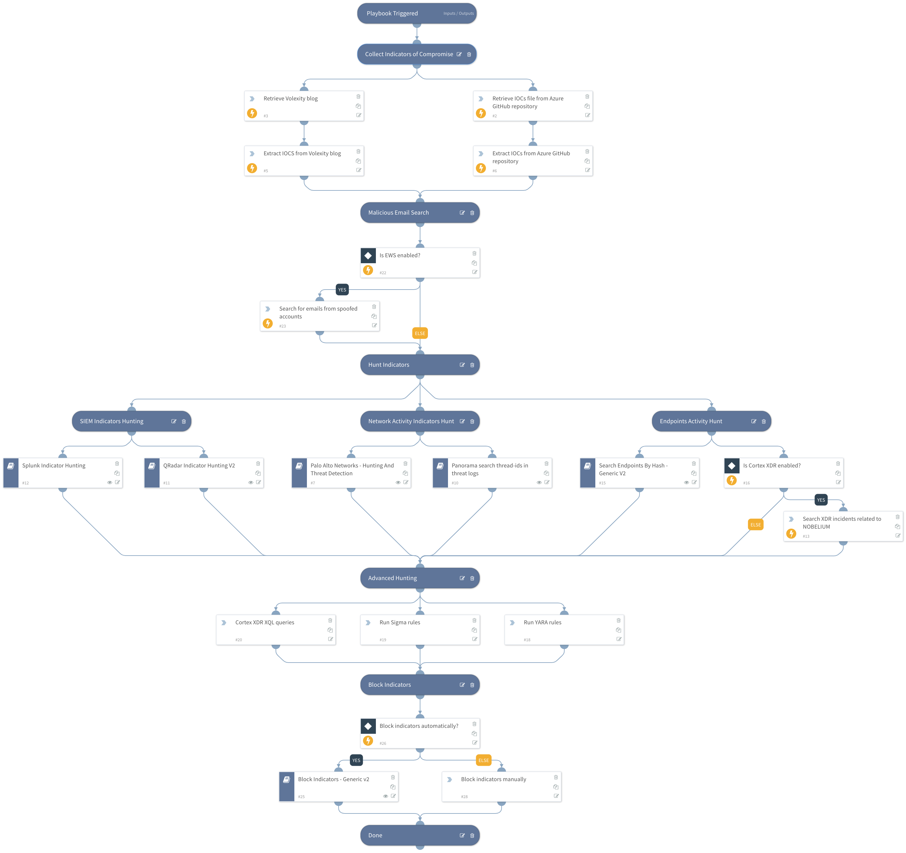

On May 27, 2021, Microsoft reported a wide scale spear phishing campaign attributed to APT29, the same threat actor responsible for the SolarWinds campaign named SolarStorm. This attack had a wide range of targets for an APT spear phishing campaign with 3,000 email accounts targeted within 150 organizations. 
https://www.microsoft.com/security/blog/2021/05/27/new-sophisticated-email-based-attack-from-nobelium/  
This playbook includes the following tasks:
- Collect IOCs to be used in your threat hunting process
- Query FW, SIEMs, EDR, XDR to detect malicious hashes, network activity and compromised hosts 
- Block known indicators
** Note: This is a beta playbook, which lets you implement and test pre-release software. Since the playbook is beta, it might contain bugs. Updates to the pack during the beta phase might include non-backward compatible features. We appreciate your feedback on the quality and usability of the pack to help us identify issues, fix them, and continually improve.

## Dependencies

This playbook uses the following sub-playbooks, integrations, and scripts.

### Sub-playbooks

* Splunk Indicator Hunting
* Search Endpoints By Hash - Generic V2
* Block Indicators - Generic v3
* Palo Alto Networks - Hunting And Threat Detection
* QRadar Indicator Hunting V2
* Panorama Query Logs

### Integrations

This playbook does not use any integrations.

### Scripts

* ParseHTMLIndicators
* http
* SearchIncidentsV2

### Commands

* extractIndicators
* ews-search-mailbox
* setIndicators

## Playbook Inputs

---

| **Name** | **Description** | **Default Value** | **Required** |
| --- | --- | --- | --- |
| EWSSearchQuery | The EWS query to find malicious emails related to NOBELIUM spear-phishing. | From:*usaid.gov or From:*in.constantcontact.com | Optional |
| BlockIndicatorsAutomatically | Whether to automatically indicators involved with NOBELIUM spear-phishing. | False | Optional |
| UserVerification | Whether to provide user verification for blocking IPs.   False - No prompt will be displayed to the user. True - The server will ask the user for blocking verification and will display the blocking list. | False | Optional |
| AutoBlockIndicators | Should the given indicators be automatically blocked, or should the user be given the option to choose?  If set to False - no prompt will appear, and all provided indicators will be blocked automatically. If set to True - the user will be prompted to select which indicators to block. | True | Optional |

## Playbook Outputs

---
There are no outputs for this playbook.

## Playbook Image

---

