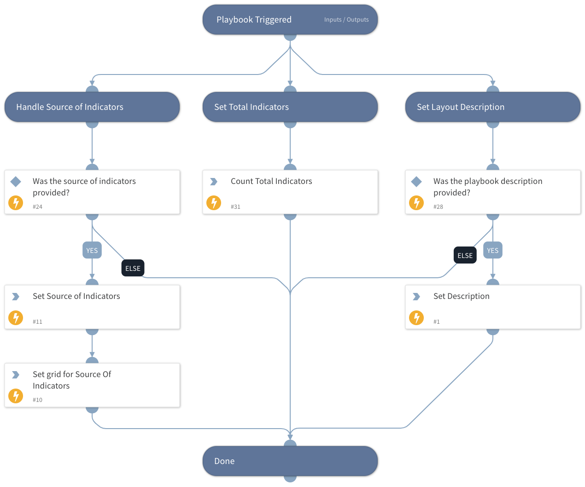

This playbook is responsible for setting up the Rapid Breach Response Incident Info tab in the layout.

## Dependencies
This playbook uses the following sub-playbooks, integrations, and scripts.

### Sub-playbooks
This playbook does not use any sub-playbooks.

### Integrations
This playbook does not use any integrations.

### Scripts
* Set
* SetGridField

### Commands
* setIncident

## Playbook Inputs
---

| **Name** | **Description** | **Default Value** | **Required** |
| --- | --- | --- | --- |
| SourceOfIndicators | The source links for the indicators. |  | Optional |
| playbookDescription | The playbook description. |  | Optional |
| countTotalIndicators | The total number of the indicators extracted. |  | Optional |

## Playbook Outputs
---
There are no outputs for this playbook.

## Playbook Image
---
