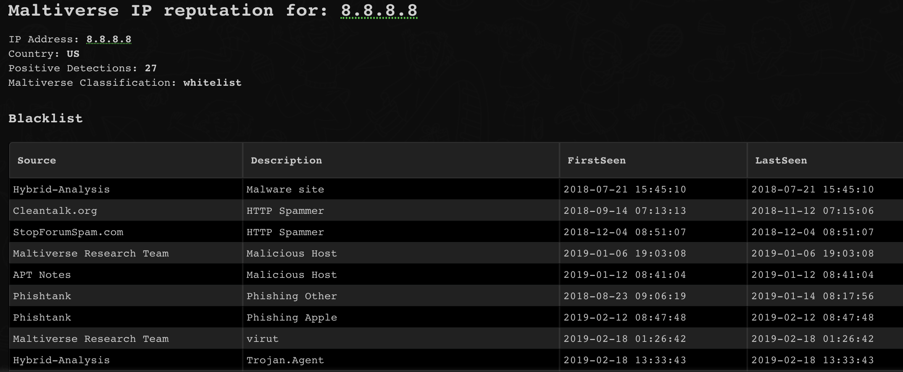

Analyze suspicious hashes, URLs, domains and IP addresses
This integration was integrated and tested with version 1.1 of Maltiverse

## Use Cases
---
1. Enriching information about different IOC types.
2. Search for Reputation about different IOC types.
3. Calculate DBot Score for indicators.


## Configure Maltiverse on Cortex XSOAR
---

1. Navigate to __Settings__ > __Integrations__ > __Servers & Services__.
2. Search for Maltiverse.
3. Click __Add instance__ to create and configure a new integration instance.
    * __Name__: a textual name for the integration instance.
    * __API Key__
    * __Source Reliability__: Reliability of the source providing the intelligence data. The default value is C - Fairly reliable.  
    * __Trust any certificate (not secure)__
    * __Use system proxy settings__
4. Click __Test__ to validate the URLs, token, and connection.

## Commands
---
You can execute these commands from the Cortex XSOAR CLI, as part of an automation, or in a playbook.
After you successfully execute a command, a DBot message appears in the War Room with the command details.
1. ip
2. domain
3. url
4. file
### 1. ip
---
Checks the reputation of an IP address
##### Base Command

`ip`
##### Input

| **Argument Name** | **Description** | **Required** |
| --- | --- | --- |
| ip | IP address to check | Required | 
| threshold | If the number of positives is higher than the threshold, the IP address will be considered malicious. If the threshold is not specified, the default IP threshold, as configured in the instance settings, will be used. | Optional | 
| fullResponse | Return all of the results, note that it can be thousands of results. Prefer not to use in playbooks. The default value is "false | Optional | 


##### Context Output

| **Path** | **Type** | **Description** |
| --- | --- | --- |
| IP.Address | String | The checked IP address | 
| IP.Geo.Country | String | The country code of the IP address | 
| IP.Malicious.Description | Unknown | Describes the reason for the IP to  be in the block list | 
| IP.PositiveDetections | Number | The number of sources that positively reported the indicator as block list |
| IP.Tags | String | The type of indicator |  
| IP.ThreatTypes | Unknown | A list with the description of the elements in the block list |  
| DBotScore.Score | Number | The DBot score | 
| DBotScore.Type | String | The type of indicator | 
| DBotScore.Vendor | String | The vendor used to calculate the score | 
| DBotScore.Indicator | String | The indicator that was tested | 
| Maltiverse.IP.Address | String | The checked IP address | 
| Maltiverse.IP.Classification | Unknown | Qualitative maliciousness classification for an IoC. Possible values are malicious, suspicious, neutral and whitelisted | 
| Maltiverse.IP.Blacklist.FirstSeen | Date | First time that the IoC has been seen | 
| Maltiverse.IP.Blacklist.LastSeen | Date | Last time that the IoC has been seen | 
| Maltiverse.IP.Blacklist.Description | String | Describes the reason for the IP to be in the block list | 
| Maltiverse.IP.Blacklist.Source | String | The name of sources that reported the indicator | 
| Maltiverse.IP.Tags | String | The type of indicator | 


##### Command Example
```!ip ip=8.8.8.8```

##### Human Readable Output


### 2. domain
---
Checks the reputation of a Domain

Notice: Submitting indicators using this command might make the indicator data publicly available. See the vendor’s documentation for more details.
##### Base Command

`domain`
##### Input

| **Argument Name** | **Description** | **Required** |
| --- | --- | --- |
| domain | Domain address to check | Required | 
| threshold | If the number of positives is higher than the threshold, the domain will be considered malicious. If the thershold is not specified, the default domain threshold, as configured in the instance settings, will be used. | Optional | 
| fullResponse | Return all of the results, note that it can be thousands of results. Prefer not to use in playbooks. The default value is "false | Optional | 


##### Context Output

| **Path** | **Type** | **Description** |
| --- | --- | --- |
| Domain.Name | String | The domain name | 
| Domain.CreationDate | Date | Date when a IoC has been inserted for the first time | 
| Domain.ModificationDate | Date | Date when a IoC has been updated for the last time | 
| Domain.TLD | Number | Top Level Domain of the hostname | 
| Domain.ASName | String | Autonumous system name of the domain |
| Domain.Tags | String | Attribute to label an IoC |  
| Domain.ThreatTypes | Unknown | A list with the description of the elements in the block list |   
| DBotScore.Score | Number | The DBot score | 
| DBotScore.Type | String | The type of indicator | 
| DBotScore.Vendor | String | The vendor used to calculate the score | 
| DBotScore.Indicator | String | The indicator that was tested | 
| Maltiverse.Domain.Address | String | The domain name | 
| Maltiverse.Domain.Classification | String | Qualitative maliciousness classification for an IoC. Possible value are malicious, suspicious, neutral and whitlist | 
| Maltiverse.Domain.Blacklist.Firstseen | Date | First time that the IoC was seen | 
| Maltiverse.Domain.Blacklist.LastSeen | Date | Last time that the IoC was seen | 
| Maltiverse.Domain.Blacklist.Description | Unknown | Describes the reason for the domain to be in the block list | 
| Maltiverse.Domain.Blacklist.Source | String | The name of sources that reported the indicator | 
| Maltiverse.Domain.Tags | String | Attribute to label an IoC | 
| Maltiverse.Domain.ModificationTime | Date | Date when the IoC was updated for the last time | 
| Maltiverse.Domain.CreationTime | Date | Date when a IoC was inserted for the first time | 
| Maltiverse.Domain.TLD | String | Top level domain of the hostname |

##### Command Example
```!domain domain=google.com```

##### Human Readable Output


### 3. url
---
Checks the reputation of an URL

Notice: Submitting indicators using this command might make the indicator data publicly available. See the vendor’s documentation for more details.
##### Base Command

`url`
##### Input

| **Argument Name** | **Description** | **Required** |
| --- | --- | --- |
| url | URL address to check | Required | 
| threshold | If the number of positives is higher than the threshold, the URL address will be considered malicious. If the threshold is not specified, the default URL threshold, as configured in the instance settings, will be used. | Optional | 
| fullResponse | Return all of the results, note that it can be thousands of results. Prefer not to use in playbooks. The default value is "false" | Optional | 


##### Context Output

| **Path** | **Type** | **Description** |
| --- | --- | --- |
| URL.Data | String | The URL | 
| URL.Malicious.Description | String | Describes the reason for the URL to be in the block list | 
| URL.Malicious.Vendor | String | The vendor that sends the indicator for reputation check. | 
| URL.PositiveDetections | Number | The number of sources that positively reported the indicator as block list | 
| URL.Tags | String | Attribute to label an IoC |  
| URL.ThreatTypes | Unknown | A list with the description of the elements in the block list |
| DBotScore.Score | Number | The DBot score | 
| DBotScore.Type | String | The type of indicato | 
| DBotScore.Vendor | String | The vendor used to calculate the score | 
| DBotScore.Indicator | String | The indicator that was tested | 
| Maltiverse.URL.Address | String | The checked URL | 
| Maltiverse.URL.Classification | String | Qualitative maliciousness classification for an IoC. Possible values are malicious, suspicious, neutral and whitelist | 
| Maltiverse.URL.Blacklist.FirstSeen | Date | First time that the IoC has been seen | 
| Maltiverse.URL.Blacklist.LastSeen | Date | Last time that the IoC was seen | 
| Maltiverse.URL.Blacklist.Description | Date | Describes the reason for the URL to be in the block list | 
| Maltiverse.URL.Blacklist.Source | String | The name of sources that reported the indicator. | 
| Maltiverse.URL.Tags | String | Attribute to label an IoC | 
| Maltiverse.URL.ModificationTime | Date | Date when the IOC has been updated for the last time. | 
| Maltiverse.URL.CreationTime | Date | Date when a IOC has been inserted for the first time | 
| Maltiverse.URL.Hostname | String | Stores the hostname to which the url belongs | 
| Maltiverse.URL.Domain | String | Stores the domain to which the hostname belongs. Hostame and domain can match on level 2 hostnames | 
| Maltiverse.URL.TLD | String | Top level domain of the hostname | 


##### Command Example
```!url url=https://dv-expert.org```

##### Human Readable Output


### 4. file
---
Check the reputation of a file
##### Base Command

`file`
##### Input

| **Argument Name** | **Description** | **Required** |
| --- | --- | --- |
| file | SHA256 to check | Required | 
| threshold | If the number of positives AV detection is higher than the threshold, the file will be considered malicious. If the threshold is not specified, the default file threshold, as configured in the instance settings, will be used. | Optional | 
| fullResponse | Return all of the results, note that it can be thousands of results. Prefer not to use in playbooks. The default value is "false" | Optional | 


##### Context Output

| **Path** | **Type** | **Description** |
| --- | --- | --- |
| File.Name | String | The full file name (including file extension). | 
| File.MD5 | String | File MD5 hash | 
| File.SHA1 | String | The SHA1 hash of the file | 
| File.SHA256 | String | The SHA256 hash of the file | 
| File.Size | Number | The size of the file in bytes | 
| File.Extension | String | The extension of the file | 
| File.Type | String | Description of the file type based on its magic numbers | 
| File.Path | String | The path of the file |
| File.Tags | String | Attribute to label an IoC |  
| File.ThreatTypes | Unknown | A list with the description of the elements in the block list |    
| DBotScore.Score | Number | The DBot score | 
| DBotScore.Type | String | The type of indicator | 
| DBotScore.Vendor | String | The vendor used to calculate the score | 
| DBotScore.Indicator | String | The indicator that was tested | 
| Maltiverse.File.Score | Number | Qualitative scoring of the maliciousness of the file. Values from 0 to 100. | 
| Maltiverse.File.Tags | String | Attribute to label an IOC | 
| Maltiverse.File.Malicious.Vendor | String | For malicious files, the vendor that made the decision | 
| Maltiverse.File.Malicious.Description | String | For malicious files, describes the reason for the file to be malicious | 
| Maltiverse.File.PositiveDetections | Number | The number of sources that positively reported the indicator as block list. | 
| Maltiverse.File.Name | String | The file name | 
| Maltiverse.File.Classification | String | Qualitative maliciousness classification for an IoC. Possible values are malicious, suspicious, neutral and whitelist | 
| Maltiverse.File.Blacklist.FirstSeen | Date | First time that the IoC has been seen. | 
| Maltiverse.File.Blacklist.LastSeen | Date | Last time that the IoC was seen | 
| Maltiverse.File.Blacklist.Description | String | Describes the reason for the URL to be in the block list | 
| Maltiverse.File.Blacklist.Source | String | The name of sources that reported the indicator | 
| Maltiverse.File.ModificationTime | Date | Date when the IOC has been updated for the last time | 
| Maltiverse.File.CreationTime | Date | Date when a IOC has been inserted for the first time | 
| Maltiverse.File.Size | Number | Size of the file in bytes | 
| Maltiverse.File.ProcessList | String | List of processes raised by the file in runtime. | 
| Maltiverse.File.ContactedHost | String | List of the IP addresses contacted by the sample in runtime | 
| Maltiverse.File.DNSRequest | String | List of hostnames resolved by the sample in runtime | 


##### Command Example
```!file file=edb2f88c29844117cd74acf8bb357edf92487a1b142fe6f60b6ac5e15d2d718f```

##### Human Readable Output


## Additional Information
---
For additional information please visit: https://whatis.maltiverse.com/

## Known Limitations
---
- When not creating an Maltiverse account there is a limit of 20 API calls per day.
  A free account grants 100 API calls per day.
  Please see https://maltiverse.com/plans for more information about the different plans.
- URL command: When running the !url command, an URL may be followed by a '/' at the end. Maltiverse requires this 
  '/' but it might cause the indicator to not show in the war room. 
