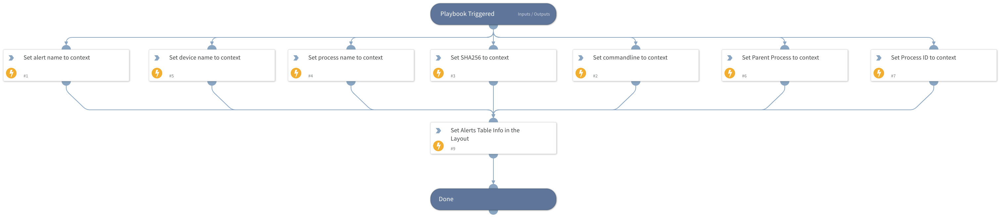

This playbook sets the alert grid for the Malware Investigation & Response layout.

## Dependencies
This playbook uses the following sub-playbooks, integrations, and scripts.

### Sub-playbooks
This playbook does not use any sub-playbooks.

### Integrations
This playbook does not use any integrations.

### Scripts
* Set
* SetGridField

### Commands
This playbook does not use any commands.

## Playbook Inputs
---

| **Name** | **Description** | **Default Value** | **Required** |
| --- | --- | --- | --- |
| AlertName | The alert name. |  | Optional |
| HostName | The host name. |  | Optional |
| FileName | The file name. |  | Optional |
| ProcessID | The process ID. |  | Optional |
| SHA256 | The SHA256 file hash. |  | Optional |
| CommandLine | The command line. |  | Optional |
| ParentProcess | The parent process. |  | Optional |

## Playbook Outputs
---
There are no outputs for this playbook.

## Playbook Image
---

