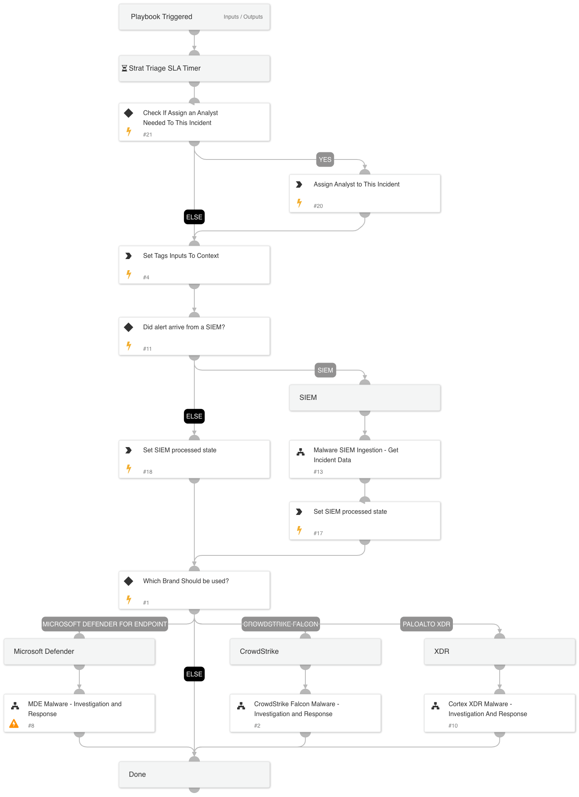

This playbook is triggered by a malware incident from an endpoint integration. It performs enrichment, detonation, and hunting within the organization, and remediation on the malware. 
 The playbook also covers the SIEM ingestion flow in which the fetching integration is the SIEM and EDR integrations grab all additional data.
 Currently supported EDR integrations are XDR, CrowdStrike Falcon, and Microsoft Defender for Endpoint. 
 Currently supported SIEM integrations are QRadar and Splunk.

## Dependencies

This playbook uses the following sub-playbooks, integrations, and scripts.

### Sub-playbooks

* CrowdStrike Falcon Malware - Investigation and Response
* MDE Malware - Investigation and Response
* Malware SIEM Ingestion - Get Incident Data
* Cortex XDR Malware - Investigation And Response

### Integrations

This playbook does not use any integrations.

### Scripts

* AssignAnalystToIncident
* Set
* SetMultipleValues

### Commands

This playbook does not use any commands.

## Playbook Inputs

---

| **Name** | **Description** | **Default Value** | **Required** |
| --- | --- | --- | --- |
| RetrieveFile | Whether file retrieval from the endpoint is allowed. | True | Optional |
| DetonateFile | Whether file detonation is allowed on the sandbox. | True | Optional |
| EnableDeduplication | Whether the deduplication playbook will be used. | False | Optional |
| TicketingSystemToUse | The name of the ticketing system to use, for example Jira or ServiceNow. |  | Optional |
| MaliciousTagName | The tag to assign for indicators to block. | Bad_Indicator | Optional |
| AutoIsolation | Whether host isolation is allowed. | False | Optional |
| AutoUnisolation | Whether automatic un-isolation is allowed. | False | Optional |
| BenignTagName | The name of the tag to apply for allowed indicators. | Good_Indicator | Optional |
| SIEMincidentFieldForType | The name of the field that specifies the type of the alert. For example in CrowdStrike this field specifies a detection or incident. | ${incident.externalcategoryname} | Optional |
| SIEMincidentFieldForID | The name of the field that provides the external ID of the alert or incident in the EDR. | ${incident.externalsystemid} | Optional |
| OverrideSIEMSeverity | Whether to set the severity according to the  ScaleToSetSeverity and SeverityValuesMapping settings \(True\) or keep the original severity as mapped by the SIEM \(False\). | False | Optional |
| TicketProjectName | For ticketing systems such as Jira a project name is required. |  | Optional |
| EnableClosureSteps | When closing an incident, whether to use closure steps to close automatically. | True | Optional |
| AdvancedHunting | Choose True to run Advance Hunting queries through your relevant integrations. Note: It may take some time. | True | Optional |
| DedupHandleSimilar | "This input defines how to handle Similar incidents.  You may choose between: ""Link"", ""Close"", ""Link and Close"". Note: that closing incidents will require you to define ""CloseSimilar"" input as well. Also, note that the closer will apply on at least one of the options \(indicators or fields\) which will match the ""closer percentage"" criteria. Default: Link " | Link | Optional |
| DedupCloseSimilar | "Defines the threshold of similarity to close a similar incident. All similar incidents with similarity above this value will be closed. For example, if CloseSimilar is set to .8 and an incident has a similarity score of .9, the incident will be closed. The value should be between 0 and 1 \[0=low similarity , 1=identical\]." | 0.9 | Optional |
| DedupLimit | The maximum number of incidents to query and set to context data. | 200 | Optional |
| SIEMEDRProductToUse | For EDR alerts routed through a SIEM, provide the supported originating EDR. Possible values: CrowdStrike, XDR, or Microsoft Defender. |  | Optional |
| OnCall | Define whether to assign OnCall to this flow. Possible values: True/False. Leave it empty if you do want not to assign an analyst to the incident. | False | Optional |

## Playbook Outputs

---
There are no outputs for this playbook.

## Playbook Image

---

