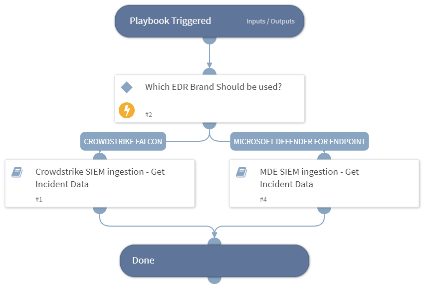

This playbook handles incident ingestion from a SIEM.  
The user provides which EDR system to use, the field containing the incident ID or detection ID, and the field indicating whether the ingested item is an incident or detection.

## Dependencies
This playbook uses the following sub-playbooks, integrations, and scripts.

### Sub-playbooks
* CrowdStrike Falcon - SIEM ingestion Get Incident Data
* MDE SIEM ingestion - Get Incident Data

### Integrations
This playbook does not use any integrations.

### Scripts
This playbook does not use any scripts.

### Commands
This playbook does not use any commands.

## Playbook Inputs
---

| **Name** | **Description** | **Default Value** | **Required** |
| --- | --- | --- | --- |
| EDRProductToUse | The EDR to get data from when ingesting endpoint alerts using a SIEM. Values can be CrowdStrike or MDE.
  playbookInputQuery: |  | Required |
| SIEMincidentFieldForType | The name of the field specifying the alert type. For example, for CrowdStrike this field specifies a detection or an incident. | ${incident.externalcategoryname} | Optional |
| SIEMincidentFieldForID | The name of the field that provides the external ID of the alert or incident in the EDR. | ${incident.externalsystemid} | Optional |
| OverrideSIEMSeverity | Whether to set the severity according to the EDR severity scale and its mapping to Cortex XSOAR (True) or keep the original severity scale as mapped by the SIEM (False). | False | Optional |

## Playbook Outputs
---

| **Path** | **Description** | **Type** |
| --- | --- | --- |
| CrowdStrike.Detection.Behavior.FileName | The file name of the behavior. | unknown |
| CrowdStrike.Detection.Behavior.Scenario | The scenario name of the behavior. | unknown |
| CrowdStrike.Detection.Behavior.MD5 | The MD5 hash of the IOC of the behavior. | unknown |
| CrowdStrike.Detection.Behavior.SHA256 | The SHA256 hash of the IOC of the behavior. | unknown |
| CrowdStrike.Detection.Behavior.IOCType | The type of the IOC. | unknown |
| CrowdStrike.Detection.Behavior.IOCValue | The value of the IOC. | unknown |
| CrowdStrike.Detection.Behavior.CommandLine | The command line executed in the behavior. | unknown |
| CrowdStrike.Detection.Behavior.UserName | The user name related to the behavior. | unknown |
| CrowdStrike.Detection.Behavior.SensorID | The sensor ID related to the behavior. | unknown |
| CrowdStrike.Detection.Behavior.ParentProcessID | The ID of the parent process. | unknown |
| CrowdStrike.Detection.Behavior.ProcessID | The process ID of the behavior. | unknown |
| CrowdStrike.Detection.Behavior.ID | The ID of the behavior. | unknown |
| CrowdStrike.Detection.System | The system name of the detection. | unknown |
| CrowdStrike.Detection.CustomerID | The ID of the customer (CID). | unknown |
| CrowdStrike.Detection.MachineDomain | The name of the domain of the detection machine. | unknown |
| CrowdStrike.Detection.ID | The detection ID. | unknown |
| CrowdStrike.Detection.ProcessStartTime | The start time of the process that generated the detection. | unknown |
| CrowdStrike.FoundDetections | Indicates whether detections were found. | unknown |

## Playbook Image
---

