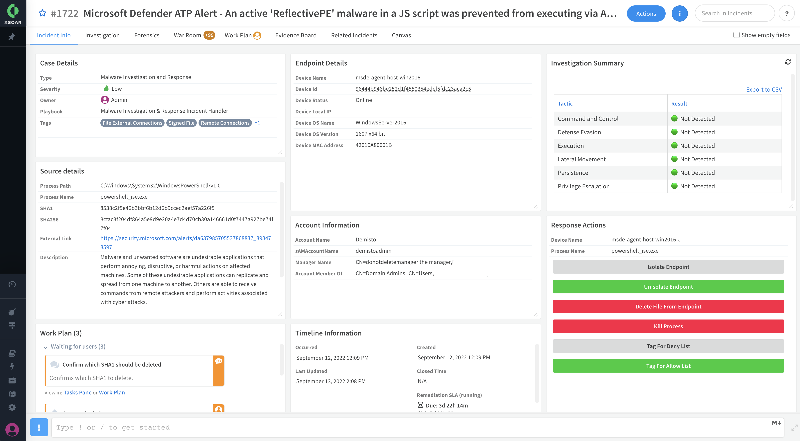

Malware threat is one of the most common cybersecurity challenges facing businesses today. It causes data breaches, hardware failures, and inoperable computers and system networks that can be extremely costly to recover.  
Malware investigations require security teams to reconcile data from multiple security products like EDRs, sandboxes, malware analysis tools, and threat intelligence providers. 
Manual investigation wastes valuable time when malware may be propagating within an organization.

The Malware Investigation & Response content pack accelerates the investigation process for endpoint malware incidents and alerts by collecting evidence of malicious behaviors from telemetry data available through EDRs and processing malware analysis reports through sandboxes. Incident layouts also include buttons to remediate activities quickly.  

The pack closely maps evidence to MITRE ATT&CK to uncover evidence of:
- Persistence (for example, registry and scheduled jobs)
- Evasion or tampering (for example and service stop and process kill)
- Lateral movement (for example, network connections and file share enumeration)
- PowerShell abuse and command-line analysis
- Digitally signed files

## What Does This Pack Do?
* Provides forensic data, including running processes and open network connections at alert detection time.
* Retrieves files and detonates sandboxes.
* Analyzes process command line strings to identify suspicious behavior.
* Processes select sandbox reports and visualizes the results in layouts.
* Extracts indicators and provides threat intelligence enrichment.
* Tags malicious and benign indicators for allow and deny lists for threat prevention and false-positive management.
* Mirrors incidents between the EDR and Cortex XSOAR and enables incident closure with the EDR.
* Supports aggregating incidents from EDRs, including multiple alerts and files.
* Supports fetching malware incidents either from the EDR product or from a SIEM solution.
* Supports account information enrichment.

## Getting Started / How to Set up the Pack
For better user experience and easier onboarding, use the [Deployment Wizard (Cortex XSOAR 6.13)](https://docs-cortex.paloaltonetworks.com/r/Cortex-XSOAR/6.13/Cortex-XSOAR-Administrator-Guide/Set-up-Your-Use-Case-with-the-Deployment-Wizard) or the [Deployment Wizard (Cortex XSOAR 8 Cloud)](https://docs-cortex.paloaltonetworks.com/r/Cortex-XSOAR/8/Cortex-XSOAR-Cloud-Documentation/Set-up-your-use-case-with-the-Deployment-Wizard) or [Deployment Wizard (Cortex XSOAR 8.7 On-prem)](https://docs-cortex.paloaltonetworks.com/r/Cortex-XSOAR/8.7/Cortex-XSOAR-On-prem-Documentation/Set-up-your-use-case-with-the-Deployment-Wizard) after installing the content pack on the Marketplace page in Cortex XSOAR (Available from version 6.8).

For manual configuration, it is recommended to configure your integration instance to use: 
- Primary Playbook: **Malware Investigation and Response Incident Handler**
- Primary Incident Type: **Malware Investigation and Response**

For more information, visit our [Cortex XSOAR Developer Docs](https://xsoar.pan.dev/docs/reference/packs/malware-investigation-and-response).

### Dependencies & Recommendations
Supported EDRs (Choose at least one): 
- CrowdStrike Falcon
- Cortex XDR
- Microsoft Defender for Endpoint

Supported Sandboxes (Optional):
- Palo Alto WildFire
- CrowdStrike FalconX

Supported Case Management (Optional):
- ServiceNow
- Atlassian Jira
