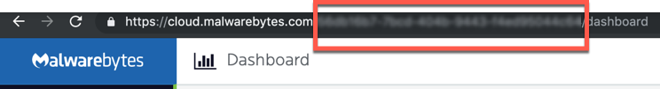
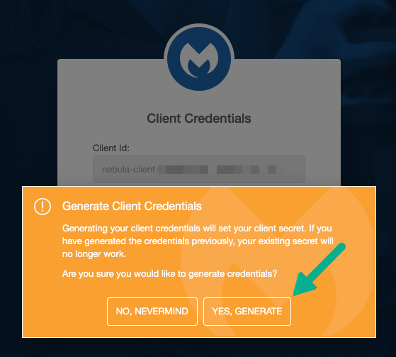
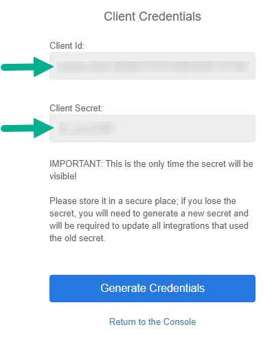

# ThreatDown (powered by Malwarebytes) | NEBULA
ThreatDown (powered by Malwarebytes) integrates with Cortex XSOAR for interactions with Incident Response, Endpoint Protection, and Endpoint Protection and Response products.

ThreatDown (powered by Malwarebytes) makes endpoints resilient through adaptive cyber protection, active threat response and orchestrated endpoint control that quickly restores workforce productivity when a compromise occurs. 

Our adaptive cyber protection predicts and detects attacks with multi-layer detection across the kill chain. 

We enable active threat response where machine learning is actionable and automated allowing for full recovery when a compromise occurs.
 
We orchestrate command and control across siloed IT and Security organizations simplifying security management and making response effective. Malwarebytes makes endpoints resilient, so that you can protect, remediate, and regain control of your digital business.

## Requirements
To run the ThreatDown Integration, you need:

1. An active ThreatDown | Nebula platform subscription.
2. ThreatDown Nebula platform login credentials.

## Generating Credentials

1. To get your Cloud Console Account Id:
    1. Log into the Cloud Console [link](https://cloud.threatdown.com).
    2. Copy the following string of characters found in the url and paste into account_id in integration config.
        
2. To get your Cloud Console Client Id and Cloud Console Client Secret:
    1. Click this [link](https://cloud.threatdown.com/auth/credentials).
    2. Enter your ThreatDown Nebula administrator credentials and click LOG IN.
    3. On the Client Credentials screen, click Generate Credentials > YES, GENERATE.
        
        
    4. Copy Client ID and Client Secret and paste into Integration config.
    
## Testing Connectivity

- Click 'Test' in integration config to test connectivity to ThreatDown Nebula platform.
