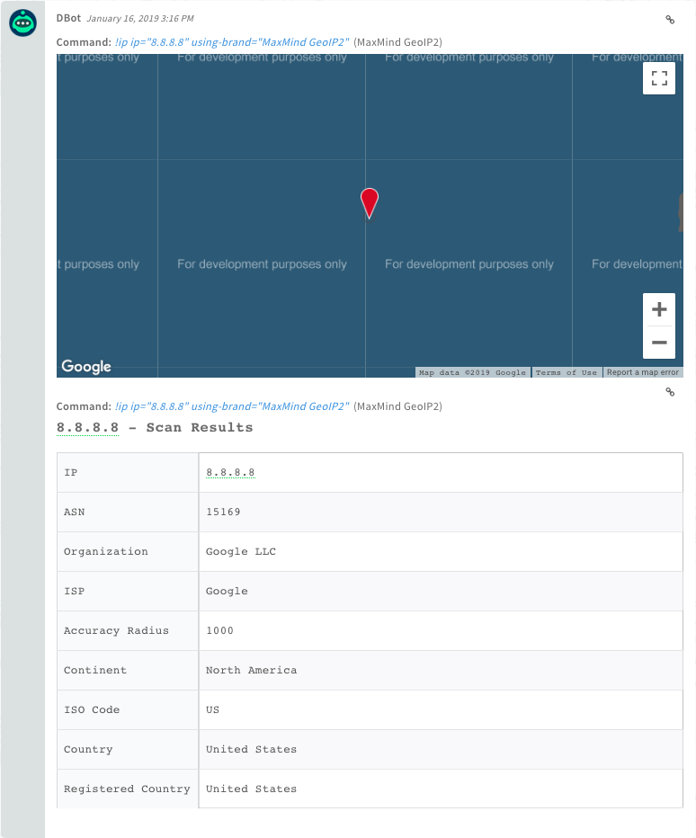

<!-- HTML_DOC -->

This integration was integrated and tested with MaxMind GeoIP2 v2.1.

<h2>Configure MaxMind GeoIP2 on Cortex XSOAR</h2>
<ol>
<li>Navigate to <strong>Settings</strong> &gt; <strong>Integrations</strong> &gt; <strong>Servers &amp; Services</strong>.</li>
<li>Search for MaxMind GeoIP2.</li>
<li>Click <strong>Add instance</strong> to create and configure a new integration instance.
<ul>
<li>
<strong>Name</strong>: a textual name for the integration instance.</li>
<li>
<strong>API Key</strong>: The API key from MaxMind</li>
<li>
<strong>Account ID</strong>: Account number used for MaxMind</li>
<li><strong>Use system proxy</strong></li>
<li><strong>Trust any certificate (not secure)</strong></li>
<li>
<strong>Service Version</strong>: Denotes what level of detail for the results. There are three options <code>Country</code>, <code>City</code>, and <code>Insights</code>. Note that each version has a different cost per API call.</li>
<li>
<strong>Base URL</strong>: The API endpoint.</li>
</ul>
</li>
<li>Click <strong>Test</strong> to validate the URLs, token, and connection.</li>
</ol>
<h2>Commands</h2>

You can execute these commands from the Cortex XSOAR CLI, as part of an automation, or in a playbook. After you successfully execute a command, a DBot message appears in the War Room with the command details.

<ol>
<li><a href="#h_53137430431546844848711">Check the reputation of an IP address: ip</a></li>
</ol>
<h3 id="h_53137430431546844848711">1. Check the reputation of an IP address</h3>

Checks the reputation of an IP address (when information is available, returns a JSON with details). Uses all configured Threat Intelligence feeds.

<h5>Base Command</h5>

<code>ip</code>

<h5>Input</h5>
<table style="width: 749px;">
<thead>
<tr>
<th style="width: 250px;"><strong>Argument Name</strong></th>
<th style="width: 348px;"><strong>Description</strong></th>
<th style="width: 142px;"><strong>Required</strong></th>
</tr>
</thead>
<tbody>
<tr>
<td style="width: 250px;">ip</td>
<td style="width: 348px;">IP address to query</td>
<td style="width: 142px;">Required</td>
</tr>
</tbody>
</table>

 

<h5>Context Output</h5>
<table style="width: 749px;">
<thead>
<tr>
<th style="width: 261px;"><strong>Path</strong></th>
<th style="width: 82px;"><strong>Type</strong></th>
<th style="width: 397px;"><strong>Description</strong></th>
</tr>
</thead>
<tbody>
<tr>
<td style="width: 261px;">IP.Address</td>
<td style="width: 82px;">string</td>
<td style="width: 397px;">The IP address</td>
</tr>
<tr>
<td style="width: 261px;">MaxMind.Address</td>
<td style="width: 82px;">string</td>
<td style="width: 397px;">The IP address</td>
</tr>
<tr>
<td style="width: 261px;">MaxMind.Geo.City</td>
<td style="width: 82px;">string</td>
<td style="width: 397px;">The IP city</td>
</tr>
<tr>
<td style="width: 261px;">IP.Geo.Country</td>
<td style="width: 82px;">string</td>
<td style="width: 397px;">The IP country</td>
</tr>
<tr>
<td style="width: 261px;">MaxMind.Geo.Country</td>
<td style="width: 82px;">string</td>
<td style="width: 397px;">The IP country</td>
</tr>
<tr>
<td style="width: 261px;">IP.Geo.Location</td>
<td style="width: 82px;">string</td>
<td style="width: 397px;">The IP geographic location in coordinates</td>
</tr>
<tr>
<td style="width: 261px;">MaxMind.Geo.Location</td>
<td style="width: 82px;">string</td>
<td style="width: 397px;">The IP geographic location in coordinates</td>
</tr>
<tr>
<td style="width: 261px;">MaxMind.Geo.TimeZone</td>
<td style="width: 82px;">string</td>
<td style="width: 397px;">The time zone the IP is located</td>
</tr>
<tr>
<td style="width: 261px;">MaxMind.Geo.Accuracy</td>
<td style="width: 82px;">number</td>
<td style="width: 397px;">The accuracy of the location</td>
</tr>
<tr>
<td style="width: 261px;">MaxMind.Geo.Continent</td>
<td style="width: 82px;">string</td>
<td style="width: 397px;">The IP continent</td>
</tr>
<tr>
<td style="width: 261px;">MaxMind.Geo.Subdivision</td>
<td style="width: 82px;">string</td>
<td style="width: 397px;">The IP subdivision</td>
</tr>
<tr>
<td style="width: 261px;">IP.ASN</td>
<td style="width: 82px;">string</td>
<td style="width: 397px;">The IP ASN</td>
</tr>
<tr>
<td style="width: 261px;">MaxMind.ASN</td>
<td style="width: 82px;">string</td>
<td style="width: 397px;">The IP ASN</td>
</tr>
<tr>
<td style="width: 261px;">MaxMind.Organization</td>
<td style="width: 82px;">string</td>
<td style="width: 397px;">The IP organization</td>
</tr>
<tr>
<td style="width: 261px;">MaxMind.Tor</td>
<td style="width: 82px;">boolean</td>
<td style="width: 397px;">Is IP a Tor exit node</td>
</tr>
<tr>
<td style="width: 261px;">MaxMind.Host</td>
<td style="width: 82px;">string</td>
<td style="width: 397px;">The IP host</td>
</tr>
<tr>
<td style="width: 261px;">MaxMind.Anonymous</td>
<td style="width: 82px;">boolean</td>
<td style="width: 397px;">Is the IP anonymous</td>
</tr>
<tr>
<td style="width: 261px;">MaxMind.UserType</td>
<td style="width: 82px;">string</td>
<td style="width: 397px;">The IP user type</td>
</tr>
<tr>
<td style="width: 261px;">MaxMind.ISP</td>
<td style="width: 82px;">string</td>
<td style="width: 397px;">The IP ISP</td>
</tr>
<tr>
<td style="width: 261px;">MaxMind.Domain</td>
<td style="width: 82px;">string</td>
<td style="width: 397px;">The domain associated to the IP</td>
</tr>
<tr>
<td style="width: 261px;">MaxMind.ISO_Code</td>
<td style="width: 82px;">string</td>
<td style="width: 397px;">ISO code for the country the IP is located</td>
</tr>
<tr>
<td style="width: 261px;">MaxMind.RegisteredCountry</td>
<td style="width: 82px;">string</td>
<td style="width: 397px;">Country the IP is registered to</td>
</tr>
</tbody>
</table>

 

<h5>Command Example</h5>

<code>!ip ip="8.8.8.8"</code>

<h5>Context Example</h5>
<pre>{
    "IP": {
        "Geo": {
            "Country": "United States",
            "Location": "37.751, -97.822"
        },
        "ASN": 15169,
        "Address": "8.8.8.8"
    },
    "MaxMind": {
        "Address": "8.8.8.8",
        "ISP": "Google",
        "Organization": "Google LLC",
        "ISO_Code": "US",
        "Geo": {
            "Location": "37.751, -97.822",
            "Country": "United States",
            "Continent": "North America",
            "Accuracy": 1000
        },
        "ASN": 15169,
        "RegisteredCountry": "United States"
    }
}
</pre>
<h5>Human Readable Output</h5>

