<!-- HTML_DOC -->

This integration was integrated and tested with version 2.1.0 of McAfee Active Response.

<h2 id="playbooks">Playbooks</h2>

<ul>
<li>Endpoint data collection</li>
<li>MAR - Endpoint data collection</li>
</ul>

<h2 id="use-cases">Use Cases</h2>

Capture and monitor events, files, host flows, process objects, context, and system state changes that may be indicators of attack (IoAs) or attack components lying dormant.

<h2>Create a McAfee DXL Certificate for McAfee Active Response</h2>

To configure an instance of McAfee Active Response, you first need to create a McAfee DXL certificate and add the certificate to the McAfee Intelligence Exchange integration.

<h4>Prerequisite</h4>

Before you create a McAfee DXL certificate, make sure you have a Broker CA certificate (<code>brokercerts.crt</code>).

<ol>
<li>Generate a certificate signing request (CSR) with a tool such as <a href="https://csrgenerator.com/" target="_blank" rel="noopener">CSR generator.</a> 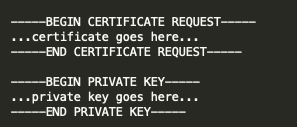
</li>
<li>Save the CSR and the private key as separate files.</li>
<li>Access your McAfee ePolicy Orchestrator environment.</li>
<li>Navigate to <strong>Server Settings</strong>. 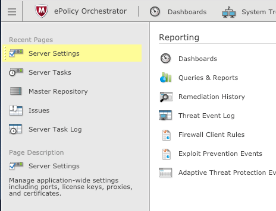
</li>
<li>Select <strong>DXL Certificates</strong> and click <strong>Edit</strong>. 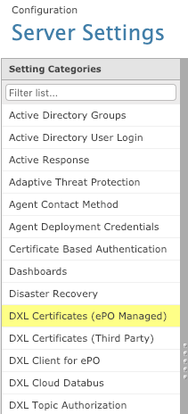
</li>
<li>Click <strong>Import CSR</strong> and select the CSR file you created previously.</li>
<li>Select your certificate and click <strong>Export Certificate</strong>. This generates a CRT file.</li>
<li>Add your certificate to <a href="https://opendxl.github.io/opendxl-client-python/pydoc/marsendauth.html" target="_blank" rel="noopener">Restrict Send Certificates</a> and <a href="https://opendxl.github.io/opendxl-client-python/pydoc/marsendauth.html" target="_blank" rel="noopener">Restrict Receive Certificates</a>.</li>
<li>In Cortex XSOAR, search for <strong>McAfee Active Response</strong> integration and click <strong>Add instance</strong>.
<ul>
<li>
<strong>Broker CA certificates content</strong> - The content of the <code>brokercerts.crt</code>
</li>
<li>
<strong>Client certificates content</strong> - The content of the CRT file you created previously.</li>
<li>
<strong>Client private key path</strong> - The content of the private key file you created previously.</li>
<li>
<strong>Brokers urls</strong> - Broker server IP address, port: 8883.</li>
<li>
<strong>Use Load-Balancing Group</strong> - Should be enabled.</li>
</ul>
</li>
</ol>

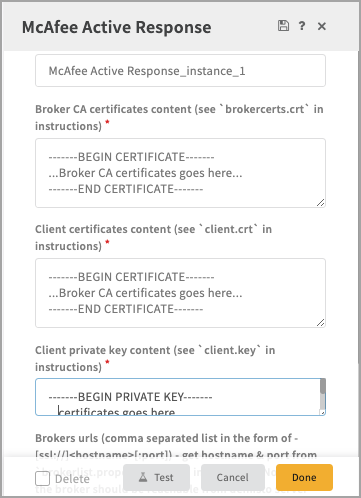

<h2 id="configure-mcafee-active-response-on-demisto">Configure McAfee Active Response on Cortex XSOAR</h2>

<ol>
<li>Navigate to <strong>Settings</strong> &gt; <strong>Integrations</strong> &gt; <strong>Servers &amp; Services</strong>.</li>
<li>Search for McAfee Active Response.</li>
<li>Click <strong>Add instance</strong> to create and configure a new integration instance.
<ul>
<li>
<strong>Name</strong>: a textual name for the integration instance.</li>
<li><strong>Broker CA certificates content (see <code>brokercerts.crt</code> in the Deatiled Instructions section)</strong></li>
<li><strong>Client certificates content (see <code>client.crt</code> in the Deatiled Instructions section)</strong></li>
<li><strong>Client private key content (see <code>client.key</code> in the Deatiled Instructions section)</strong></li>
<li><strong>Brokers URLs (CSV list in the form of - [ssl://][:port]) - Get the hostname and port from <code>brokerlist.properties</code> file in the Deatiled Instructions section. Note that the broker should be reachable from Cortex XSOAR server.</strong></li>
</ul>
</li>
<li>Click <strong>Test</strong> to validate the URLs, token, and connection.</li>
</ol>

<h2 id="commands">Commands</h2>

You can execute these commands from the Cortex XSOAR CLI, as part of an automation, or in a playbook.  After you successfully execute a command, a DBot message appears in the War Room with the command details.

<ol>
<li><a href="#search-endpoint-data" target="_self">Search endpoint data: mar-search</a></li>
<li><a href="#get-a-list-of-collectors" target="_self">Get a list of collectors: mar-collectors-list</a></li>
<li><a href="#search-endpoint-data-crossed-by-multiple-collectors" target="_self">Search endpoint data crossed by multiple collectors: mar-search-multiple</a></li>
<li><a href="#get-information-for-services" target="_self">Get information for services: mar-search-services</a></li>
<li><a href="#get-information-for-processes" target="_self">Get information for processes: mar-search-processes</a></li>
<li><a href="#get-information-for-winregistry" target="_self">Get information for WinRegistry: mar-search-win-registry</a></li>
<li><a href="#get-information-for-files" target="_self">Get information for files: mar-search-files</a></li>
<li><a href="#get-information-for-usb-connected-devices" target="_self">Get information for USB-connected devices: mar-search-usb-connected-storage-devices</a></li>
<li><a href="#get-information-for-user-profiles" target="_self">Get information for user profiles: mar-search-user-profiles</a></li>
<li><a href="#get-information-for-scheduled-tasks" target="_self">Get information for scheduled tasks: mar-search-scheduled-tasks</a></li>
<li><a href="#get-information-for-hosts" target="_self">Get information for hosts: mar-search-host-info</a></li>
</ol>

<h3 id="search-endpoint-data">1. Search endpoint data</h3>

Executes a search for endpoint data.

<h5 id="base-command">Base Command</h5>

<code>mar-search</code>

<h5 id="input">Input</h5>

<table style="width: 749px;">
<thead>
<tr>
<th style="width: 132px;"><strong>Argument Name</strong></th>
<th style="width: 537px;"><strong>Description</strong></th>
<th style="width: 71px;"><strong>Required</strong></th>
</tr>
</thead>
<tbody>
<tr>
<td style="width: 132px;">collector</td>
<td style="width: 537px;">The collector to query.</td>
<td style="width: 71px;">Required</td>
</tr>
<tr>
<td style="width: 132px;">prejection-collector</td>
<td style="width: 537px;">Prejection collector to return. By default, the prejection collector is equal to the collector.</td>
<td style="width: 71px;">Optional</td>
</tr>
<tr>
<td style="width: 132px;">outputs</td>
<td style="width: 537px;">CSV fields (outputs). Run the <a href="#get-a-list-of-collectors" target="_self"><code>mar-collectors-list</code></a> command to view all collectors and fields command for all collectors’ outputs. If not supplied, all outputs are displayed.</td>
<td style="width: 71px;">Optional</td>
</tr>
<tr>
<td style="width: 132px;">filter-by</td>
<td style="width: 537px;">Field name (output) to filter by, e.g., ip_address. Run the <a href="#get-a-list-of-collectors" target="_self"><code>mar-collectors-list</code></a> command to view all collectors and fields for all collectors outputs.</td>
<td style="width: 71px;">Optional</td>
</tr>
<tr>
<td style="width: 132px;">filter-operator</td>
<td style="width: 537px;">Filtering operator.</td>
<td style="width: 71px;">Optional</td>
</tr>
<tr>
<td style="width: 132px;">filter-value</td>
<td style="width: 537px;">Filtering value of the <code>filter-by</code> field.</td>
<td style="width: 71px;">Optional</td>
</tr>
</tbody>
</table>

 

<h5 id="context-output">Context Output</h5>

<table style="width: 748px;">
<thead>
<tr>
<th style="width: 36px;"><strong>Path</strong></th>
<th style="width: 71px;"><strong>Type</strong></th>
<th style="width: 633px;"><strong>Description</strong></th>
</tr>
</thead>
<tbody>
<tr>
<td style="width: 36px;">MAR</td>
<td style="width: 71px;">unknown</td>
<td style="width: 633px;">MAR results in a given collector, e.g., '‘MAR.HostInfo`. For information about possible output paths, run the <a href="#get-a-list-of-collectors" target="_self">mar-collectors-list</a> command.</td>
</tr>
<tr>
<td style="width: 36px;">MAR</td>
<td style="width: 71px;">unknown</td>
<td style="width: 633px;">MAR Results in a given collector, e.g., '‘MAR.HostInfo`. For information about possible output paths, run the <a href="#get-a-list-of-collectors" target="_self">mar-collectors-list</a> command.</td>
</tr>
</tbody>
</table>

 

<h5 id="command-example">Command Example</h5>

<pre>!mar-search collector=Processes</pre>

<h5 id="context-example">Context Example</h5>

<pre>{
    "MAR": {
        "Services": [
            {
                "status": "Running", 
                "description": "Base Filtering Engine", 
                "startuptype": "Automatic", 
                "created_at": "2019-02-06T17:16:25.193Z", 
                "user": "NT AUTHORITY\\LocalService", 
                "name": "BFE"
            }, 
            {
                "status": "Running", 
                "description": "Diagnostic Policy Service", 
                "startuptype": "Automatic (Delayed Start)", 
                "created_at": "2019-02-06T17:16:25.193Z", 
                "user": "NT AUTHORITY\\LocalService", 
                "name": "DPS"
            }, 
            {
                "status": "Stopped", 
                "description": "Encrypting File System (EFS)", 
                "startuptype": "Manual", 
                "created_at": "2019-02-06T17:16:25.193Z", 
                "user": "LocalSystem", 
                "name": "EFS"
            }
        ]
    }
}
</pre>

<h5 id="human-readable-output">Human Readable Output</h5>

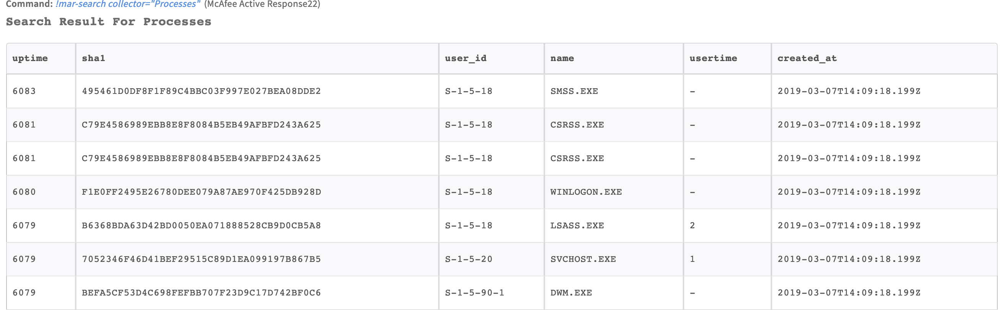

<h3 id="get-a-list-of-collectors">2. Get a list of collectors</h3>

Returns a list of all collectors and their outputs.

<h5 id="base-command-1">Base Command</h5>

<code>mar-collectors-list</code>

<h5 id="input-1">Input</h5>

There are no input arguments for this command.

<h5 id="context-output-1">Context Output</h5>

There is no context output for this command.

<h5 id="command-example-1">Command Example</h5>

<pre>!mar-collectors-list</pre>

<h5 id="human-readable-output-1">Human Readable Output</h5>

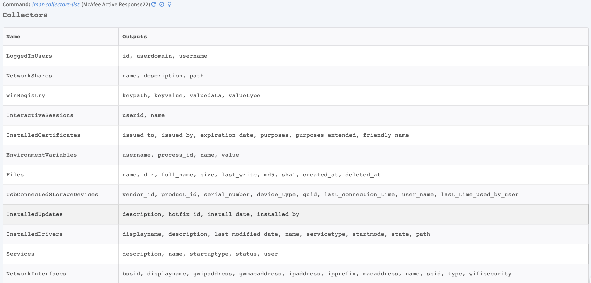

<h3 id="search-endpoint-data-crossed-by-multiple-collectors">3. Search endpoint data crossed by multiple collectors</h3>

Searches endpoint data crossed by multiple collectors.

<h5 id="base-command-2">Base Command</h5>

<code>mar-search-multiple</code>

<h5 id="input-2">Input</h5>

<table style="width: 749px;">
<thead>
<tr>
<th style="width: 132px;"><strong>Argument Name</strong></th>
<th style="width: 537px;"><strong>Description</strong></th>
<th style="width: 71px;"><strong>Required</strong></th>
</tr>
</thead>
<tbody>
<tr>
<td style="width: 132px;">collectors</td>
<td style="width: 537px;">The collectors to query.</td>
<td style="width: 71px;">Required</td>
</tr>
<tr>
<td style="width: 132px;">filter_collector</td>
<td style="width: 537px;">The collector to filter by, e.g., HostInfo</td>
<td style="width: 71px;">Optional</td>
</tr>
<tr>
<td style="width: 132px;">filter-by</td>
<td style="width: 537px;">Field name (output) of <code>filter_collector</code> to filter by, e.g., ip_address. Run the <a href="#get-a-list-of-collectors" target="_self"><code>mar-collectors-list</code></a> command to view all collectors and fields.</td>
<td style="width: 71px;">Optional</td>
</tr>
<tr>
<td style="width: 132px;">filter-operator</td>
<td style="width: 537px;">Filtering operatior</td>
<td style="width: 71px;">Optional</td>
</tr>
<tr>
<td style="width: 132px;">filter-value</td>
<td style="width: 537px;">Filtering value of the <code>filter-by</code> field</td>
<td style="width: 71px;">Optional</td>
</tr>
</tbody>
</table>

 

<h5 id="context-output-2">Context Output</h5>

<table style="width: 749px;">
<thead>
<tr>
<th style="width: 138px;"><strong>Path</strong></th>
<th style="width: 61px;"><strong>Type</strong></th>
<th style="width: 541px;"><strong>Description</strong></th>
</tr>
</thead>
<tbody>
<tr>
<td style="width: 138px;">Mar.SearchMultiple</td>
<td style="width: 61px;">unknown</td>
<td style="width: 541px;">The result of the search query. For information about possible output paths, run the <a href="#get-a-list-of-collectors" target="_self">mar-collectors-list</a> command.</td>
</tr>
</tbody>
</table>

 

<h5 id="command-example-2">Command Example</h5>

<pre>!mar-search-multiple collectors=Services,HostInfo</pre>

<h5 id="context-example-1">Context Example</h5>

<pre>{
    "MAR": {
        "SearchMultiple": [
            {
                "status": "Stopped", 
                "description": "Volume Shadow Copy", 
                "startuptype": "Manual", 
                "ip_address": "192.168.1.156", 
                "created_at": "2019-02-06T17:20:57.204Z", 
                "hostname": "WIN-AQ0LQQOG4Q7", 
                "user": "LocalSystem", 
                "os": "Microsoft Windows [Version 6.3.9600]", 
                "name": "VSS"
            }, 
            {
                "status": "Running", 
                "description": "Network Store Interface Service", 
                "startuptype": "Automatic", 
                "ip_address": "192.168.1.156", 
                "created_at": "2019-02-06T17:20:57.204Z", 
                "hostname": "WIN-AQ0LQQOG4Q7", 
                "user": "NT Authority\\LocalService", 
                "os": "Microsoft Windows [Version 6.3.9600]", 
                "name": "nsi"
            }
        ]
    }
}
</pre>

<h5 id="human-readable-output-2">Human Readable Output</h5>

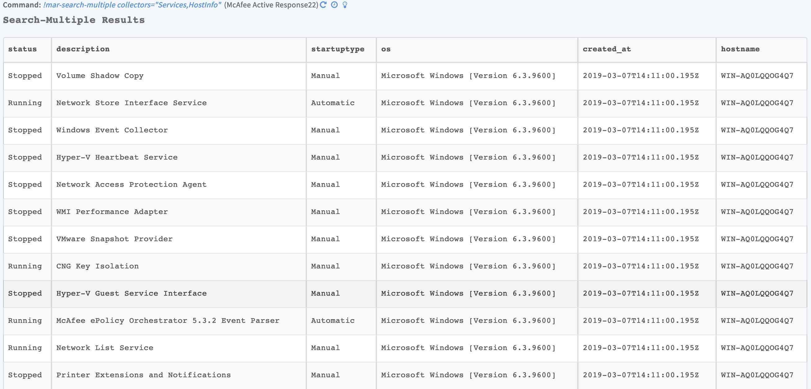

<h3 id="get-information-for-services">4. Get information for services</h3>

Returns services information from McAfee Active Response.

<h5 id="base-command-3">Base Command</h5>

<code>mar-search-services</code>

<h5 id="input-3">Input</h5>

<table style="width: 748px;">
<thead>
<tr>
<th style="width: 144px;"><strong>Argument Name</strong></th>
<th style="width: 525px;"><strong>Description</strong></th>
<th style="width: 71px;"><strong>Required</strong></th>
</tr>
</thead>
<tbody>
<tr>
<td style="width: 144px;">filter-by</td>
<td style="width: 525px;">Field name (output) to filter by, e.g., ip_address. Run the <a href="#get-a-list-of-collectors" target="_self"><code>mar-collectors-list</code></a> command to view all collectors and fields for all collectors’ outputs.</td>
<td style="width: 71px;">Optional</td>
</tr>
<tr>
<td style="width: 144px;">filter-operator</td>
<td style="width: 525px;">Filtering operator.</td>
<td style="width: 71px;">Optional</td>
</tr>
<tr>
<td style="width: 144px;">filter-value</td>
<td style="width: 525px;">Filtering value of the <code>filter-by</code> field.</td>
<td style="width: 71px;">Optional</td>
</tr>
</tbody>
</table>

 

<h5 id="context-output-3">Context Output</h5>

<table style="width: 749px;">
<thead>
<tr>
<th style="width: 330px;"><strong>Path</strong></th>
<th style="width: 133px;"><strong>Type</strong></th>
<th style="width: 277px;"><strong>Description</strong></th>
</tr>
</thead>
<tbody>
<tr>
<td style="width: 330px;">MAR.Services.Name</td>
<td style="width: 133px;">unknown</td>
<td style="width: 277px;">Service name.</td>
</tr>
<tr>
<td style="width: 330px;">MAR.Services.Description</td>
<td style="width: 133px;">unknown</td>
<td style="width: 277px;">Service description.</td>
</tr>
<tr>
<td style="width: 330px;">MAR.Services.Status</td>
<td style="width: 133px;">unknown</td>
<td style="width: 277px;">Service status.</td>
</tr>
<tr>
<td style="width: 330px;">MAR.Services.Startuptype</td>
<td style="width: 133px;">unknown</td>
<td style="width: 277px;">Service startup type.</td>
</tr>
<tr>
<td style="width: 330px;">MAR.Services.User</td>
<td style="width: 133px;">unknown</td>
<td style="width: 277px;">Service user.</td>
</tr>
</tbody>
</table>

 

<h5 id="command-example-3">Command Example</h5>

<pre>!mar-search-services</pre>

<h5 id="context-example-2">Context Example</h5>

<pre>{
    "MAR": {
        "Services": [
            {
                "Status": "Running", 
                "Description": "Base Filtering Engine", 
                "Startuptype": "Automatic", 
                "created_at": "2019-03-06T15:04:16.193Z", 
                "User": "NT AUTHORITY\\LocalService", 
                "Name": "BFE"
            }, 
            {
                "Status": "Running", 
                "Description": "Diagnostic Policy Service", 
                "Startuptype": "Automatic (Delayed Start)", 
                "created_at": "2019-03-06T15:04:16.193Z", 
                "User": "NT AUTHORITY\\LocalService", 
                "Name": "DPS"
            }, 
            {
                "Status": "Stopped", 
                "Description": "Encrypting File System (EFS)", 
                "Startuptype": "Manual", 
                "created_at": "2019-03-06T15:04:16.193Z", 
                "User": "LocalSystem", 
                "Name": "EFS"
            }
        ]
    }
}
</pre>

<h5 id="human-readable-output-3">Human Readable Output</h5>

<h3 id="get-information-for-processes">5. Get information for processes</h3>

Returns processes information from McAfee Active Response.

<h5 id="base-command-4">Base Command</h5>

<code>mar-search-processes</code>

<h5 id="input-4">Input</h5>

<table style="width: 749px;">
<thead>
<tr>
<th style="width: 141px;"><strong>Argument Name</strong></th>
<th style="width: 528px;"><strong>Description</strong></th>
<th style="width: 71px;"><strong>Required</strong></th>
</tr>
</thead>
<tbody>
<tr>
<td style="width: 141px;">filter-by</td>
<td style="width: 528px;">Field name (output) to filter by, e.g., ip_address. Run the <a href="#get-a-list-of-collectors" target="_self"><code>mar-collectors-list</code></a> command to view all collectors and fields for all collectors outputs.</td>
<td style="width: 71px;">Optional</td>
</tr>
<tr>
<td style="width: 141px;">filter-operator</td>
<td style="width: 528px;">Filtering operator.</td>
<td style="width: 71px;">Optional</td>
</tr>
<tr>
<td style="width: 141px;">filter-value</td>
<td style="width: 528px;">Filtering value of the <code>filter-by</code> field.</td>
<td style="width: 71px;">Optional</td>
</tr>
</tbody>
</table>

 

<h5 id="context-output-4">Context Output</h5>

<table style="width: 749px;">
<thead>
<tr>
<th style="width: 337px;"><strong>Path</strong></th>
<th style="width: 123px;"><strong>Type</strong></th>
<th style="width: 280px;"><strong>Description</strong></th>
</tr>
</thead>
<tbody>
<tr>
<td style="width: 337px;">MAR.Processes.Name</td>
<td style="width: 123px;">unknown</td>
<td style="width: 280px;">Process name.</td>
</tr>
<tr>
<td style="width: 337px;">MAR.Processes.Id</td>
<td style="width: 123px;">unknown</td>
<td style="width: 280px;">Process ID.</td>
</tr>
<tr>
<td style="width: 337px;">MAR.Processes.Parentname</td>
<td style="width: 123px;">unknown</td>
<td style="width: 280px;">Process parent name.</td>
</tr>
<tr>
<td style="width: 337px;">MAR.Processes.Size</td>
<td style="width: 123px;">unknown</td>
<td style="width: 280px;">Process size.</td>
</tr>
<tr>
<td style="width: 337px;">MAR.Processes.Md5</td>
<td style="width: 123px;">unknown</td>
<td style="width: 280px;">Process MD5 hash.</td>
</tr>
<tr>
<td style="width: 337px;">MAR.Processes.Sha1</td>
<td style="width: 123px;">unknown</td>
<td style="width: 280px;">Process SHA-1 hash.</td>
</tr>
<tr>
<td style="width: 337px;">MAR.Processes.Cmdline</td>
<td style="width: 123px;">unknown</td>
<td style="width: 280px;">Process command line.</td>
</tr>
<tr>
<td style="width: 337px;">MAR.Processes.Imagepath</td>
<td style="width: 123px;">unknown</td>
<td style="width: 280px;">Process image path.</td>
</tr>
<tr>
<td style="width: 337px;">MAR.Processes.Kerneltime</td>
<td style="width: 123px;">unknown</td>
<td style="width: 280px;">Process kernel time.</td>
</tr>
<tr>
<td style="width: 337px;">MAR.Processes.Usertime</td>
<td style="width: 123px;">unknown</td>
<td style="width: 280px;">Process user time.</td>
</tr>
<tr>
<td style="width: 337px;">MAR.Processes.Uptime</td>
<td style="width: 123px;">unknown</td>
<td style="width: 280px;">Process up time.</td>
</tr>
<tr>
<td style="width: 337px;">MAR.Processes.User</td>
<td style="width: 123px;">unknown</td>
<td style="width: 280px;">Process user.</td>
</tr>
<tr>
<td style="width: 337px;">MAR.Processes.User_id</td>
<td style="width: 123px;">unknown</td>
<td style="width: 280px;">Process user ID.</td>
</tr>
</tbody>
</table>

 

<h5 id="command-example-4">Command Example</h5>

<pre>!mar-search-processes</pre>

<h5 id="context-example-3">Context Example</h5>

<pre>{
    "MAR": {
        "Processes": [
            {
                "Uptime": 8468384, 
                "Imagepath": "C:\\WINDOWS\\SYSTEM32\\CSRSS.EXE", 
                "User_id": "S-1-5-18", 
                "Name": "CSRSS.EXE", 
                "Usertime": 3, 
                "created_at": "2019-02-07T09:16:39.195Z", 
                "Parentname": "-", 
                "Cmdline": "-", 
                "Sha1": "C79E4586989EBB8E8F8084B5EB49AFBFD243A625", 
                "User": "NT AUTHORITY\\SYSTEM", 
                "Kerneltime": 16, 
                "Size": 2048, 
                "Id": 336, 
                "Md5": "B2D3F07F5E8A13AF988A8B3C0A800880"
            }, 
            {
                "Uptime": 8468383, 
                "Imagepath": "C:\\WINDOWS\\SYSTEM32\\WININIT.EXE", 
                "User_id": "S-1-5-18", 
                "Name": "WININIT.EXE", 
                "Usertime": "-", 
                "created_at": "2019-02-07T09:16:39.195Z", 
                "Parentname": "-", 
                "Cmdline": "wininit.exe", 
                "Sha1": "83D158A31A41C3FC37DB569F187108C754C629C8", 
                "User": "NT AUTHORITY\\SYSTEM", 
                "Kerneltime": "-", 
                "Size": 840, 
                "Id": 388, 
                "Md5": "D9516405E05F24EDCD90B1988FAF3948"
            }
        ]
    }
}
</pre>

<h5 id="human-readable-output-4">Human Readable Output</h5>

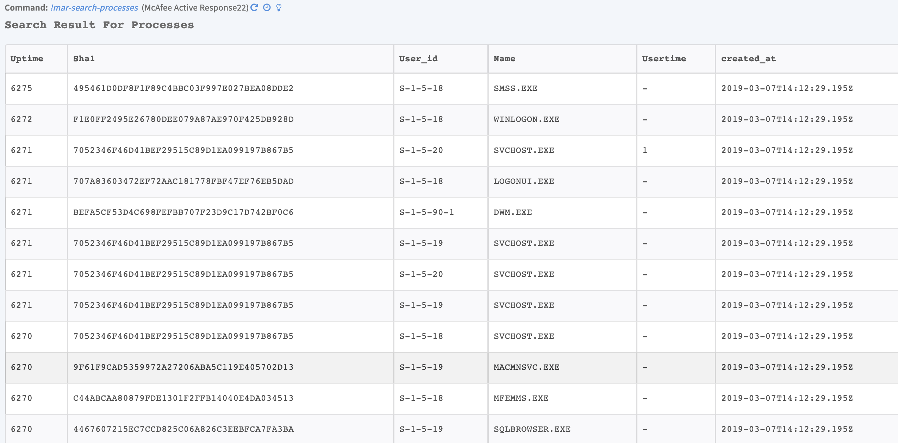

<h3 id="get-information-for-winregistry">6. Get information for WinRegistry</h3>

Returns WinRegistry information from McAfee Active Response.

<h5 id="base-command-5">Base Command</h5>

<code>mar-search-win-registry</code>

<h5 id="input-5">Input</h5>

<table style="width: 749px;">
<thead>
<tr>
<th style="width: 130px;"><strong>Argument Name</strong></th>
<th style="width: 539px;"><strong>Description</strong></th>
<th style="width: 71px;"><strong>Required</strong></th>
</tr>
</thead>
<tbody>
<tr>
<td style="width: 130px;">filter-by</td>
<td style="width: 539px;">Field name (output) to filter by, e.g., ip_address. Run the <a href="#get-a-list-of-collectors" target="_self"><code>mar-collectors-list</code></a> command to view all collectors and fields for all collectors outputs.</td>
<td style="width: 71px;">Optional</td>
</tr>
<tr>
<td style="width: 130px;">filter-operator</td>
<td style="width: 539px;">Filtering operator.</td>
<td style="width: 71px;">Optional</td>
</tr>
<tr>
<td style="width: 130px;">filter-value</td>
<td style="width: 539px;">Filtering value of the <code>filter-by</code> field.</td>
<td style="width: 71px;">Optional</td>
</tr>
</tbody>
</table>

 

<h5 id="context-output-5">Context Output</h5>

<table style="width: 749px;">
<thead>
<tr>
<th style="width: 349px;"><strong>Path</strong></th>
<th style="width: 106px;"><strong>Type</strong></th>
<th style="width: 285px;"><strong>Description</strong></th>
</tr>
</thead>
<tbody>
<tr>
<td style="width: 349px;">MAR.WinRegistry.Keypath</td>
<td style="width: 106px;">unknown</td>
<td style="width: 285px;">WinRegistry key path.</td>
</tr>
<tr>
<td style="width: 349px;">MAR.WinRegistry.Keyvalue</td>
<td style="width: 106px;">unknown</td>
<td style="width: 285px;">WinRegistry key value.</td>
</tr>
<tr>
<td style="width: 349px;">MAR.WinRegistry.Valuedata</td>
<td style="width: 106px;">unknown</td>
<td style="width: 285px;">WinRegistry value data.</td>
</tr>
<tr>
<td style="width: 349px;">MAR.WinRegistry.Valuetype</td>
<td style="width: 106px;">unknown</td>
<td style="width: 285px;">WinRegistry value type.</td>
</tr>
</tbody>
</table>

 

<h5 id="command-example-5">Command Example</h5>

<pre>!mar-search-win-registry</pre>

<h3 id="get-information-for-files">7. Get information for files</h3>

Returns file information from McAfee Active Response.

<h5 id="base-command-6">Base Command</h5>

<code>mar-search-files</code>

<h5 id="input-6">Input</h5>

<table style="width: 749px;">
<thead>
<tr>
<th style="width: 155px;"><strong>Argument Name</strong></th>
<th style="width: 514px;"><strong>Description</strong></th>
<th style="width: 71px;"><strong>Required</strong></th>
</tr>
</thead>
<tbody>
<tr>
<td style="width: 155px;">filter-by</td>
<td style="width: 514px;">Field name (output) to filter by, e.g., ip_address. Run the <a href="#get-a-list-of-collectors" target="_self"><code>mar-collectors-list</code></a> command to view all collectors and fields for all collectors outputs.</td>
<td style="width: 71px;">Optional</td>
</tr>
<tr>
<td style="width: 155px;">filter-operator</td>
<td style="width: 514px;">Filtering operator.</td>
<td style="width: 71px;">Optional</td>
</tr>
<tr>
<td style="width: 155px;">filter-value</td>
<td style="width: 514px;">Filtering value of the <code>filter-by</code> field.</td>
<td style="width: 71px;">Optional</td>
</tr>
</tbody>
</table>

 

<h5 id="context-output-6">Context Output</h5>

<table style="width: 748px;">
<thead>
<tr>
<th style="width: 257px;"><strong>Path</strong></th>
<th style="width: 121px;"><strong>Type</strong></th>
<th style="width: 362px;"><strong>Description</strong></th>
</tr>
</thead>
<tbody>
<tr>
<td style="width: 257px;">MAR.Files.Name</td>
<td style="width: 121px;">unknown</td>
<td style="width: 362px;">File name.</td>
</tr>
<tr>
<td style="width: 257px;">MAR.Files.Dir</td>
<td style="width: 121px;">unknown</td>
<td style="width: 362px;">File directory.</td>
</tr>
<tr>
<td style="width: 257px;">MAR.Files.Full_name</td>
<td style="width: 121px;">unknown</td>
<td style="width: 362px;">File full name.</td>
</tr>
<tr>
<td style="width: 257px;">MAR.Files.Size</td>
<td style="width: 121px;">unknown</td>
<td style="width: 362px;">File size.</td>
</tr>
<tr>
<td style="width: 257px;">MAR.Files.Last_write</td>
<td style="width: 121px;">unknown</td>
<td style="width: 362px;">File last write.</td>
</tr>
<tr>
<td style="width: 257px;">MAR.Files.MD5</td>
<td style="width: 121px;">unknown</td>
<td style="width: 362px;">File MD5 hash.</td>
</tr>
<tr>
<td style="width: 257px;">MAR.Files.Sha1</td>
<td style="width: 121px;">unknown</td>
<td style="width: 362px;">File SHA-1 hash.</td>
</tr>
<tr>
<td style="width: 257px;">MAR.Files.Created_at</td>
<td style="width: 121px;">unknown</td>
<td style="width: 362px;">Datetime the file was created.</td>
</tr>
<tr>
<td style="width: 257px;">MAR.Files.Deleted_at</td>
<td style="width: 121px;">unknown</td>
<td style="width: 362px;">Datetime the file was deleted.</td>
</tr>
</tbody>
</table>

 

<h5 id="command-example-6">Command Example</h5>

<pre>!mar-search-files</pre>

<h3 id="get-information-for-usb-connected-devices">8. Get information for USB-connected devices</h3>

Returns information for USB connected devices from McAfee Active Response.

<h5 id="base-command-7">Base Command</h5>

<code>mar-search-usb-connected-storage-devices</code>

<h5 id="input-7">Input</h5>

<table style="width: 748px;">
<thead>
<tr>
<th style="width: 141px;"><strong>Argument Name</strong></th>
<th style="width: 528px;"><strong>Description</strong></th>
<th style="width: 71px;"><strong>Required</strong></th>
</tr>
</thead>
<tbody>
<tr>
<td style="width: 141px;">filter-by</td>
<td style="width: 528px;">Field name (output) to filter by, e.g., ip_address. Run the <a href="#get-a-list-of-collectors" target="_self"><code>mar-collectors-list</code></a> command to view all collectors and fields for all collectors outputs.</td>
<td style="width: 71px;">Optional</td>
</tr>
<tr>
<td style="width: 141px;">filter-operator</td>
<td style="width: 528px;">Filtering operator.</td>
<td style="width: 71px;">Optional</td>
</tr>
<tr>
<td style="width: 141px;">filter-value</td>
<td style="width: 528px;">Filtering value of the <code>filter-by</code> field.</td>
<td style="width: 71px;">Optional</td>
</tr>
</tbody>
</table>

 

<h5 id="context-output-7">Context Output</h5>

<table style="width: 749px;">
<thead>
<tr>
<th style="width: 430px;"><strong>Path</strong></th>
<th style="width: 62px;"><strong>Type</strong></th>
<th style="width: 248px;"><strong>Description</strong></th>
</tr>
</thead>
<tbody>
<tr>
<td style="width: 430px;">MAR.UsbConnectedStorageDevices.Vendor_id</td>
<td style="width: 62px;">unknown</td>
<td style="width: 248px;">USB connected storage devices vendor ID.</td>
</tr>
<tr>
<td style="width: 430px;">MAR.UsbConnectedStorageDevices.Product_id</td>
<td style="width: 62px;">unknown</td>
<td style="width: 248px;">USB connected storage devices product ID.</td>
</tr>
<tr>
<td style="width: 430px;">MAR.UsbConnectedStorageDevices.Serial_number</td>
<td style="width: 62px;">unknown</td>
<td style="width: 248px;">USB connected storage devices serial number.</td>
</tr>
<tr>
<td style="width: 430px;">MAR.UsbConnectedStorageDevices.Device_type</td>
<td style="width: 62px;">unknown</td>
<td style="width: 248px;">USB connected storage devices type.</td>
</tr>
<tr>
<td style="width: 430px;">MAR.UsbConnectedStorageDevices.Guid</td>
<td style="width: 62px;">unknown</td>
<td style="width: 248px;">USB connected storage devices GUID.</td>
</tr>
<tr>
<td style="width: 430px;">MAR.UsbConnectedStorageDevices.Last_connection_time</td>
<td style="width: 62px;">unknown</td>
<td style="width: 248px;">USB connected storage devices last connection time.</td>
</tr>
<tr>
<td style="width: 430px;">MAR.UsbConnectedStorageDevices.User_name</td>
<td style="width: 62px;">unknown</td>
<td style="width: 248px;">USB connected storage devices user name.</td>
</tr>
<tr>
<td style="width: 430px;">MAR.UsbConnectedStorageDevices.Last_time_used_by_user</td>
<td style="width: 62px;">unknown</td>
<td style="width: 248px;">Last time USB connected storage devices were last used by a user.</td>
</tr>
</tbody>
</table>

 

<h5 id="command-example-7">Command Example</h5>

<pre>!mar-search-usb-connected-storage-devices</pre>

<h3 id="get-information-for-user-profiles">9. Get information for user profiles</h3>

Returns user profile information from McAfee Active Response.

<h5 id="base-command-8">Base Command</h5>

<code>mar-search-user-profiles</code>

<h5 id="input-8">Input</h5>

<table style="width: 749px;">
<thead>
<tr>
<th style="width: 135px;"><strong>Argument Name</strong></th>
<th style="width: 534px;"><strong>Description</strong></th>
<th style="width: 71px;"><strong>Required</strong></th>
</tr>
</thead>
<tbody>
<tr>
<td style="width: 135px;">filter-by</td>
<td style="width: 534px;">Field name (output) to filter by, e.g., ip_address. Run the <a href="#get-a-list-of-collectors" target="_self"><code>mar-collectors-list</code></a> command to view all collectors and fields for all collectors outputs.</td>
<td style="width: 71px;">Optional</td>
</tr>
<tr>
<td style="width: 135px;">filter-operator</td>
<td style="width: 534px;">Filtering operator.</td>
<td style="width: 71px;">Optional</td>
</tr>
<tr>
<td style="width: 135px;">filter-value</td>
<td style="width: 534px;">Filtering value of the <code>filter-by</code> field.</td>
<td style="width: 71px;">Optional</td>
</tr>
</tbody>
</table>

 

<h5 id="context-output-8">Context Output</h5>

<table style="width: 749px;">
<thead>
<tr>
<th style="width: 347px;"><strong>Path</strong></th>
<th style="width: 91px;"><strong>Type</strong></th>
<th style="width: 302px;"><strong>Description</strong></th>
</tr>
</thead>
<tbody>
<tr>
<td style="width: 347px;">MAR.UserProfiles.Accountdisabled</td>
<td style="width: 91px;">unknown</td>
<td style="width: 302px;">User profile account disabled.</td>
</tr>
<tr>
<td style="width: 347px;">MAR.UserProfiles.Domain</td>
<td style="width: 91px;">unknown</td>
<td style="width: 302px;">User profile domain.</td>
</tr>
<tr>
<td style="width: 347px;">MAR.UserProfiles.Fullname</td>
<td style="width: 91px;">unknown</td>
<td style="width: 302px;">User profile full name.</td>
</tr>
<tr>
<td style="width: 347px;">MAR.UserProfiles.Installdate</td>
<td style="width: 91px;">unknown</td>
<td style="width: 302px;">User profile install date.</td>
</tr>
<tr>
<td style="width: 347px;">MAR.UserProfiles.Localaccount</td>
<td style="width: 91px;">unknown</td>
<td style="width: 302px;">User profile local account.</td>
</tr>
<tr>
<td style="width: 347px;">MAR.UserProfiles.Lockedout</td>
<td style="width: 91px;">unknown</td>
<td style="width: 302px;">User profile lockedout.</td>
</tr>
<tr>
<td style="width: 347px;">MAR.UserProfiles.Accountname</td>
<td style="width: 91px;">unknown</td>
<td style="width: 302px;">User profile account name.</td>
</tr>
<tr>
<td style="width: 347px;">MAR.UserProfiles.Sid</td>
<td style="width: 91px;">unknown</td>
<td style="width: 302px;">User profile SID.</td>
</tr>
<tr>
<td style="width: 347px;">MAR.UserProfiles.Passwordexpires</td>
<td style="width: 91px;">unknown</td>
<td style="width: 302px;">User profile password expired.</td>
</tr>
</tbody>
</table>

 

<h5 id="command-example-8">Command Example</h5>

<pre>!mar-search-user-profiles</pre>

<h5 id="context-example-4">Context Example</h5>

<pre>{
    "MAR": {
       "UserProfiles": [
            {
                "Domain": "-", 
                "Installdate": "2017-10-02T06:15:20.000Z", 
                "Localaccount": "False", 
                "created_at": "2019-03-06T15:39:44.193Z", 
                "Sid": "S-1-5-80-3880006512-4290199581-1648723128-3569869737-3631323133", 
                "Accountname": "MSSQL$SQLEXPRESS", 
                "Lockedout": "-", 
                "Fullname": "-", 
                "Accountdisabled": "-", 
                "Passwordexpires": "-"
            }, 
            {
                "Domain": "WIN-AQ0LQQOG4Q7", 
                "Installdate": "2017-09-17T02:20:46.000Z", 
                "Localaccount": "True", 
                "created_at": "2019-03-06T15:39:44.193Z", 
                "Sid": "S-1-5-21-2851129524-1971544412-1620677069-500", 
                "Accountname": "Administrator", 
                "Lockedout": "False", 
                "Fullname": "-", 
                "Accountdisabled": "False", 
                "Passwordexpires": "False"
            }, 
            {
                "Domain": "WIN-AQ0LQQOG4Q7", 
                "Installdate": "-", 
                "Localaccount": "True", 
                "created_at": "2019-03-06T15:39:44.193Z", 
                "Sid": "S-1-5-21-2851129524-1971544412-1620677069-501", 
                "Accountname": "Guest", 
                "Lockedout": "False", 
                "Fullname": "-", 
                "Accountdisabled": "True", 
                "Passwordexpires": "False"
            }
        ]
    }
}
</pre>

<h5 id="human-readable-output-5">Human Readable Output</h5>

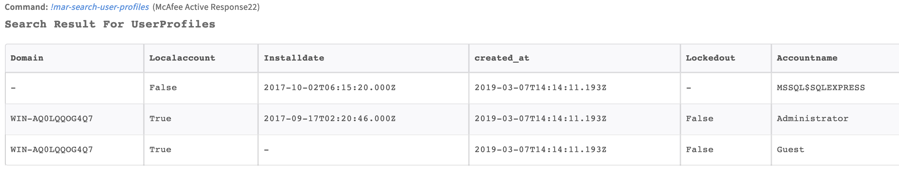

<h3 id="get-information-for-scheduled-tasks">10. Get information for scheduled tasks</h3>

Returns scheduled task information from McAfee Active Response.

<h5 id="base-command-9">Base Command</h5>

<code>mar-search-scheduled-tasks</code>

<h5 id="input-9">Input</h5>

<table style="width: 749px;">
<thead>
<tr>
<th style="width: 143px;"><strong>Argument Name</strong></th>
<th style="width: 526px;"><strong>Description</strong></th>
<th style="width: 71px;"><strong>Required</strong></th>
</tr>
</thead>
<tbody>
<tr>
<td style="width: 143px;">filter-by</td>
<td style="width: 526px;">Field name (output) to filter by (e.g. ip_address). Run <a href="#get-a-list-of-collectors" target="_self"><code>mar-collectors-list</code></a> to view all collectors and fields command for all collectors outputs.</td>
<td style="width: 71px;">Optional</td>
</tr>
<tr>
<td style="width: 143px;">filter-operator</td>
<td style="width: 526px;">Filtering operator.</td>
<td style="width: 71px;">Optional</td>
</tr>
<tr>
<td style="width: 143px;">filter-value</td>
<td style="width: 526px;">Filtering value of the <code>filter-by</code> field.</td>
<td style="width: 71px;">Optional</td>
</tr>
</tbody>
</table>

 

<h5 id="context-output-9">Context Output</h5>

<table style="width: 749px;">
<thead>
<tr>
<th style="width: 353px;"><strong>Path</strong></th>
<th style="width: 87px;"><strong>Type</strong></th>
<th style="width: 300px;"><strong>Description</strong></th>
</tr>
</thead>
<tbody>
<tr>
<td style="width: 353px;">MAR.ScheduledTasks.Folder</td>
<td style="width: 87px;">unknown</td>
<td style="width: 300px;">Scheduled tasks folder.</td>
</tr>
<tr>
<td style="width: 353px;">MAR.ScheduledTasks.Taskname</td>
<td style="width: 87px;">unknown</td>
<td style="width: 300px;">Scheduled tasks name.</td>
</tr>
<tr>
<td style="width: 353px;">MAR.ScheduledTasks.Status</td>
<td style="width: 87px;">unknown</td>
<td style="width: 300px;">Scheduled tasks status.</td>
</tr>
<tr>
<td style="width: 353px;">MAR.ScheduledTasks.Last_run</td>
<td style="width: 87px;">unknown</td>
<td style="width: 300px;">Scheduled tasks last run</td>
</tr>
<tr>
<td style="width: 353px;">MAR.ScheduledTasks.Username</td>
<td style="width: 87px;">unknown</td>
<td style="width: 300px;">Scheduled tasks user name.</td>
</tr>
<tr>
<td style="width: 353px;">MAR.ScheduledTasks.Schedule_on</td>
<td style="width: 87px;">unknown</td>
<td style="width: 300px;">Scheduled tasks schedule on.</td>
</tr>
</tbody>
</table>

 

<h5 id="command-example-9">Command Example</h5>

<pre>!mar-search-scheduled-tasks</pre>

<h5 id="context-example-5">Context Example</h5>

<pre>{
    "MAR": {
       "ScheduledTasks": [
            {
                "Status": "Ready", 
                "Username": "SYSTEM", 
                "created_at": "2019-03-06T15:41:29.195Z", 
                "Schedule_on": "Log On, Daily", 
                "Last_run": "2019-03-05T16:54:08.000Z", 
                "Taskname": "GoogleUpdateTaskMachineCore", 
                "Folder": "/"
            }, 
            {
                "Status": "Disabled", 
                "Username": "SYSTEM", 
                "created_at": "2019-03-06T15:41:29.195Z", 
                "Schedule_on": "Idle", 
                "Last_run": "2017-09-17T02:32:59.000Z", 
                "Taskname": ".NET Framework NGEN v4.0.30319 64 Critical", 
                "Folder": "/Microsoft/Windows/.NET Framework"
            }
        ]
    }
}
</pre>

<h5 id="human-readable-output-6">Human Readable Output</h5>

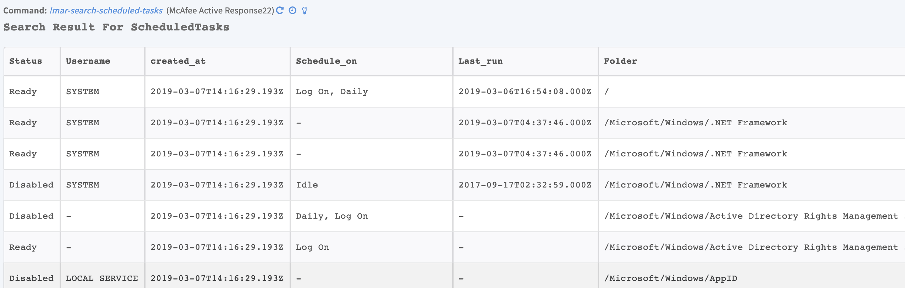

<h3 id="get-information-for-hosts">11. Get information for hosts</h3>

Returns host information from McAfee Active Response.

<h5 id="base-command-10">Base Command</h5>

<code>mar-search-host-info</code>

<h5 id="input-10">Input</h5>

<table style="width: 749px;">
<thead>
<tr>
<th style="width: 136px;"><strong>Argument Name</strong></th>
<th style="width: 533px;"><strong>Description</strong></th>
<th style="width: 71px;"><strong>Required</strong></th>
</tr>
</thead>
<tbody>
<tr>
<td style="width: 136px;">filter-by</td>
<td style="width: 533px;">Field name (output) to filter by, e.g., ip_address. Run the <a href="#get-a-list-of-collectors" target="_self"><code>mar-collectors-list</code></a> command to view all collectors and fields for all collectors outputs.</td>
<td style="width: 71px;">Optional</td>
</tr>
<tr>
<td style="width: 136px;">filter-operator</td>
<td style="width: 533px;">Filtering operator.</td>
<td style="width: 71px;">Optional</td>
</tr>
<tr>
<td style="width: 136px;">filter-value</td>
<td style="width: 533px;">Filtering value of the <code>filter-by</code> field.</td>
<td style="width: 71px;">Optional</td>
</tr>
</tbody>
</table>

 

<h5 id="context-output-10">Context Output</h5>

<table style="width: 749px;">
<thead>
<tr>
<th style="width: 338px;"><strong>Path</strong></th>
<th style="width: 104px;"><strong>Type</strong></th>
<th style="width: 298px;"><strong>Description</strong></th>
</tr>
</thead>
<tbody>
<tr>
<td style="width: 338px;">MAR.HostInfo.Hostname</td>
<td style="width: 104px;">unknown</td>
<td style="width: 298px;">Host name.</td>
</tr>
<tr>
<td style="width: 338px;">MAR.HostInfo.Ip_address</td>
<td style="width: 104px;">unknown</td>
<td style="width: 298px;">Host IP address.</td>
</tr>
<tr>
<td style="width: 338px;">MAR.HostInfo.Os</td>
<td style="width: 104px;">unknown</td>
<td style="width: 298px;">Host operating system.</td>
</tr>
</tbody>
</table>

 

<h5 id="command-example-10">Command Example</h5>

<pre>!mar-search-host-info</pre>

<h5 id="context-example-6">Context Example</h5>

<pre>{
    "MAR": {
       "HostInfo": [
            {
                "Os": "Microsoft Windows [Version 6.3.9600]", 
                "created_at": "2019-03-06T15:44:10.192Z", 
                "Hostname": "WIN-AQ0LQQOG4Q7", 
                "Ip_address": "192.168.1.156"
            }
        ]
    }
}
</pre>

<h5 id="human-readable-output-7">Human Readable Output</h5>

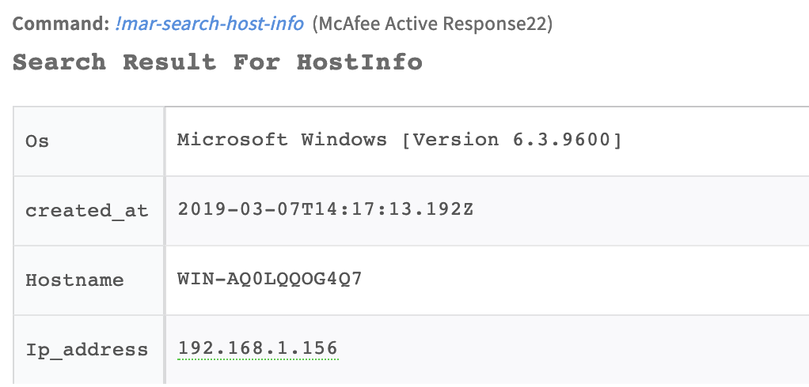

