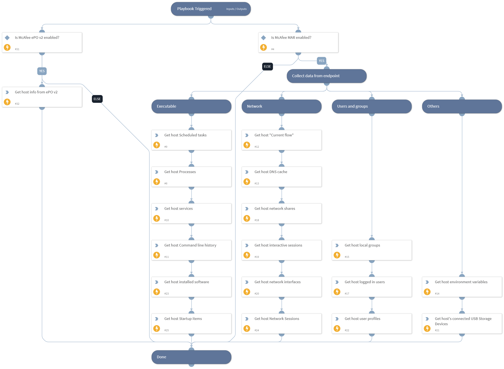

Use McAfee Active Response to collect data from an endpoint for IR purposes (requires ePO as well).

Input:
* Hostname (Default: ${Endpoint.Hostname})

## Dependencies

This playbook uses the following sub-playbooks, integrations, and scripts.

### Sub-playbooks

This playbook does not use any sub-playbooks.

### Integrations

* McAfee ePO v2
* McAfee Active Response

### Scripts

* Exists

### Commands

* mar-search-multiple
* epo-find-system

## Playbook Inputs

---

| **Name** | **Description** | **Default Value** | **Required** |
| --- | --- | --- | --- |
| Hostname | Hostname to run on. | Endpoint.Hostname | Optional |

## Playbook Outputs

---
There are no outputs for this playbook.

## Playbook Image

---

