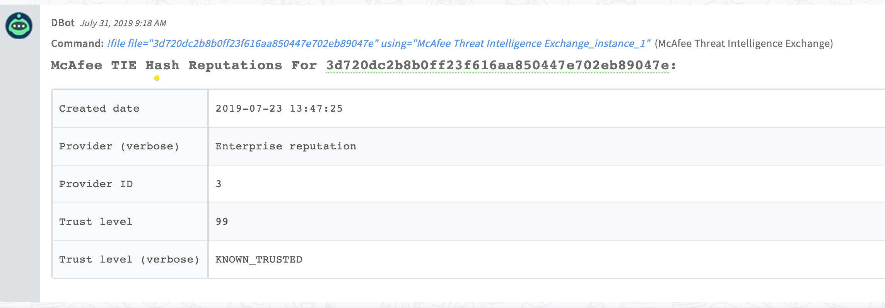
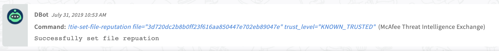
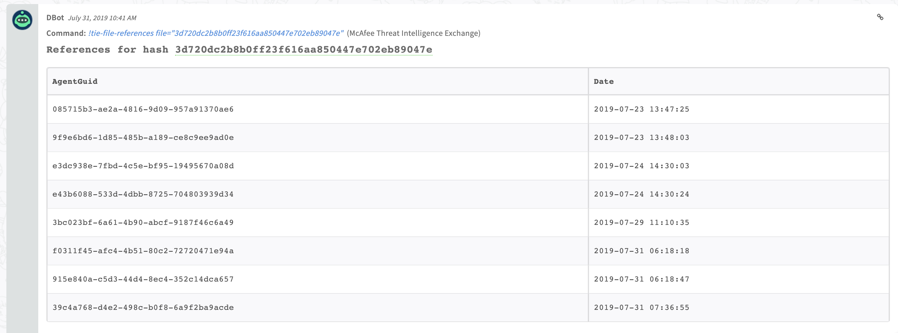

<!-- HTML_DOC -->

Use the McAfee Threat Intelligence Exchange (TIE) integration to get file reputations and the systems that reference the files.

<h2 class="code-line" data-line-start="3" data-line-end="4">
Detailed Instructions</h2>

This section includes information required for configuring an integration instance.

<h3 class="code-line" data-line-start="6" data-line-end="7">
Prerequisites - Connect to McAfee Threat Intelligence Exchange (TIE) using the DXL TIE Client</h3>

To connect the McAfee TIE using the DXL TIE client, you need to create certificates and configure DXL. For more information, see the <a href="https://opendxl.github.io/opendxl-client-python/pydoc/index.html">OpenDXL documentation</a>. After you complete this configuration, you will have the following files:

<ul>
<li class="has-line-data" data-line-start="8" data-line-end="9">Broker CA certificates (<code>brokercerts.crt</code> file)</li>
<li class="has-line-data" data-line-start="9" data-line-end="10">Client certificate (<code>client.crt</code> file)</li>
<li class="has-line-data" data-line-start="10" data-line-end="11">Client private key (<code>client.key</code> file)</li>
<li class="has-line-data" data-line-start="11" data-line-end="13">Broker list properties file (‘brokerlist.properties’ file)</li>
</ul>

To use the <strong>tie-set-file-reputation</strong> command, you need to authorize the client (Cortex XSOAR) to run the command. Follow the instructions in the <a href="https://opendxl.github.io/opendxl-client-python/pydoc/marsendauth.html">OpenDXL documentation</a>. In step #4, instead of selecting <strong>Active Response Server API</strong>, select <strong>TIE Server Set Enterprise Reputation</strong>.

<h3 class="code-line" data-line-start="15" data-line-end="16">
Dependencies (Python packages)</h3>

You don’t need to install the packages, they are included in the Docker image.

<ul>
<li class="has-line-data" data-line-start="17" data-line-end="18"><a href="https://opendxl.github.io/opendxl-client-python/pydoc/index.html">DXL client documentation</a></li>
<li class="has-line-data" data-line-start="18" data-line-end="20"><a href="https://opendxl.github.io/opendxl-tie-client-python/pydoc/">DXL TIE client documentation</a></li>
</ul>
<h2 class="code-line" data-line-start="20" data-line-end="21">
Configure McAfee Threat Intelligence Exchange on Cortex XSOAR</h2>
<ol>
<li class="has-line-data" data-line-start="21" data-line-end="22">Navigate to <strong>Settings</strong> &gt; <strong>Integrations</strong> &gt; <strong>Servers &amp; Services</strong>.</li>
<li class="has-line-data" data-line-start="22" data-line-end="23">Search for McAfee Threat Intelligence Exchange.</li>
<li class="has-line-data" data-line-start="23" data-line-end="29">Click <strong>Add instance</strong> to create and configure a new integration instance.
<ul>
<li class="has-line-data" data-line-start="24" data-line-end="25">
<strong>Name</strong>: a textual name for the integration instance.</li>
<li class="has-line-data" data-line-start="25" data-line-end="26"><strong>Broker CA certificates content (see <code>brokercerts.crt</code> in Detailed Instructions)</strong></li>
<li class="has-line-data" data-line-start="26" data-line-end="27"><strong>Client certificates content (see <code>client.crt</code> in Detailed Instructions)</strong></li>
<li class="has-line-data" data-line-start="27" data-line-end="28"><strong>Client private key path (e.g., /usr/config/client.key)</strong></li>
<li class="has-line-data" data-line-start="28" data-line-end="29"><strong>A CSV list of broker URLs in the format: [ssl://]&lt;hostname&gt;[:port]) Get the hostname and port from the <code>brokerlist.properties</code> file (in instructions). The broker should be reachable from Cortex XSOAR server.</strong></li>
</ul>
</li>
<li class="has-line-data" data-line-start="29" data-line-end="31">Click <strong>Test</strong> to validate the URLs, token, and connection.</li>
</ol>
<h2 class="code-line" data-line-start="31" data-line-end="32">
Commands</h2>

You can execute these commands from the Cortex XSOAR CLI, as part of an automation, or in a playbook. After you successfully execute a command, a DBot message appears in the War Room with the command details.

<ol>
<li class="has-line-data" data-line-start="33" data-line-end="34"><a href="#h_20443057-9349-4fb0-a44e-7cfe1c4b75b3" target="_self">Get the reputation for a file hash: file</a></li>
<li class="has-line-data" data-line-start="34" data-line-end="35"><a href="#h_e37c9af6-dce4-4198-bd27-2c152fc253b1" target="_self">Set the enterprise reputation for a file: tie-set-file-reputation</a></li>
<li class="has-line-data" data-line-start="35" data-line-end="36"><a href="#h_f459cc8b-6849-4afa-be3c-2aaa5c96a7d0" target="_self">Get the systems that referenced a file: tie-file-references</a></li>
</ol>
<h3 id="h_20443057-9349-4fb0-a44e-7cfe1c4b75b3" class="code-line" data-line-start="36" data-line-end="37">
1. Get the reputation for a file hash</h3>

Retrieves the reputations for the specified hash. Supports MD5 SHA1 &amp; SHA256.

<h5 class="code-line" data-line-start="39" data-line-end="40">
Base Command</h5>

<code>file</code>

<h5 class="code-line" data-line-start="42" data-line-end="43">
Input</h5>
<table class="table table-striped table-bordered" style="width: 749px;">
<thead>
<tr>
<th style="width: 158px;"><strong>Argument Name</strong></th>
<th style="width: 499px;"><strong>Description</strong></th>
<th style="width: 83px;"><strong>Required</strong></th>
</tr>
</thead>
<tbody>
<tr>
<td style="width: 158px;">file</td>
<td style="width: 499px;">Hash of the file to query. Can be “MD5”, “SHA1”, or “SHA256”.</td>
<td style="width: 83px;">Required</td>
</tr>
</tbody>
</table>

 

<h5 class="code-line" data-line-start="49" data-line-end="50">
Context Output</h5>
<table class="table table-striped table-bordered" style="width: 749px;">
<thead>
<tr>
<th style="width: 238px;"><strong>Path</strong></th>
<th style="width: 96px;"><strong>Type</strong></th>
<th style="width: 406px;"><strong>Description</strong></th>
</tr>
</thead>
<tbody>
<tr>
<td style="width: 238px;">File.MD5</td>
<td style="width: 96px;">unknown</td>
<td style="width: 406px;">MD5 hash of the file (if supplied).</td>
</tr>
<tr>
<td style="width: 238px;">File.SHA1</td>
<td style="width: 96px;">unknown</td>
<td style="width: 406px;">SHA1 hash of the file (if supplied).</td>
</tr>
<tr>
<td style="width: 238px;">File.SHA256</td>
<td style="width: 96px;">unknown</td>
<td style="width: 406px;">MD5 hash of the file (if supplied).</td>
</tr>
<tr>
<td style="width: 238px;">File.TrustLevel</td>
<td style="width: 96px;">unknown</td>
<td style="width: 406px;">File lowest trust level.</td>
</tr>
<tr>
<td style="width: 238px;">File.Vendor</td>
<td style="width: 96px;">unknown</td>
<td style="width: 406px;">Vendor of the file lowest trust level.</td>
</tr>
<tr>
<td style="width: 238px;">DBotScore.Score</td>
<td style="width: 96px;">unknown</td>
<td style="width: 406px;">Vendor used to calculate the score.</td>
</tr>
<tr>
<td style="width: 238px;">DBotScore.Vendor</td>
<td style="width: 96px;">unknown</td>
<td style="width: 406px;">The actual score.</td>
</tr>
<tr>
<td style="width: 238px;">DBotScore.Type</td>
<td style="width: 96px;">unknown</td>
<td style="width: 406px;">Indicator type.</td>
</tr>
<tr>
<td style="width: 238px;">DBotScore.Indicator</td>
<td style="width: 96px;">unknown</td>
<td style="width: 406px;">The hash of the file.</td>
</tr>
</tbody>
</table>

 

<h5 class="code-line" data-line-start="63" data-line-end="64">
Command Example</h5>
<pre>!file file=3d720dc2b8b0ff23f616aa850447e702eb89047e</pre>
<h5 class="code-line" data-line-start="67" data-line-end="68">
Human Readable Output</h5>

<h3 id="h_e37c9af6-dce4-4198-bd27-2c152fc253b1" class="code-line" data-line-start="70" data-line-end="71">
2. Set the enterprise reputation for a file</h3>

Sets the “Enterprise” reputation (trust level) of a specified file. Permissions are required to invoke this method. See the ‘How-to’ in instance instruction.

<h5 class="code-line" data-line-start="73" data-line-end="74">
Base Command</h5>

<code>tie-set-file-reputation</code>

<h5 class="code-line" data-line-start="76" data-line-end="77">
Input</h5>
<table class="table table-striped table-bordered" style="width: 749px;">
<thead>
<tr>
<th style="width: 145px;"><strong>Argument Name</strong></th>
<th style="width: 524px;"><strong>Description</strong></th>
<th style="width: 71px;"><strong>Required</strong></th>
</tr>
</thead>
<tbody>
<tr>
<td style="width: 145px;">file</td>
<td style="width: 524px;">Hash of the file for which to set the reputation. Can be “MD5”, “SHA1”, or “SHA256”.</td>
<td style="width: 71px;">Required</td>
</tr>
<tr>
<td style="width: 145px;">trust_level</td>
<td style="width: 524px;">The new trust level for the file.</td>
<td style="width: 71px;">Required</td>
</tr>
<tr>
<td style="width: 145px;">filename</td>
<td style="width: 524px;">A file name to associate with the file.</td>
<td style="width: 71px;">Optional</td>
</tr>
<tr>
<td style="width: 145px;">comment</td>
<td style="width: 524px;">A comment to associate with the file.</td>
<td style="width: 71px;">Optional</td>
</tr>
</tbody>
</table>

 

<h5 class="code-line" data-line-start="86" data-line-end="87">
Context Output</h5>

There is no context output for this command.

<h5 class="code-line" data-line-start="90" data-line-end="91">
Command Example</h5>
<pre>!tie-set-file-reputation file=3b0fcc439a7d83860433d34e564ff1e9ddd4cfaa trust_level=MOST_LIKELY_TRUSTED
</pre>
<h5 class="code-line" data-line-start="95" data-line-end="96">
Human Readable Output</h5>

<h3 id="h_f459cc8b-6849-4afa-be3c-2aaa5c96a7d0" class="code-line" data-line-start="99" data-line-end="100">
3. Get the systems that referenced a file</h3>

Retrieves the set of systems which have referenced (typically executed) the specified file.

<h5 class="code-line" data-line-start="102" data-line-end="103">
Base Command</h5>

<code>tie-file-references</code>

<h5 class="code-line" data-line-start="105" data-line-end="106">
Input</h5>
<table class="table table-striped table-bordered" style="width: 749px;">
<thead>
<tr>
<th style="width: 140px;"><strong>Argument Name</strong></th>
<th style="width: 526px;"><strong>Description</strong></th>
<th style="width: 74px;"><strong>Required</strong></th>
</tr>
</thead>
<tbody>
<tr>
<td style="width: 140px;">file</td>
<td style="width: 526px;">Hash of the file for which to search. Can be “MD5”, “SHA1”, or “SHA256”.</td>
<td style="width: 74px;">Required</td>
</tr>
</tbody>
</table>

 

<h5 class="code-line" data-line-start="112" data-line-end="113">
Context Output</h5>
<table class="table table-striped table-bordered" style="width: 749px;">
<thead>
<tr>
<th style="width: 235px;"><strong>Path</strong></th>
<th style="width: 76px;"><strong>Type</strong></th>
<th style="width: 429px;"><strong>Description</strong></th>
</tr>
</thead>
<tbody>
<tr>
<td style="width: 235px;">File.MD5</td>
<td style="width: 76px;">unknown</td>
<td style="width: 429px;">MD5 hash of the file (if supplied).</td>
</tr>
<tr>
<td style="width: 235px;">File.SHA1</td>
<td style="width: 76px;">unknown</td>
<td style="width: 429px;">SHA1 hash of the file (if supplied).</td>
</tr>
<tr>
<td style="width: 235px;">File.SHA256</td>
<td style="width: 76px;">unknown</td>
<td style="width: 429px;">SHA256 hash of the file (if supplied).</td>
</tr>
<tr>
<td style="width: 235px;">File.References.AgentGuid</td>
<td style="width: 76px;">unknown</td>
<td style="width: 429px;">The GUID of the system that referenced the file.</td>
</tr>
<tr>
<td style="width: 235px;">File.References.Date</td>
<td style="width: 76px;">unknown</td>
<td style="width: 429px;">The time the system first referenced the file.</td>
</tr>
</tbody>
</table>

 

<h5 class="code-line" data-line-start="123" data-line-end="124">
Command Example</h5>
<pre>!tie-file-references file=3d720dc2b8b0ff23f616aa850447e702eb89047e
</pre>
<h5 class="code-line" data-line-start="128" data-line-end="129">
Human Readable Output</h5>

