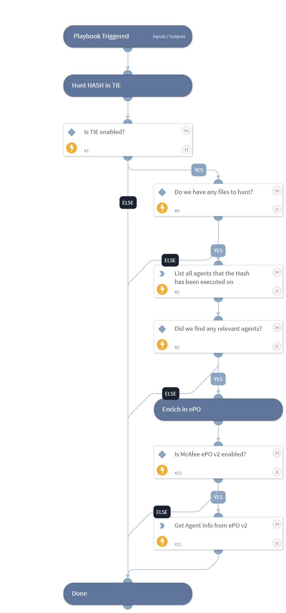

Hunt for sightings of MD5, SHA1 and/or SHA256 hashes on endpoints, using McAfee TIE (requires ePO as well).

Input:
* Hash (default, takes all deferent hashes from context)

Output:
* All agents that files with "Hash" has been executed on (TIE)
* Enrich Agents info from ePO

## Dependencies

This playbook uses the following sub-playbooks, integrations, and scripts.

### Sub-playbooks

This playbook does not use any sub-playbooks.

### Integrations

* McAfee ePO v2
* McAfeeTIEV2
* McAfee-TIE

### Scripts

This playbook does not use any scripts.

### Commands

* epo-find-system
* tie-file-references

## Playbook Inputs

---

| **Name** | **Description** | **Default Value** | **Required** |
| --- | --- | --- | --- |
| Hash | The Hash to hunt \(Could be MD5,SHA1,SHA256\). Default is set to all hashes | ${.=val.File.map(function(f) {return [f.MD5, f.SHA1, f.SHA256];}).reduce(function(a, b){return a.concat(b);}, []).filter(function (val1) {return val1;})} | Optional |

## Playbook Outputs

---

| **Path** | **Description** | **Type** |
| --- | --- | --- |
| Endpoint.Hostname | Hostname | string |
| Endpoint | The endpoint | unknown |

## Playbook Image

---

