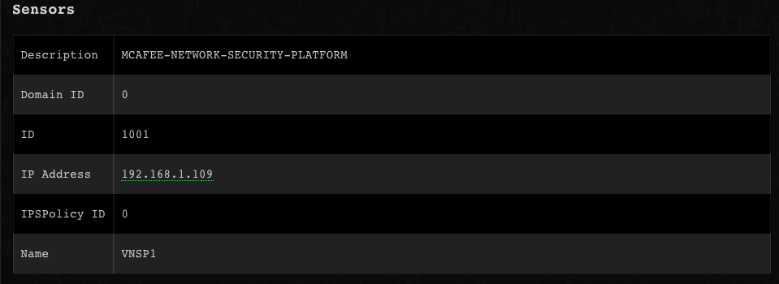
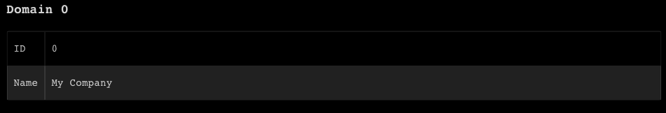
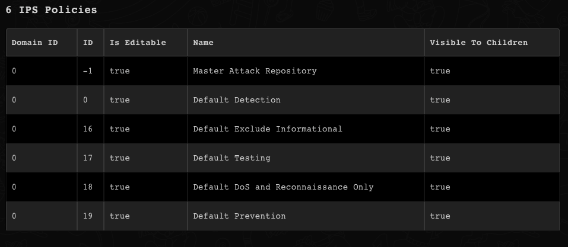
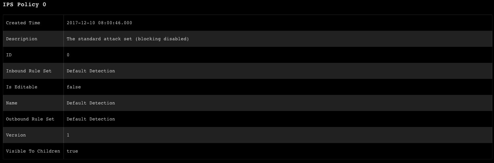
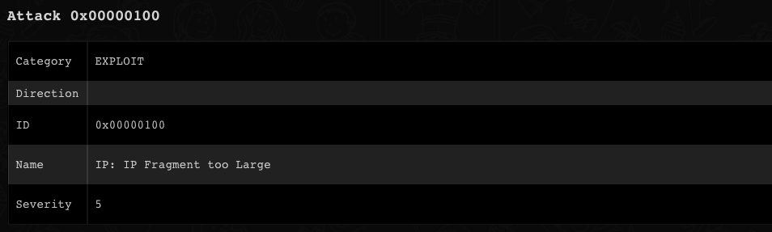

<!-- HTML_DOC -->
<h2>Overview</h2>

Use the McAfee NSM integration in Cortex XSOAR to retrieve information about sensors, domains, policies, alerts, and attacks in McAfee NSM.

This integration was integrated and tested with McAfee v9.1.

 

<h2>Configure McAfee NSM on Cortex XSOAR</h2>

<ol>
<li>Navigate to <strong>Settings</strong> &gt; <strong>Integrations</strong> &gt; <strong>Servers &amp; Services</strong>.</li>
<li>Search for McAfee NSM.</li>
<li>Click <strong>Add instance</strong> to create and configure a new integration instance. 
<ul>
<li>
<strong>Name</strong>: a textual name for the integration instance.</li>
<li><strong>URL (for example: <a href="https://192.168.0.1:5000/" rel="nofollow">https://192.168.0.1:5000</a>)</strong></li>
<li><strong>Username</strong></li>
<li><strong>Use system proxy settings</strong></li>
<li><strong>Trust any certificate (not secure)</strong></li>
</ul>
</li>
<li>Click <strong>Test</strong> to validate the URLs, token, and connection.</li>
</ol>
<h2>Commands</h2>

You can execute these commands from the Cortex XSOAR CLI, as part of an automation, or in a playbook. After you successfully execute a command, a DBot message appears in the War Room with the command details.

<ol>
<li><a href="#h_76556011641539684830822">Get a list of sensors for a domain: nsm-get-sensors</a></li>
<li><a href="#h_104113752811539684881373">Get all domains: nsm-get-domains</a></li>
<li><a href="#h_1631259691571539684929078">Get alerts: nsm-get-alerts</a></li>
<li><a href="#h_3735024832301539684975869">Update alert information: nsm-update-alerts</a></li>
<li><a href="#h_6552226993021539685015589">Get details for a single alert: nsm-get-alert-details</a></li>
<li><a href="#h_153153903731539685194486">Get IPS policies in a domain: nsm-get-ips-policies</a></li>
<li><a href="#h_135223014451539685246613">Get policy details for a single IPS policy: nsm-get-ips-policy-details</a></li>
<li><a href="#h_3782375735151539685390349">Get all attack definitions: nsm-get-attacks</a></li>
</ol>
<h3 id="h_76556011641539684830822">1. Get a list of sensors for a domain</h3>

Returns a list of sensors for a specified domain.

<h5>Base Command</h5>
<pre><code>nsm-get-sensors</code></pre>
<h5>Input</h5>
<table style="width: 748px;" border="2" cellpadding="6">
<thead>
<tr>
<th style="width: 158px;"><strong>Argument Name</strong></th>
<th style="width: 464px;"><strong>Description</strong></th>
<th style="width: 86px;"><strong>Required</strong></th>
</tr>
</thead>
<tbody>
<tr>
<td style="width: 158px;">domainID</td>
<td style="width: 464px;">The domain of the sensors. If blank, returns all sensors.</td>
<td style="width: 86px;">Optional</td>
</tr>
</tbody>
</table>
<h5> </h5>
<h5>Context Output</h5>
<table style="width: 748px;" border="2" cellpadding="6">
<thead>
<tr>
<th style="width: 341px;"><strong>Path</strong></th>
<th style="width: 90px;"><strong>Type</strong></th>
<th style="width: 277px;"><strong>Description</strong></th>
</tr>
</thead>
<tbody>
<tr>
<td style="width: 341px;">NSM.Sensors.ID</td>
<td style="width: 90px;">string</td>
<td style="width: 277px;">Sensor ID</td>
</tr>
<tr>
<td style="width: 341px;">NSM.Sensors.Description</td>
<td style="width: 90px;">string</td>
<td style="width: 277px;">Sensor description</td>
</tr>
<tr>
<td style="width: 341px;">NSM.Sensors.DomainID</td>
<td style="width: 90px;">string</td>
<td style="width: 277px;">Sensor's domain ID</td>
</tr>
</tbody>
</table>
<h5> </h5>
<h5>Command Example</h5>
<pre><code>!nsm-get-sensors domainID=0</code></pre>
<h5>Context Example</h5>
<pre>{
    "NSM": {
        "Sensors": {
            "Description": "MCAFEE-NETWORK-SECURITY-PLATFORM",
            "DomainID": 0,
            "ID": 1001,
            "IP Address": "192.168.1.109",
            "IPSPolicyID": 0,
            "Name": "VNSP1"
        }
    }
}
</pre>
<h5>Human Readable Output</h5>

<h3 id="h_104113752811539684881373">2. Get all domains</h3>

Returns all domains.

<h5>Base Command</h5>
<pre><code>nsm-get-domains</code></pre>
<h5>Input</h5>
<table style="width: 748px;" border="2" cellpadding="6">
<thead>
<tr>
<th style="width: 162px;"><strong>Argument Name</strong></th>
<th style="width: 455px;"><strong>Description</strong></th>
<th style="width: 91px;"><strong>Required</strong></th>
</tr>
</thead>
<tbody>
<tr>
<td style="width: 162px;">domain</td>
<td style="width: 455px;">Specific domain details. If blank, returns all domains.</td>
<td style="width: 91px;">Optional</td>
</tr>
</tbody>
</table>
<h5> </h5>
<h5>Context Output</h5>
<table style="width: 748px;" border="2" cellpadding="6">
<thead>
<tr>
<th style="width: 331px;"><strong>Path</strong></th>
<th style="width: 139px;"><strong>Type</strong></th>
<th style="width: 238px;"><strong>Description</strong></th>
</tr>
</thead>
<tbody>
<tr>
<td style="width: 331px;">NSM.Domains.ID</td>
<td style="width: 139px;">number</td>
<td style="width: 238px;">Domain ID</td>
</tr>
<tr>
<td style="width: 331px;">NSM.Domains.Name</td>
<td style="width: 139px;">string</td>
<td style="width: 238px;">Domain name</td>
</tr>
</tbody>
</table>
<h5> </h5>
<h5>Command Example</h5>
<pre><code>!nsm-get-domains domain=0</code></pre>
<h5>Context Example</h5>
<pre>{
    "NSM": {
        "Domains": {
            "ID": 0,
            "Name": "My Company"
        }
    }
}
</pre>
<h5>Human Readable Output</h5>

<h3 id="h_1631259691571539684929078">3. Get alerts</h3>

Returns alerts according to query parameters.

<h5>Base Command</h5>
<pre><code>nsm-get-alerts</code></pre>
<h5>Input</h5>
<table style="width: 748px;" border="2" cellpadding="6">
<thead>
<tr>
<th style="width: 130px;"><strong>Argument Name</strong></th>
<th style="width: 507px;"><strong>Description</strong></th>
<th style="width: 71px;"><strong>Required</strong></th>
</tr>
</thead>
<tbody>
<tr>
<td style="width: 130px;">time_period</td>
<td style="width: 507px;">Time period</td>
<td style="width: 71px;">Optional</td>
</tr>
<tr>
<td style="width: 130px;">start_time</td>
<td style="width: 507px;">Start time in "mm/dd/yyyy HH:MM" format only. Used for custom time only.</td>
<td style="width: 71px;">Optional</td>
</tr>
<tr>
<td style="width: 130px;">end_time</td>
<td style="width: 507px;">End time in "mm/dd/yyyy HH:MM" format only. used for custom time only</td>
<td style="width: 71px;">Optional</td>
</tr>
<tr>
<td style="width: 130px;">state</td>
<td style="width: 507px;">Alert state</td>
<td style="width: 71px;">Optional</td>
</tr>
<tr>
<td style="width: 130px;">search</td>
<td style="width: 507px;">Search string in alert details</td>
<td style="width: 71px;">Optional</td>
</tr>
<tr>
<td style="width: 130px;">filter</td>
<td style="width: 507px;">Filter alert by fields. Example: "name:hello;direction:Inbound,Outbound;attackcount:&gt;3,&lt;4".</td>
<td style="width: 71px;">Optional</td>
</tr>
</tbody>
</table>
<h5> </h5>
<h5>Context Output</h5>
<table style="width: 748px;" border="2" cellpadding="6">
<thead>
<tr>
<th style="width: 239px;"><strong>Path</strong></th>
<th style="width: 73px;"><strong>Type</strong></th>
<th style="width: 396px;"><strong>Description</strong></th>
</tr>
</thead>
<tbody>
<tr>
<td style="width: 239px;">NSM.Alerts.ID</td>
<td style="width: 73px;">number</td>
<td style="width: 396px;">Alert ID</td>
</tr>
<tr>
<td style="width: 239px;">NSM.Alerts.Name</td>
<td style="width: 73px;">string</td>
<td style="width: 396px;">Alert name</td>
</tr>
<tr>
<td style="width: 239px;">NSM.Alerts.State</td>
<td style="width: 73px;">string</td>
<td style="width: 396px;">Alert state (<em>Acknowledged</em>, <em>Unacknowledged</em>)</td>
</tr>
<tr>
<td style="width: 239px;">NSM.Alerts.CreatedTime</td>
<td style="width: 73px;">string</td>
<td style="width: 396px;">Alert creation time</td>
</tr>
<tr>
<td style="width: 239px;">NSM.Alerts.Assignee</td>
<td style="width: 73px;">string</td>
<td style="width: 396px;">Alert assignee</td>
</tr>
<tr>
<td style="width: 239px;">NSM.Alerts.AttackSeverity</td>
<td style="width: 73px;">string</td>
<td style="width: 396px;">Alert severity</td>
</tr>
<tr>
<td style="width: 239px;">NSM.Alerts.Application</td>
<td style="width: 73px;">string</td>
<td style="width: 396px;">The application associated with the alert</td>
</tr>
<tr>
<td style="width: 239px;">NSM.Alerts.EventResult</td>
<td style="width: 73px;">unknown</td>
<td style="width: 396px;">Event result</td>
</tr>
<tr>
<td style="width: 239px;">NSM.Alerts.Event</td>
<td style="width: 73px;">unknown</td>
<td style="width: 396px;">The event that triggered the alert</td>
</tr>
<tr>
<td style="width: 239px;">NSM.Alerts.Attack</td>
<td style="width: 73px;">unknown</td>
<td style="width: 396px;">Alert's attack</td>
</tr>
<tr>
<td style="width: 239px;">NSM.Alerts.Attacker</td>
<td style="width: 73px;">unknown</td>
<td style="width: 396px;">The attacker who committed the attack</td>
</tr>
<tr>
<td style="width: 239px;">NSM.Alerts.Target</td>
<td style="width: 73px;">unknown</td>
<td style="width: 396px;">The attack's target</td>
</tr>
<tr>
<td style="width: 239px;">NSM.Alerts.MalwareFile</td>
<td style="width: 73px;">unknown</td>
<td style="width: 396px;">Malware file used in the attack</td>
</tr>
</tbody>
</table>
<h5> </h5>
<h5>Command Example</h5>
<pre><code>!nsm-get-alerts state=ANY</code></pre>
<h3 id="h_3735024832301539684975869">4. Update alert information</h3>

Update the state or the assignee of specified alerts.

<h5>Base Command</h5>
<pre><code>nsm-update-alerts</code></pre>
<h5>Input</h5>
<table style="width: 744px;" border="2" cellpadding="6">
<thead>
<tr>
<th style="width: 140px;"><strong>Argument Name</strong></th>
<th style="width: 497px;"><strong>Description</strong></th>
<th style="width: 71px;"><strong>Required</strong></th>
</tr>
</thead>
<tbody>
<tr>
<td style="width: 140px;">state</td>
<td style="width: 497px;">Alert state</td>
<td style="width: 71px;">Optional</td>
</tr>
<tr>
<td style="width: 140px;">time_period</td>
<td style="width: 497px;">Time period</td>
<td style="width: 71px;">Optional</td>
</tr>
<tr>
<td style="width: 140px;">start_time</td>
<td style="width: 497px;">Start time in "mm/dd/yyyy HH:MM" format only. Used for custom time only</td>
<td style="width: 71px;">Optional</td>
</tr>
<tr>
<td style="width: 140px;">end_time</td>
<td style="width: 497px;">End time in "mm/dd/yyyy HH:MM" format only. Used for custom time only</td>
<td style="width: 71px;">Optional</td>
</tr>
<tr>
<td style="width: 140px;">new_state</td>
<td style="width: 497px;">The new alert state</td>
<td style="width: 71px;">Optional</td>
</tr>
<tr>
<td style="width: 140px;">new_assignee</td>
<td style="width: 497px;">The new assignee</td>
<td style="width: 71px;">Optional</td>
</tr>
<tr>
<td style="width: 140px;">search</td>
<td style="width: 497px;">Search string in alert details</td>
<td style="width: 71px;">Optional</td>
</tr>
<tr>
<td style="width: 140px;">filter</td>
<td style="width: 497px;">Filter alert by fields. Example: "name:hello;direction:Inbound,Outbound;attackcount:&gt;3,&lt;4"</td>
<td style="width: 71px;">Optional</td>
</tr>
</tbody>
</table>
<h5> </h5>
<h5>Context Output</h5>
<table style="width: 748px;" border="2" cellpadding="6">
<thead>
<tr>
<th style="width: 232px;"><strong>Path</strong></th>
<th style="width: 80px;"><strong>Type</strong></th>
<th style="width: 396px;"><strong>Description</strong></th>
</tr>
</thead>
<tbody>
<tr>
<td style="width: 232px;">NSM.Alerts.ID</td>
<td style="width: 80px;">number</td>
<td style="width: 396px;">Alert ID</td>
</tr>
<tr>
<td style="width: 232px;">NSM.Alerts.Name</td>
<td style="width: 80px;">string</td>
<td style="width: 396px;">Alert name</td>
</tr>
<tr>
<td style="width: 232px;">NSM.Alerts.State</td>
<td style="width: 80px;">string</td>
<td style="width: 396px;">Alert state (<em>Acknowledged</em>,<em>Unacknowledged</em>)</td>
</tr>
<tr>
<td style="width: 232px;">NSM.Alerts.CreatedTime</td>
<td style="width: 80px;">string</td>
<td style="width: 396px;">Alert creation time</td>
</tr>
<tr>
<td style="width: 232px;">NSM.Alerts.Assignee</td>
<td style="width: 80px;">string</td>
<td style="width: 396px;">Alert assignee</td>
</tr>
<tr>
<td style="width: 232px;">NSM.Alerts.AttackSeverity</td>
<td style="width: 80px;">string</td>
<td style="width: 396px;">Alert severity</td>
</tr>
<tr>
<td style="width: 232px;">NSM.Alerts.Application</td>
<td style="width: 80px;">string</td>
<td style="width: 396px;">The application associated with the alert</td>
</tr>
<tr>
<td style="width: 232px;">NSM.Alerts.EventResult</td>
<td style="width: 80px;">unknown</td>
<td style="width: 396px;">Event result</td>
</tr>
<tr>
<td style="width: 232px;">NSM.Alerts.Event</td>
<td style="width: 80px;">unknown</td>
<td style="width: 396px;">The event that triggered the alert</td>
</tr>
<tr>
<td style="width: 232px;">NSM.Alerts.Attack</td>
<td style="width: 80px;">unknown</td>
<td style="width: 396px;">Alert's attack</td>
</tr>
<tr>
<td style="width: 232px;">NSM.Alerts.Attacker</td>
<td style="width: 80px;">unknown</td>
<td style="width: 396px;">The attacker who committed the attack</td>
</tr>
<tr>
<td style="width: 232px;">NSM.Alerts.Target</td>
<td style="width: 80px;">unknown</td>
<td style="width: 396px;">The attack's Target</td>
</tr>
<tr>
<td style="width: 232px;">NSM.Alerts.MalwareFile</td>
<td style="width: 80px;">unknown</td>
<td style="width: 396px;">Malware file used in the attack</td>
</tr>
</tbody>
</table>
<h5> </h5>
<h5>Command Example</h5>
<pre><code>!nsm-update-alerts start_time="10/10/2018 08:00" state=Acknowledged</code></pre>
<h3 id="h_6552226993021539685015589">5. Get details for a single alert</h3>

Returns details for a single, specified alert.

<h5>Base Command</h5>
<pre><code>nsm-get-alert-details</code></pre>
<h5>Input</h5>
<table style="width: 748px;" border="2" cellpadding="6">
<thead>
<tr>
<th style="width: 303px;"><strong>Argument Name</strong></th>
<th style="width: 225px;"><strong>Description</strong></th>
<th style="width: 180px;"><strong>Required</strong></th>
</tr>
</thead>
<tbody>
<tr>
<td style="width: 303px;">alert_id</td>
<td style="width: 225px;">Alert ID</td>
<td style="width: 180px;">Required</td>
</tr>
<tr>
<td style="width: 303px;">sensor_id</td>
<td style="width: 225px;">Sensor ID</td>
<td style="width: 180px;">Required</td>
</tr>
</tbody>
</table>
<h5> </h5>
<h5>Context Output</h5>
<table style="width: 748px;" border="2" cellpadding="6">
<thead>
<tr>
<th style="width: 224px;"><strong>Path</strong></th>
<th style="width: 79px;"><strong>Type</strong></th>
<th style="width: 405px;"><strong>Description</strong></th>
</tr>
</thead>
<tbody>
<tr>
<td style="width: 224px;">NSM.Alerts.ID</td>
<td style="width: 79px;">string</td>
<td style="width: 405px;">Alert ID</td>
</tr>
<tr>
<td style="width: 224px;">NSM.Alerts.Name</td>
<td style="width: 79px;">string</td>
<td style="width: 405px;">Alert name</td>
</tr>
<tr>
<td style="width: 224px;">NSM.Alerts.State</td>
<td style="width: 79px;">string</td>
<td style="width: 405px;">Alert state (<em>Acknowledged</em>,<em>Unacknowledged</em>)</td>
</tr>
<tr>
<td style="width: 224px;">NSM.Alerts.CreatedTime</td>
<td style="width: 79px;">date</td>
<td style="width: 405px;">Alert creation time</td>
</tr>
<tr>
<td style="width: 224px;">NSM.Alerts.Assignee</td>
<td style="width: 79px;">string</td>
<td style="width: 405px;">Alert assignee</td>
</tr>
<tr>
<td style="width: 224px;">NSM.Alerts.Description</td>
<td style="width: 79px;">string</td>
<td style="width: 405px;">Alert description</td>
</tr>
<tr>
<td style="width: 224px;">NSM.Alerts.EventResult</td>
<td style="width: 79px;">string</td>
<td style="width: 405px;">Event result</td>
</tr>
<tr>
<td style="width: 224px;">NSM.Alerts.Event</td>
<td style="width: 79px;">unknown</td>
<td style="width: 405px;">Alert event</td>
</tr>
<tr>
<td style="width: 224px;">NSM.Alerts.Attack</td>
<td style="width: 79px;">unknown</td>
<td style="width: 405px;">Alert's attack</td>
</tr>
<tr>
<td style="width: 224px;">NSM.Alerts.Attacker</td>
<td style="width: 79px;">unknown</td>
<td style="width: 405px;">The attacker who committed the attack</td>
</tr>
<tr>
<td style="width: 224px;">NSM.Alerts.Target</td>
<td style="width: 79px;">unknown</td>
<td style="width: 405px;">The attack's target</td>
</tr>
<tr>
<td style="width: 224px;">NSM.Alerts.MalwareFile</td>
<td style="width: 79px;">string</td>
<td style="width: 405px;">Malware file used in the attack</td>
</tr>
<tr>
<td style="width: 224px;">NSM.Alerts.Details</td>
<td style="width: 79px;">unknown</td>
<td style="width: 405px;">Extra details</td>
</tr>
</tbody>
</table>
<h5> </h5>
<h5>Command Example</h5>
<pre><code>!nsm-get-alert-details alert_id=0</code></pre>
<h3 id="h_153153903731539685194486">6. Get IPS policies in a domain</h3>

Returns the IPS policies in a domain.

<h5>Base Command</h5>
<pre><code>nsm-get-ips-policies</code></pre>
<h5>Input</h5>
<table style="width: 748px;" border="2" cellpadding="6">
<thead>
<tr>
<th style="width: 303px;"><strong>Argument Name</strong></th>
<th style="width: 225px;"><strong>Description</strong></th>
<th style="width: 180px;"><strong>Required</strong></th>
</tr>
</thead>
<tbody>
<tr>
<td style="width: 303px;">domain_id</td>
<td style="width: 225px;">Domain ID</td>
<td style="width: 180px;">Required</td>
</tr>
</tbody>
</table>
<h5> </h5>
<h5>Context Output</h5>
<table style="width: 748px;" border="2" cellpadding="6">
<thead>
<tr>
<th style="width: 249px;"><strong>Path</strong></th>
<th style="width: 61px;"><strong>Type</strong></th>
<th style="width: 398px;"><strong>Description</strong></th>
</tr>
</thead>
<tbody>
<tr>
<td style="width: 249px;">NSM.IPSPolicies.ID</td>
<td style="width: 61px;">number</td>
<td style="width: 398px;">IPS policy ID</td>
</tr>
<tr>
<td style="width: 249px;">NSM.IPSPolicies.Name</td>
<td style="width: 61px;">string</td>
<td style="width: 398px;">IPS policy name</td>
</tr>
<tr>
<td style="width: 249px;">NSM.IPSPolicies.DomainID</td>
<td style="width: 61px;">number</td>
<td style="width: 398px;">IPS policy domain ID</td>
</tr>
<tr>
<td style="width: 249px;">NSM.IPSPolicies.IsEditable</td>
<td style="width: 61px;">boolean</td>
<td style="width: 398px;">Whether you can edit the IPS policy</td>
</tr>
<tr>
<td style="width: 249px;">NSM.IPSPolicies.VisibleToChildren</td>
<td style="width: 61px;">boolean</td>
<td style="width: 398px;">Whether the IPS Policy is visible to domain's children</td>
</tr>
</tbody>
</table>
<h5> </h5>
<h5>Command Example</h5>
<pre><code>!nsm-get-ips-policies domain_id=0</code></pre>
<h5>Context Example</h5>
<pre>{
    "NSM": {
        "IPSPolicies": [
            {
                "DomainID": 0,
                "ID": -1,
                "IsEditable": true,
                "Name": "Master Attack Repository",
                "VisibleToChildren": true
            },
            {
                "DomainID": 0,
                "ID": 0,
                "IsEditable": true,
                "Name": "Default Detection",
                "VisibleToChildren": true
            },
            {
                "DomainID": 0,
                "ID": 16,
                "IsEditable": true,
                "Name": "Default Exclude Informational",
                "VisibleToChildren": true
            },
            {
                "DomainID": 0,
                "ID": 17,
                "IsEditable": true,
                "Name": "Default Testing",
                "VisibleToChildren": true
            },
            {
                "DomainID": 0,
                "ID": 18,
                "IsEditable": true,
                "Name": "Default DoS and Reconnaissance Only",
                "VisibleToChildren": true
            },
            {
                "DomainID": 0,
                "ID": 19,
                "IsEditable": true,
                "Name": "Default Prevention",
                "VisibleToChildren": true
            }
        ]
    }
}
</pre>
<h5>Human Readable Output</h5>

<h3 id="h_135223014451539685246613">7. Get policy details for a single IPS policy</h3>

Returns policy details for the specified IPS policy.

<h5>Base Command</h5>
<pre><code>nsm-get-ips-policy-details</code></pre>
<h5>Input</h5>
<table style="width: 748px;" border="2" cellpadding="6">
<thead>
<tr>
<th style="width: 300px;"><strong>Argument Name</strong></th>
<th style="width: 229px;"><strong>Description</strong></th>
<th style="width: 179px;"><strong>Required</strong></th>
</tr>
</thead>
<tbody>
<tr>
<td style="width: 300px;">policy_id</td>
<td style="width: 229px;">IPS Policy ID</td>
<td style="width: 179px;">Required</td>
</tr>
</tbody>
</table>
<h5> </h5>
<h5>Context Output</h5>
<table style="width: 748px;" border="2" cellpadding="6">
<thead>
<tr>
<th style="width: 249px;"><strong>Path</strong></th>
<th style="width: 69px;"><strong>Type</strong></th>
<th style="width: 390px;"><strong>Description</strong></th>
</tr>
</thead>
<tbody>
<tr>
<td style="width: 249px;">NSM.IPSPolicies.ID</td>
<td style="width: 69px;">number</td>
<td style="width: 390px;">IPS policy ID</td>
</tr>
<tr>
<td style="width: 249px;">NSM.IPSPolicies.Name</td>
<td style="width: 69px;">string</td>
<td style="width: 390px;">IPS policy Name</td>
</tr>
<tr>
<td style="width: 249px;">NSM.IPSPolicies.Description</td>
<td style="width: 69px;">string</td>
<td style="width: 390px;">IPS policy information</td>
</tr>
<tr>
<td style="width: 249px;">NSM.IPSPolicies.CreatedTime</td>
<td style="width: 69px;">string</td>
<td style="width: 390px;">Policy creation time</td>
</tr>
<tr>
<td style="width: 249px;">NSM.IPSPolicies.IsEditable</td>
<td style="width: 69px;">boolean</td>
<td style="width: 390px;">Whether you can edit the IPS policy</td>
</tr>
<tr>
<td style="width: 249px;">NSM.IPSPolicies.VisibleToChildren</td>
<td style="width: 69px;">boolean</td>
<td style="width: 390px;">Whether the IPS Policy is visible to domain's children</td>
</tr>
<tr>
<td style="width: 249px;">NSM.IPSPolicies.Version</td>
<td style="width: 69px;">number</td>
<td style="width: 390px;">IPS policy version</td>
</tr>
<tr>
<td style="width: 249px;">NSM.IPSPolicies.InboundRuleSet</td>
<td style="width: 69px;">unknown</td>
<td style="width: 390px;">Inbound rule set</td>
</tr>
<tr>
<td style="width: 249px;">NSM.IPSPolicies.OutboundRuleSet</td>
<td style="width: 69px;">unknown</td>
<td style="width: 390px;">Outbound rule set</td>
</tr>
<tr>
<td style="width: 249px;">NSM.IPSPolicies.ExploitAttacks</td>
<td style="width: 69px;">unknown</td>
<td style="width: 390px;">A list of exploit attacks related to the IPS Policy</td>
</tr>
</tbody>
</table>
<h5> </h5>
<h5>Command Example</h5>
<pre><code>!nsm-get-ips-policy-details policy_id=0</code></pre>
<h5>Human Readable Output</h5>

<h3 id="h_3782375735151539685390349">8. Get all attack definitions</h3>

Returns all available attack definitions in McAfee NSM.

<h5>Base Command</h5>
<pre><code>nsm-get-attacks</code></pre>
<h5>Input</h5>
<table style="width: 748px;" border="2" cellpadding="6">
<thead>
<tr>
<th style="width: 263px;"><strong>Argument Name</strong></th>
<th style="width: 290px;"><strong>Description</strong></th>
<th style="width: 155px;"><strong>Required</strong></th>
</tr>
</thead>
<tbody>
<tr>
<td style="width: 263px;">attack_id</td>
<td style="width: 290px;">Particular attack ID</td>
<td style="width: 155px;">Optional</td>
</tr>
</tbody>
</table>
<h5> </h5>
<h5>Context Output</h5>
<table style="width: 748px;" border="2" cellpadding="6">
<thead>
<tr>
<th style="width: 332px;"><strong>Path</strong></th>
<th style="width: 130px;"><strong>Type</strong></th>
<th style="width: 246px;"><strong>Description</strong></th>
</tr>
</thead>
<tbody>
<tr>
<td style="width: 332px;">NSM.Attacks.ID</td>
<td style="width: 130px;">string</td>
<td style="width: 246px;">Attack ID</td>
</tr>
<tr>
<td style="width: 332px;">NSM.Attacks.Name</td>
<td style="width: 130px;">string</td>
<td style="width: 246px;">Attack name</td>
</tr>
<tr>
<td style="width: 332px;">NSM.Attacks.Severity</td>
<td style="width: 130px;">number</td>
<td style="width: 246px;">Attack severity</td>
</tr>
<tr>
<td style="width: 332px;">NSM.Attacks.Direction</td>
<td style="width: 130px;">string</td>
<td style="width: 246px;">Attack direction</td>
</tr>
<tr>
<td style="width: 332px;">NSM.Attacks.Category</td>
<td style="width: 130px;">string</td>
<td style="width: 246px;">Attack category</td>
</tr>
</tbody>
</table>
<h5> </h5>
<h5>Command Example</h5>
<pre><code>!nsm-get-attacks attack_id="0x00000100"</code></pre>
<h5>Context Example</h5>
<pre>{
    "NSM": {
        "Attacks": {
            "Category": "EXPLOIT",
            "Direction": null,
            "ID": "0x00000100",
            "Name": "IP: IP Fragment too Large",
            "Severity": 5
        }
    }
}
</pre>
<h5>Human Readable Output</h5>

<h2>Troubleshooting</h2>

If you receive an <code>401 Unauthorized</code> error, the user credentials may be incorrect.
