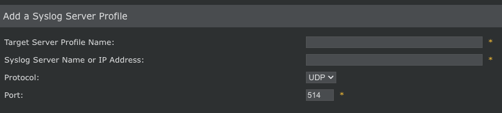
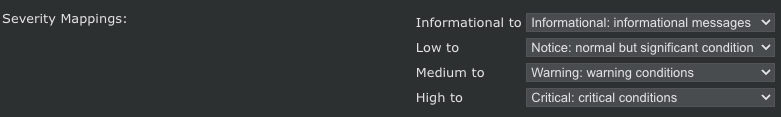
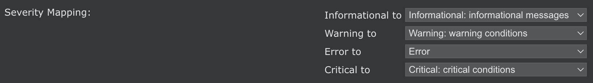
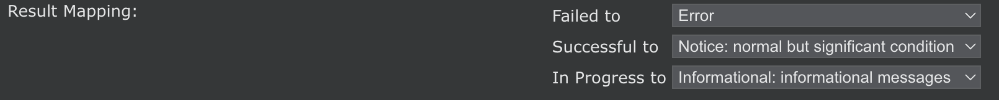

# McAfee NSM (Network Security Manager)
This pack includes Cortex XSIAM content.
<~XSIAM>
## McAfee NSM Syslog configuration
McAfee NSM syslog event types:
* IPS Events
* Faults
* User Activity (audit logs)

*config Syslog IPS Events:*
1. In McAfee NSM, go to **Manager** > **Setup**> **Notification** > **IPS Events** > **syslog**.
2. In Enable Syslog Notification, click *YES* .
3. Click *+* and add the target server. 
   If you do not have a configured target server, click **Add** near Target Server and  fill in the target server details.

   
4. In Facility, select **Log Alert (note 1)**.
5. In Severity mapping, leave the configuration as it.  It should be:
 
6. Click the Notify for all Alerts checkbox.
7. Click **Save**.

*Configure Syslog Faults Events:*
1. In McAfee NSM, go to **Manager** > **Setup**> **Notification** > **Faults** > **syslog**.
2. In Enable Syslog Notification, click **YES**.
3. Fill in the "Server Name or IP Address" and "Port" fields .
4. In the Facilities dropdown, select **Security/authorization (code 4)**.
5. In Severity mapping, leave the configuration as it.  It should be:
    
6. In the Forward Faults dropdown, select **informational and above**.
7. In Message Preference, click the Syslog default checkbox.
8. Click **Save**.

*Configure Syslog User Activity (audit logs) Events:*
1. In McAfee NSM, go to **Manager** > **Setup**> **Notification** > **User Activity** > **syslog**.
2. In Enable Syslog Notification, click **YES**.
3. Fill in the "Server Name or IP Address" and "Port" fields .
4. In the Protocol dropdown, select **Protocol**.
5. In the Facilities dropdown, select **Log Alert (note 1)**.
6. In Severity mapping, leave the configuration as it.  It should be:
    
7. In the Forward audit dropdown, select **Allow All Auditlogs**.
7. In Message Preference, click the Syslog default checkbox.
8. Click **Save**.

## Event Time configuration

By default, on Fault and IPS events (syslog) do not have an event time. To add an event time, perform the following:
*IPS Events*
1. In McAfee NSM, go to **Manager** > **Setup**> **Notification** > **IPS Events** > **syslog**.
2. Choose the target server and click the pencil (edit).
3. In the message part, add in the end of the string ``` at  $IV_ATTACK_TIME$```.
4. Click **Save**.

*Syslog Faults*
1. In McAfee NSM, go to **Manager** > **Setup**> **Notification** > **Faults** > **syslog**.
2. In Message Preference, click edit and add to the end of the message ``` at  $IV_FAULT_TIME$```.
3. Click **Save**.

Note:
In order to parse the timestamp correctly, make sure to configure the logs to be sent in a UTC timezone (timestamp ends with UTC).

## Collect Events from Vendor
In order to use the collector, use the [Broker VM](#broker-vm) option.

### Broker VM
To create or configure the Broker VM, use the information described [here](https://docs-cortex.paloaltonetworks.com/r/Cortex-XDR/Cortex-XDR-Pro-Administrator-Guide/Configure-the-Broker-VM).

You can configure the specific vendor and product for this instance.

1. Navigate to **Settings** > **Configuration** > **Data Broker** > **Broker VMs**. 
2. Go to the apps tab and add the **Syslog** app. If it already exists, click the **Syslog** app and then click **Configure**.
3. Click **Add New**.
4. When configuring the Syslog Collector, set the following values:
   - vendor as vendor - mcafee
   - product as product - nsm
</~XSIAM>