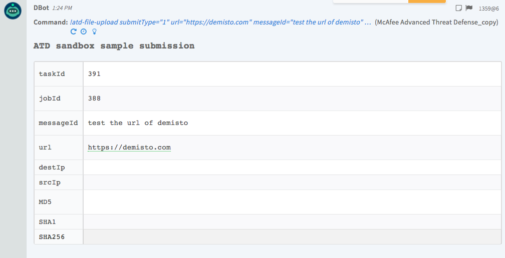
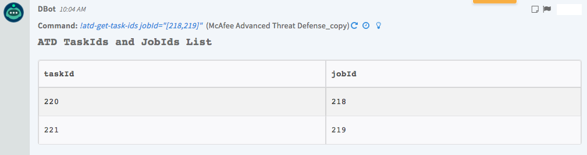
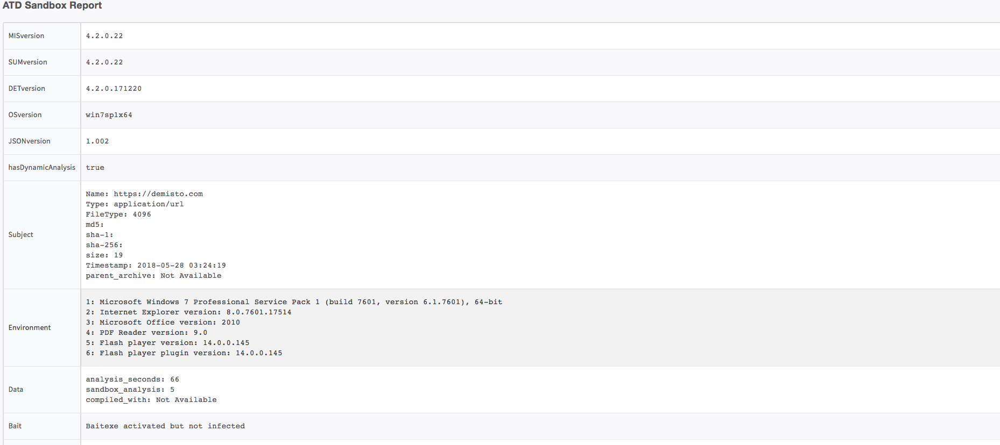
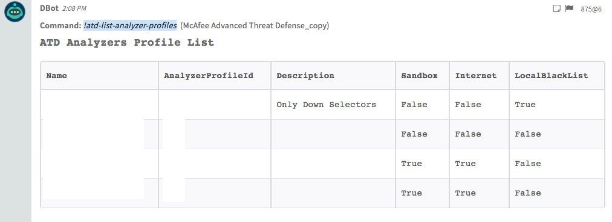
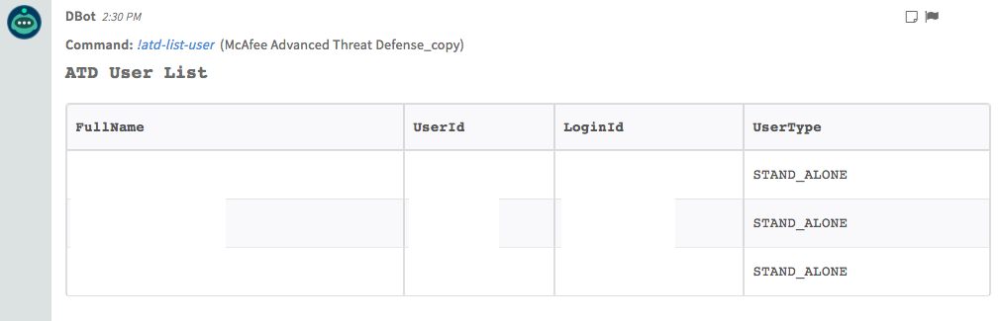
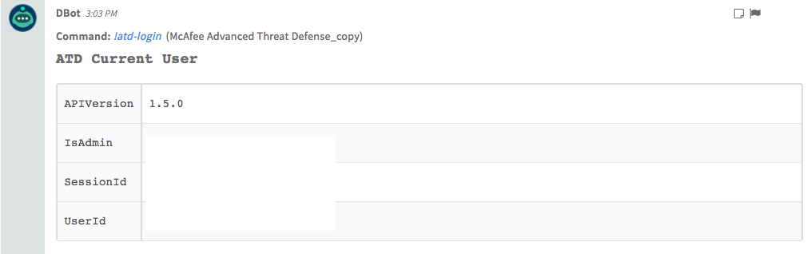
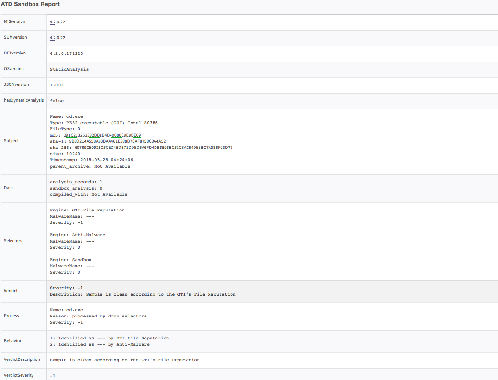
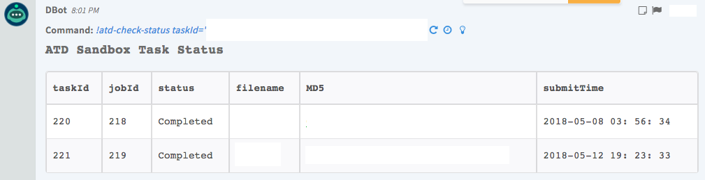

<!-- HTML_DOC -->
<h2>Overview</h2>

Use the McAfee Advanced Threat Defense integration to enhance protection from network edge to endpoint and enable investigation.

This integration was integrated and tested with MATD Version 4.2.2.16.

<h2>McAfee Advanced Threat Defense Playbooks</h2>

This integration is used in the following Cortex XSOAR playbooks.

<ul>
<li>McAfee ATD - Detonate URL</li>
<li>McAfee ATD - Detonate File</li>
</ul>
<h2>Use cases</h2>

<ul>
<li>Add a file to the integrations war room.</li>
<li>Sample a file.</li>
<li>Get information on an old sample.</li>
<li>Send a URL sample to McAfee ATD.</li>
</ul>
<h2>Configure McAfee Advanced Threat Defense on Cortex XSOAR</h2>

<ol>
<li>Navigate to <strong>Settings</strong> &gt; <strong>Integrations</strong> &gt; <strong>Servers &amp; Services</strong>.</li>
<li>Search for McAfee Advanced Threat Defense.</li>
<li>Click <strong>Add instance</strong> to create and configure a new integration instance. 
<ul>
<li>
<strong>Name</strong>: a textual name for the integration instance.</li>
<li><strong>Server URL (e.g. <a href="https://192.168.0.1/" rel="nofollow">https://192.168.0.1</a>)</strong></li>
<li><strong>Username</strong></li>
<li><strong>Password</strong></li>
<li><strong>Trust any certificate (not secure)</strong></li>
<li><strong>Use system proxy settings</strong></li>
</ul>
</li>
<li>Click <strong>Test</strong> to validate the URLs, token, and connection.</li>
</ol>
<h2> </h2>
<h2>Commands</h2>

You can execute these commands from the Cortex XSOAR CLI, as part of an automation, or in a playbook. After you successfully execute a command, a DBot message appears in the War Room with the command details.

<ol>
<li><a href="#h_53523308371535891435690">Upload a file: atd-file-upload</a></li>
<li><a href="#h_302118921961535891441834">Retrieve taskIDs: atd-get-task-ids</a></li>
<li><a href="#h_5983918091841535891447978">Download an analysis report: atd-get-report</a></li>
<li><a href="#h_7996401532701535891458065">Get a list of analyzer profiles: atd-list-analyzer-profiles</a></li>
<li><a href="#h_4045512523551535891464726">Get a list of all users: atd-list-user</a></li>
<li><a href="#h_880142004391535891472428">Retrieve session details: atd-login</a></li>
<li><a href="#h_8231456545221535891479906">Detonate a file: detonate-file (deprecated)</a></li>
<li><a href="#h_5978331416041535891488436">Detonate a URL: detonate-url (deprecated)</a></li>
<li><a href="#h_2528097436861535891496998">Check a task's status: atd-check-status</a></li>
</ol>
<h3 id="h_53523308371535891435690">1. Upload a file</h3>

Upload a file or Web URL for dynamic analysis using the specified Analyzer Profile. You can only submit a single file or Web URL in each command.

Notice: Submitting indicators using this command might make the indicator data publicly available. See the vendor’s documentation for more details.

<h5>Base Command</h5>

<code>atd-file-upload</code>

<h5>Input</h5>
<table style="width: 746px;" border="2" cellpadding="6">
<thead>
<tr>
<th style="width: 135px;"><strong>Argument Name</strong></th>
<th style="width: 502px;"><strong>Description</strong></th>
<th style="width: 71px;"><strong>Required</strong></th>
</tr>
</thead>
<tbody>
<tr>
<td style="width: 135px;">vmProfileList</td>
<td style="width: 502px;">Analyzer profile ID. The profile ID number can be found in the UI Policy/Analyzer Profile page, OR using command atd-list-analyzer-profiles, under vmProfileid key result</td>
<td style="width: 71px;">Optional</td>
</tr>
<tr>
<td style="width: 135px;">submitType</td>
<td style="width: 502px;">This parameter accepts four values — '0', '1', '2' and '3'. • 0 — Regular file upload • 1 — URL submission — URL link is processed inside analyzer VM • 2 — Submit file with URL • 3 — URL Download — File from URL is firstly downloaded and then analyzed</td>
<td style="width: 71px;">Required</td>
</tr>
<tr>
<td style="width: 135px;">url</td>
<td style="width: 502px;">A valid URL</td>
<td style="width: 71px;">Optional</td>
</tr>
<tr>
<td style="width: 135px;">messageId</td>
<td style="width: 502px;">Maximum 128-character string.</td>
<td style="width: 71px;">Optional</td>
</tr>
<tr>
<td style="width: 135px;">srcIp</td>
<td style="width: 502px;">IPv4 address of the source system or gateway from where the file is downloaded.</td>
<td style="width: 71px;">Optional</td>
</tr>
<tr>
<td style="width: 135px;">dstIp</td>
<td style="width: 502px;">IPv4 address of the target endpoint.</td>
<td style="width: 71px;">Optional</td>
</tr>
<tr>
<td style="width: 135px;">skipTaskId</td>
<td style="width: 502px;">Value '0' indicates corresponding taskid in API response. Value '1' indicates -1 as taskid in API response.</td>
<td style="width: 71px;">Optional</td>
</tr>
<tr>
<td style="width: 135px;">analyzeAgain</td>
<td style="width: 502px;">Value '0' indicates skip sample analysis if it is analyzed previously . Value '1' indicates do not skip sample analysis if it is not analyzed previously.</td>
<td style="width: 71px;">Optional</td>
</tr>
<tr>
<td style="width: 135px;">xMode</td>
<td style="width: 502px;">Value '0' indicates no user interaction is needed during sample analysis. Value '1' indicates user interaction is needed during sample analysis.</td>
<td style="width: 71px;">Optional</td>
</tr>
<tr>
<td style="width: 135px;">filePriorityQ</td>
<td style="width: 502px;">This parameter indicates priority of sample analysis. run_now assigns highest priority (i.e., sample is analyzed right away), add_to_q puts sample in waiting state if there is a waiting queue of samples, default is run_now</td>
<td style="width: 71px;">Optional</td>
</tr>
<tr>
<td style="width: 135px;">entryID</td>
<td style="width: 502px;">entry ID f the file to upload</td>
<td style="width: 71px;">Optional</td>
</tr>
<tr>
<td style="width: 135px;">fileName</td>
<td style="width: 502px;">The name of the file</td>
<td style="width: 71px;">Optional</td>
</tr>
</tbody>
</table>
<h5> </h5>
<h5>Context Output</h5>
<table style="width: 748px;" border="2" cellpadding="6">
<thead>
<tr>
<th style="width: 186px;"><strong>Path</strong></th>
<th style="width: 76px;"><strong>Type</strong></th>
<th style="width: 446px;"><strong>Description</strong></th>
</tr>
</thead>
<tbody>
<tr>
<td style="width: 186px;">ATD.Task.taskId</td>
<td style="width: 76px;">number</td>
<td style="width: 446px;">Task ID of the uploaded sample</td>
</tr>
<tr>
<td style="width: 186px;">ATD.Task.jobId</td>
<td style="width: 76px;">number</td>
<td style="width: 446px;">Job ID of the uploaded sample</td>
</tr>
<tr>
<td style="width: 186px;">ATD.Task.messageId</td>
<td style="width: 76px;">string</td>
<td style="width: 446px;">The message ID relevant to the uploaded sample</td>
</tr>
<tr>
<td style="width: 186px;">ATD.Task.url</td>
<td style="width: 76px;">string</td>
<td style="width: 446px;">The URL that was detonated</td>
</tr>
<tr>
<td style="width: 186px;">ATD.Task.srcIp</td>
<td style="width: 76px;">string</td>
<td style="width: 446px;">Source IPv4 address</td>
</tr>
<tr>
<td style="width: 186px;">ATD.Task.destIp</td>
<td style="width: 76px;">string</td>
<td style="width: 446px;">Destination IPv4 address</td>
</tr>
<tr>
<td style="width: 186px;">ATD.Task.MD5</td>
<td style="width: 76px;">string</td>
<td style="width: 446px;">MD5 of the uploaded sample</td>
</tr>
<tr>
<td style="width: 186px;">ATD.Task.SHA1</td>
<td style="width: 76px;">string</td>
<td style="width: 446px;">SHA-1 of the uploaded sample</td>
</tr>
<tr>
<td style="width: 186px;">ATD.Task.SHA256</td>
<td style="width: 76px;">string</td>
<td style="width: 446px;">SHA-256 of the uploaded sample</td>
</tr>
<tr>
<td style="width: 186px;">ATD.taskId</td>
<td style="width: 76px;">number</td>
<td style="width: 446px;">The task ID of the uploaded sample</td>
</tr>
</tbody>
</table>
<h5> </h5>
<h5>Command Example</h5>

<code>!atd-file-upload submitType=1 analyzeAgain=1 filePriorityQ=run_now messageId="test the url of demisto" url="<a href="https://demisto.com/" rel="nofollow">https://demisto.com</a>"!atd-check-status jobId=[220,34]</code> <code></code>

<h5>Context Example</h5>
<pre>{  
   root:{  

   }   7   items estimatedTime:0   fileId:   just testing filesWait:0   mimeType:   application/url results:[  

   ]   1   item 0:{  

   }   12   items cache:0   destIp:null   file:   https:   //demisto.com md5:   xxx messageId:   sha1:   sha256:   size:19   srcIp:   submitType:1   taskId:388   url:   https:   //demisto.com subId:385   success:true
}</pre>
<h5>Human Readable Output</h5>

 

<h3 id="h_302118921961535891441834">2. Retrieve taskIds</h3>

fetches the list of task id's associated with a job id

<h5>Base Command</h5>

<code>atd-get-task-ids</code>

<h5>Input</h5>
<table style="width: 748px;" border="2" cellpadding="6">
<thead>
<tr>
<th style="width: 151px;"><strong>Argument Name</strong></th>
<th style="width: 470px;"><strong>Description</strong></th>
<th style="width: 87px;"><strong>Required</strong></th>
</tr>
</thead>
<tbody>
<tr>
<td style="width: 151px;">jobId</td>
<td style="width: 470px;">Unique identifier for the previously submitted file</td>
<td style="width: 87px;">Required</td>
</tr>
</tbody>
</table>
<h5> </h5>
<h5>Context Output</h5>
<table style="width: 748px;" border="2" cellpadding="6">
<thead>
<tr>
<th style="width: 162px;"><strong>Path</strong></th>
<th style="width: 89px;"><strong>Type</strong></th>
<th style="width: 457px;"><strong>Description</strong></th>
</tr>
</thead>
<tbody>
<tr>
<td style="width: 162px;">ATD.Task.jobId</td>
<td style="width: 89px;">number</td>
<td style="width: 457px;">taskId that corresponds to the jobId that was sent</td>
</tr>
<tr>
<td style="width: 162px;">ATD.Task.jobId</td>
<td style="width: 89px;">number</td>
<td style="width: 457px;">The jobId that was sent</td>
</tr>
</tbody>
</table>
<h5> </h5>
<h5>Command Example</h5>

<code>!atd-get-taskids jobId=${ATD.Task.jobId}M</code> <code>!atd-get-taskids jobId=[220,34]</code>

<h5>Context Example</h5>
<pre>{  
   root:[  

   ]   2   items 0:{  

   }   2   items result:{  

   }   1   item taskIdList:220   success:true   1:{  

   }   2   items result:{  

   }   1   item taskIdList:221   success:true
}
</pre>
<h5>Human Readable Output</h5>

 

<h3 id="h_5983918091841535891447978">3. Download an analysis report</h3>

Downloads the analysis report for a specific task.

<h5>Base Command</h5>

<code>atd-get-report</code>

<h5>Input</h5>
<table style="width: 744px;" border="2" cellpadding="6">
<thead>
<tr>
<th style="width: 149px;"><strong>Argument Name</strong></th>
<th style="width: 488px;"><strong>Description</strong></th>
<th style="width: 71px;"><strong>Required</strong></th>
</tr>
</thead>
<tbody>
<tr>
<td style="width: 149px;">taskId</td>
<td style="width: 488px;">The returned taskId value in the submission step, previously returned value in the File/URL submission step</td>
<td style="width: 71px;">Optional</td>
</tr>
<tr>
<td style="width: 149px;">jobId</td>
<td style="width: 488px;">Job ID</td>
<td style="width: 71px;">Optional</td>
</tr>
<tr>
<td style="width: 149px;">type</td>
<td style="width: 488px;">
<ul>
<li>html — HTML report</li>
<li>txt — Text report</li>
<li>xml — XML report</li>
<li>zip — All files packaged in a single zip file</li>
<li>json — Same as XML but in JSON format</li>
<li>ioc - Indicators of Compromise format</li>
<li>stix - Structured Threat Information expression. By default, Stix generation is disabled. Use set stixreportstatus enable to enable it.</li>
<li>pdf - Portable Document Format</li>
<li>sample - Download sample from McAfee Advanced Threat Defense</li>
</ul>
</td>
<td style="width: 71px;">Required</td>
</tr>
<tr>
<td style="width: 149px;">threshold</td>
<td style="width: 488px;">ATD severity (if exceeded, the file is considered malicious)</td>
<td style="width: 71px;">Optional</td>
</tr>
</tbody>
</table>

 

<h5>Context Output</h5>
<table style="width: 750px;" border="2" cellpadding="6">
<thead>
<tr>
<th><strong>Path</strong></th>
<th><strong>Type</strong></th>
<th><strong>Description</strong></th>
</tr>
</thead>
<tbody>
<tr>
<td>File.Name</td>
<td>string</td>
<td>Filename (only if the report type is JSON)</td>
</tr>
<tr>
<td>File.Type</td>
<td>string</td>
<td>File type, for example "PE" (only if the report type is JSON)</td>
</tr>
<tr>
<td>File.Size</td>
<td>number</td>
<td>File size (only if the report type is JSON)</td>
</tr>
<tr>
<td>File.MD5</td>
<td>string</td>
<td>MD5 hash of the file (only if the report type is JSON)</td>
</tr>
<tr>
<td>File.SHA1</td>
<td>string</td>
<td>SHA-1 hash of the file (only if the report type is JSON)</td>
</tr>
<tr>
<td>File.SHA256</td>
<td>string</td>
<td>SHA-256 hash of the file (only if the report type is JSON)</td>
</tr>
<tr>
<td>File.Malicious.Vendor</td>
<td>string</td>
<td>For malicious files, the vendor that made the decision</td>
</tr>
<tr>
<td>File.Malicious.Description</td>
<td>string</td>
<td>For malicious files, the reason for the vendor to make the decision</td>
</tr>
<tr>
<td>DBotScore.Indicator</td>
<td>string</td>
<td>The indicator we tested (only if the report type is JSON)</td>
</tr>
<tr>
<td>DBotScore.Type</td>
<td>string</td>
<td>The type of the indicator (only if the report type is JSON)</td>
</tr>
<tr>
<td>DBotScore.Vendor</td>
<td>string</td>
<td>Vendor used to calculate the score (only if the report type is JSON)</td>
</tr>
<tr>
<td>DBotScore.Score</td>
<td>number</td>
<td>The actual score (only if the report type is JSON)</td>
</tr>
<tr>
<td>File.EntryID</td>
<td>string</td>
<td>Entry ID of the sample</td>
</tr>
<tr>
<td>IP.Address</td>
<td>string</td>
<td>IPs relevant to the sample</td>
</tr>
<tr>
<td>InfoFile.EntryID</td>
<td>string</td>
<td>EntryID of the report file</td>
</tr>
<tr>
<td>InfoFile.Extension</td>
<td>string</td>
<td>Extension of the report file</td>
</tr>
<tr>
<td>InfoFile.Name</td>
<td>string</td>
<td>The name of the report file, which you can use later, for example, to send the report in an email as part of a playbook task. The report name is the the taskId, for example, 7173.pdf.</td>
</tr>
<tr>
<td>InfoFile.Info</td>
<td>string</td>
<td>Information for the report file</td>
</tr>
<tr>
<td>InfoFile.Size</td>
<td>number</td>
<td>Size of the report file</td>
</tr>
<tr>
<td>InfoFile.Type</td>
<td>string</td>
<td>Type of the report file</td>
</tr>
</tbody>
</table>
<h5> </h5>
<h5>Command Example</h5>

<code>!atd-get-report taskId=391 type=json</code>

<h5>Context Example</h5>
<pre>{  
   root:{  

   }   1   item Summary:{  

   }   20   items Bait:   Baitexe activated but not infected Behavior:[  

   ]   15   items 0:   Identified as --- by Gateway Anti-Malware 1:   Identified as --- by GTI File Reputation 2:   Identified as --- by GTI URL Reputation 3:   Identified as --- by Anti-Malware 4:   Altered Web Proxy Auto-Discovery Protocol (WPAD) for rerouting of the network traffic 5:   Modified time attribute of the specified file after its creation 6:   Modified file's time creation attributes 7:   Hid content by modifying its attributes 8:   Downloaded data from a webserver 9:   Modified INTERNET_OPTION_CONNECT_RETRIES:   number of times that WinInet attempts to resolve and connect to a host 10:   Connected to a specific service provider 11:   Manipulated an existing Windows service by its handle 12:   Created named mutex object 13:   Obtained user's logon name 14:   Set a filter function to supersede the top-level exception handler ( http:   //msdn.microsoft.com/en-us/library/vstudio/x85tt0dd.aspx ) DETversion:4.2   .0.171220 Data:{  

   }   3   items analysis_seconds:66   compiled_with:   Not Available sandbox_analysis:5   Environment:[  

   ]   6   items 0:Microsoft Windows 7 Professional Service Pack 1 (build 7601,
   version 6.1.7601),
   64-   bit 1:   Internet Explorer version:8.0   .7601.17514 2:   Microsoft Office version:2010   3:   PDF Reader version:9.0   4:   Flash player version:14.0   .0.145 5:   Flash player plugin version:14.0   .0.145 Files:[  

   ]   1   item 0:{  

   }   6   items FileType:0   Md5:   Name:   iexplore.exe Processes:[  

   ]   1   item Sha1:   Sha256:   Ips:[  

   ]   1   item JSONversion:1.002   MISversion:4.2   .0.22 OSversion:   win7sp1x64 Process:[  

   ]   1   item 0:{  

   }   3   items Name:   https:   //demisto.com Reason:   loaded by MATD Analyzer Severity:2   Processes:[  

   ]   1   item SUMversion:4.2   .0.22 Selectors:[  

   ]   5   items 0:{  

   }   3   items Engine:   Gateway Anti-Malware MalwareName:   --- Severity:0   1:{  

   }   3   items Engine:   GTI File Reputation MalwareName:   --- Severity:0   2:{  

   }   3   items Engine:   GTI URL Reputation MalwareName:   --- Severity:-1   3:{  

   }   3   items Engine:   Anti-Malware MalwareName:   --- Severity:0   4:{  

   }   3   items Engine:   Sandbox MalwareName:   --- Severity:2   Stats:[  

   ]   7   items 0:{  

   }   3   items Category:Persistence,
   Installation Boot Survival ID:0   Severity:2   1:{  

   }   3   items Category:Hiding,
   Camouflage,
   Stealthiness,
   Detection and Removal Protection ID:1   Severity:2   2:{  

   }   3   items Category:Security Solution / Mechanism bypass,
   termination and removal,
   Anti Debugging,
   VM Detection ID:2   Severity:2   3:{  

   }   3   items Category:   Spreading ID:3   Severity:2   4:{  

   }   3   items Category:Exploiting,
   Shellcode ID:4   Severity:0   5:{  

   }   3   items Category:   Networking ID:5   Severity:2   6:{  

   }   3   items Category:Data spying,
   Sniffing,
   Keylogging,
   Ebanking Fraud ID:6   Severity:0   Subject:{  

   }   9   items FileType:4096   Name:   https:   //demisto.com Timestamp:2018-05   -28   03:24:19   Type:   application/url md5:   xxxx parent_archive:   Not Available sha-1:   xxxxx sha-256:   xxxxxx size:19   URL_Reputation:[  

   ]   4   items 0:{  

   }   7   items category:   --- functional:   --- port:443   reputation:   Clean risk:   --- severity:-1   url:31.152   .142.194 1:{  

   }   7   items category:   Business functional:   Business/Services port:80   reputation:   Clean risk:   Information severity:-1   url:   DEMISTO.COM 2:{  

   }   7   items category:   Business functional:   Business/Services port:80   reputation:   Clean risk:   Information severity:-1   url:   HTTPS:   //DEMISTO.COM 3:{  

   }   7   items category:   --- functional:   --- port:80   reputation:   Failed risk:   --- severity:-2   url:   WIN-K0RA93TITV8 Urls:[  

   ]   3   items 0:{  

   }   8   items Category:   Business Functional:   Business/Services Port:80   Processes:[  

   ]   1   item 0:{  

   }   3   items Name:   iexplore.exe RelType:8   Sha256:   Reputation:0   Risk:   Information Severity:-1   Url:   DEMISTO.COM 1:{  

   }   8   items Category:   Business Functional:   Business/Services Port:80   Processes:[  

   ]   1   item 0:{  

   }   3   items Name:   iexplore.log RelType:8   Sha256:   Reputation:0   Risk:   Information Severity:-1   Url:   HTTPS:   //DEMISTO.COM 2:{  

   }   8   items Category:   --- Functional:   --- Port:80   Processes:[  

   ]   1   item 0:{  

   }   3   items Name:   iexplore.exe RelType:8   Sha256:   Reputation:15   Risk:   --- Severity:-2   Url:   WIN-K0RA93TITV8 Verdict:{  

   }   2   items Description:   Sample is somewhat suspicious:   final severity level 2 Severity:2   hasDynamicAnalysis:true
}
</pre>
<h5>Human Readable Output</h5>

 

<h3 id="h_7996401532701535891458065">4. Get a list of analyzer profiles</h3>

Displays a list of analyzer profiles. Only the analyzer profiles that the user has access to are displayed.

<h5>Base Command</h5>

<code>atd-list-analyzer-profiles</code>

<h5>Input</h5>

There are no arguments for this command.

<h5>Context Output</h5>
<table style="width: 748px;" border="2" cellpadding="6">
<thead>
<tr>
<th style="width: 288px;"><strong>Path</strong></th>
<th style="width: 62px;"><strong>Type</strong></th>
<th style="width: 358px;"><strong>Description</strong></th>
</tr>
</thead>
<tbody>
<tr>
<td style="width: 288px;">ATD.ListAnalyzerProfiles.Name</td>
<td style="width: 62px;">string</td>
<td style="width: 358px;">Analyzer's profile name</td>
</tr>
<tr>
<td style="width: 288px;">ATD.ListAnalyzerProfiles.AnalyzerProfileId</td>
<td style="width: 62px;">number</td>
<td style="width: 358px;">Analyzer's profile ID</td>
</tr>
<tr>
<td style="width: 288px;">ATD.ListAnalyzerProfiles.Description</td>
<td style="width: 62px;">string</td>
<td style="width: 358px;">Analyzer's profile description</td>
</tr>
<tr>
<td style="width: 288px;">ATD.ListAnalyzerProfiles.Sandbox</td>
<td style="width: 62px;">boolean</td>
<td style="width: 358px;">Whether the Analyzer's profile has access to the sandbox</td>
</tr>
<tr>
<td style="width: 288px;">ATD.ListAnalyzerProfiles.Internet</td>
<td style="width: 62px;">boolean</td>
<td style="width: 358px;">Whether the Analyzer's profile has access to the internet</td>
</tr>
<tr>
<td style="width: 288px;">ATD.ListAnalyzerProfiles.LocalBlackList</td>
<td style="width: 62px;">boolean</td>
<td style="width: 358px;">Whether the Analyzer's profile has access to the local block list</td>
</tr>
</tbody>
</table>
<h5> </h5>
<h5>Command Example</h5>

<code>!atd-list-analyzer-profiles</code><code></code>

<h5>Context Example</h5>
<pre>{  
   results:[  

   ]   4   items 0:{  

   }   55   items artimas:0   asm:0   aviraAV:0   consoleLog:0   createTime:2012-12   -01   02:16:01   customrules:0   default32OSName:   default64OSName:   defaultVM:0   dnnEnable:0   dropZip:0   dumpZip:0   family:0   filePassword:   filePassword1:   flp:0   gam:1   gml:0   gtiTS:1   gtiURLRep:0   heuristic:0   imageid:0   internet:0   lastChange:null   locBlackList:1   locWhiteList:0   logZip:0   maxExecTime:180   mfeAV:1   minExecTime:5   name:   xxxxxxxxxxxx netLog:0   netdriveZip:0   noPDF:0   ntvLog:0   openarchive:1   overrideOS:0   pe32:0   reAnalysis:1   recusiveAnalysis:0   runtimeArgument:   sandbox:0   selectedOSName:   sophosAV:0   ssAPIid:1   ssKeyid:1   ssLevelid:1   summary:1   userLog:0   userid:   xx vmDesc:   Only Down Selectors vmProfileid:   xx xMode:0   yaraScan:0   yararules:0   1:{  

   }   55   items artimas:0   asm:0   aviraAV:0   consoleLog:0   createTime:2018-01   -02   05:28:39   customrules:0   default32OSName:   default64OSName:   defaultVM:0   dnnEnable:0   dropZip:0   dumpZip:0   family:0   filePassword:   filePassword1:   flp:0   gam:1   gml:0   gtiTS:1   gtiURLRep:0   heuristic:0   imageid:0   internet:0   lastChange:2018-01   -02   05:28:39   locBlackList:0   locWhiteList:1   logZip:0   maxExecTime:0   mfeAV:1   minExecTime:0   name:   xxxxxxxxxx netLog:0   netdriveZip:0   noPDF:0   ntvLog:0   openarchive:1   overrideOS:0   pe32:0   reAnalysis:1   recusiveAnalysis:0   runtimeArgument:   sandbox:0   selectedOSName:   sophosAV:0   ssAPIid:0   ssKeyid:0   ssLevelid:0   summary:1   userLog:0   userid:   xx vmDesc:   vmProfileid:   xx xMode:0   yaraScan:0   yararules:0
}
</pre>
<h5>Human Readable Output</h5>

 

<h3 id="h_4045512523551535891464726">5. Get a list of all users</h3>

Displays profile information for all McAfee Advanced Threat Defense users.

<h5>Base Command</h5>

<code>atd-list-user</code>

<h5>Input</h5>
<table style="width: 744px;" border="2" cellpadding="6">
<thead>
<tr>
<th style="width: 146px;"><strong>Argument Name</strong></th>
<th style="width: 491px;"><strong>Description</strong></th>
<th style="width: 71px;"><strong>Required</strong></th>
</tr>
</thead>
<tbody>
<tr>
<td style="width: 146px;">userType</td>
<td style="width: 491px;">User type associated with a user profile. For example NSP, MWG, STAND_ALONE (default), and so on.</td>
<td style="width: 71px;">Optional</td>
</tr>
</tbody>
</table>
<h5> </h5>
<h5>Context Output</h5>
<table style="width: 748px;" border="2" cellpadding="6">
<thead>
<tr>
<th style="width: 292px;"><strong>Path</strong></th>
<th style="width: 127px;"><strong>Type</strong></th>
<th style="width: 289px;"><strong>Description</strong></th>
</tr>
</thead>
<tbody>
<tr>
<td style="width: 292px;">ATD.Users.FullName</td>
<td style="width: 127px;">string</td>
<td style="width: 289px;">User's full name</td>
</tr>
<tr>
<td style="width: 292px;">ATD.Users.UserId</td>
<td style="width: 127px;">number</td>
<td style="width: 289px;">User's ID</td>
</tr>
<tr>
<td style="width: 292px;">ATD.Users.LoginId</td>
<td style="width: 127px;">string</td>
<td style="width: 289px;">User's login ID</td>
</tr>
<tr>
<td style="width: 292px;">ATD.Users.UserType</td>
<td style="width: 127px;">string</td>
<td style="width: 289px;">User type</td>
</tr>
</tbody>
</table>

 

<h5>Command Example</h5>

<code>!atd-list-user</code> <code>!atd-list-user userType="NSP"</code>

<h5>Context Example</h5>
<pre>{  
   root:{  

   }   2   items results:[  

   ]   3   items 0:{  

   }   4   items fullName:   xxxxxxx idx:   xxxx loginId:   xxxxxx userType:   STAND_ALONE 1:{  

   }   4   items fullName:   xxxxxx idx:   xxx loginId:   xxxxxxxx userType:   STAND_ALONE 2:{  

   }   4   items fullName:   xxxxx idx:   xxx loginId:   xxxxx userType:   STAND_ALONE success:true
}
</pre>
<h5>Human Readable Output</h5>

 

<h3 id="h_880142004391535891472428">6. Retrieve session details.</h3>

Returns details for the current session.

<h5>Base Command</h5>

<code>atd-login</code>

<h5>Input</h5>

There are no arguments for this command.

<h5> </h5>
<h5>Context Output</h5>
<table style="width: 748px;" border="2" cellpadding="6">
<thead>
<tr>
<th style="width: 211px;"><strong>Path</strong></th>
<th style="width: 76px;"><strong>Type</strong></th>
<th style="width: 421px;"><strong>Description</strong></th>
</tr>
</thead>
<tbody>
<tr>
<td style="width: 211px;">ATD.Session.APIVersion</td>
<td style="width: 76px;">string</td>
<td style="width: 421px;">The API version used in the session</td>
</tr>
<tr>
<td style="width: 211px;">ATD.Session.IsAdmin</td>
<td style="width: 76px;">boolean</td>
<td style="width: 421px;">Whether the current user is an admin</td>
</tr>
<tr>
<td style="width: 211px;">ATD.Session.SessionId</td>
<td style="width: 76px;">string</td>
<td style="width: 421px;">Session ID</td>
</tr>
<tr>
<td style="width: 211px;">ATD.Session.UserId</td>
<td style="width: 76px;">number</td>
<td style="width: 421px;">The UserId of the user logged in to the session</td>
</tr>
</tbody>
</table>

 

<h5>Command Example</h5>

<code>!atd-login</code>

<h5>Context Example</h5>
<pre>{  
   apiVersion:1.5   .0 isAdmin:1   matdVersion:4.2   .0.22 serverTZ:   PDT session:   xxxxxxxxxxxxxxxx userId:xxx
}
</pre>
<h5>Human Readable Output</h5>

 

<h3 id="h_8231456545221535891479906">7. Detonate a file (deprecated)</h3>

Deprecated, use the <strong>McAfee ATD Detonate File</strong> playbook.

<h5>Base Command</h5>

<code>detonate-file</code>

<h5>Input</h5>
<table style="width: 746px;" border="2" cellpadding="6">
<thead>
<tr>
<th style="width: 134px;"><strong>Argument Name</strong></th>
<th style="width: 502px;"><strong>Description</strong></th>
<th style="width: 72px;"><strong>Required</strong></th>
</tr>
</thead>
<tbody>
<tr>
<td style="width: 134px;">upload</td>
<td style="width: 502px;">ID of the entry that contains the file to detonate</td>
<td style="width: 72px;">Required</td>
</tr>
<tr>
<td style="width: 134px;">timeout</td>
<td style="width: 502px;">Total wait time (in seconds)</td>
<td style="width: 72px;">Optional</td>
</tr>
<tr>
<td style="width: 134px;">format</td>
<td style="width: 502px;">Report format type</td>
<td style="width: 72px;">Optional</td>
</tr>
<tr>
<td style="width: 134px;">threshold</td>
<td style="width: 502px;">ATD severity (if exceeded, the file is considered malicious)</td>
<td style="width: 72px;">Optional</td>
</tr>
<tr>
<td style="width: 134px;">fileName</td>
<td style="width: 502px;">File name</td>
<td style="width: 72px;">Optional</td>
</tr>
</tbody>
</table>
<h5> </h5>
<h5>Context Output</h5>
<table style="width: 748px;" border="2" cellpadding="6">
<thead>
<tr>
<th style="width: 204px;"><strong>Path</strong></th>
<th style="width: 57px;"><strong>Type</strong></th>
<th style="width: 447px;"><strong>Description</strong></th>
</tr>
</thead>
<tbody>
<tr>
<td style="width: 204px;">InfoFile.Name</td>
<td style="width: 57px;">string</td>
<td style="width: 447px;">File name (only if the report type is JSON)</td>
</tr>
<tr>
<td style="width: 204px;">InfoFile.Type</td>
<td style="width: 57px;">string</td>
<td style="width: 447px;">File type, for example "PE" (only if the report type is JSON)</td>
</tr>
<tr>
<td style="width: 204px;">InfoFile.Size</td>
<td style="width: 57px;">number</td>
<td style="width: 447px;">File size (only in case of report type=json)</td>
</tr>
<tr>
<td style="width: 204px;">InfoFile.MD5</td>
<td style="width: 57px;">string</td>
<td style="width: 447px;">MD5 hash of the file (only if the report type is JSON)</td>
</tr>
<tr>
<td style="width: 204px;">InfoFile.SHA1</td>
<td style="width: 57px;">string</td>
<td style="width: 447px;">SHA-1 hash of the file (only if the report type is JSON)</td>
</tr>
<tr>
<td style="width: 204px;">InfoFile.SHA256</td>
<td style="width: 57px;">string</td>
<td style="width: 447px;">SHA-256 hash of the file (only if the report type is JSON)</td>
</tr>
<tr>
<td style="width: 204px;">InfoFile.Malicious.Vendor</td>
<td style="width: 57px;">string</td>
<td style="width: 447px;">For malicious files, the vendor that made the decision</td>
</tr>
<tr>
<td style="width: 204px;">InfoFile.Malicious.Description</td>
<td style="width: 57px;">string</td>
<td style="width: 447px;">For malicious files, the reason that the vendor made the decision</td>
</tr>
<tr>
<td style="width: 204px;">DBotScore.Indicator</td>
<td style="width: 57px;">string</td>
<td style="width: 447px;">The indicator that was tested (only if the report type is JSON)</td>
</tr>
<tr>
<td style="width: 204px;">DBotScore.Type</td>
<td style="width: 57px;">string</td>
<td style="width: 447px;">The type of the indicator (only if the report type is JSON)</td>
</tr>
<tr>
<td style="width: 204px;">DBotScore.Vendor</td>
<td style="width: 57px;">string</td>
<td style="width: 447px;">Vendor used to calculate the score (only if the report type is JSON)</td>
</tr>
<tr>
<td style="width: 204px;">DBotScore.Score</td>
<td style="width: 57px;">number</td>
<td style="width: 447px;">The actual score (only if the report type is JSON)</td>
</tr>
<tr>
<td style="width: 204px;">ATD.Task.taskId</td>
<td style="width: 57px;">number</td>
<td style="width: 447px;">The returned TaskId value in the submission step, previously returned value in the File/URL submission step</td>
</tr>
<tr>
<td style="width: 204px;">ATD.Task.jobId</td>
<td style="width: 57px;">number</td>
<td style="width: 447px;">The returned JobId value in the submission step, previously returned value in the File/URL submission step</td>
</tr>
<tr>
<td style="width: 204px;">ATD.Task.status</td>
<td style="width: 57px;">string</td>
<td style="width: 447px;">The task ID status (Completed or Analyzing)</td>
</tr>
<tr>
<td style="width: 204px;">ATD.Task.messageId</td>
<td style="width: 57px;">string</td>
<td style="width: 447px;">The message ID relevant to the uploaded sample</td>
</tr>
<tr>
<td style="width: 204px;">ATD.Task.url</td>
<td style="width: 57px;">string</td>
<td style="width: 447px;">The detonated URL</td>
</tr>
<tr>
<td style="width: 204px;">ATD.Task.srcIp</td>
<td style="width: 57px;">string</td>
<td style="width: 447px;">Source IPv4 address</td>
</tr>
<tr>
<td style="width: 204px;">ATD.Task.destIp</td>
<td style="width: 57px;">string</td>
<td style="width: 447px;">Destination IPv4 address</td>
</tr>
<tr>
<td style="width: 204px;">ATD.Task.MD5</td>
<td style="width: 57px;">string</td>
<td style="width: 447px;">MD5 of the uploaded sample</td>
</tr>
<tr>
<td style="width: 204px;">ATD.Task.SHA256</td>
<td style="width: 57px;">string</td>
<td style="width: 447px;">SHA-256 of the uploaded sample</td>
</tr>
<tr>
<td style="width: 204px;">ATD.Task.SHA1</td>
<td style="width: 57px;">string</td>
<td style="width: 447px;">SHA-1 of the uploaded sample</td>
</tr>
<tr>
<td style="width: 204px;">IP.Address</td>
<td style="width: 57px;">string</td>
<td style="width: 447px;">IPs relevant to the sample</td>
</tr>
</tbody>
</table>

 

<h5>Command Example</h5>

<code>!detonate-file upload=${File.EntryID} format=json timeout=240 threshold = 4</code>

<h5>Context Example</h5>
<pre>{  
   root:{  

   }   1   item Summary:{  

   }   12   items Behavior:[  

   ]   3   items 0:   Identified as --- by Gateway Anti-Malware 1:   Identified as --- by GTI File Reputation 2:   Identified as --- by Anti-Malware DETversion:4.2   .0.171220 Data:{  

   }   3   items analysis_seconds:1   compiled_with:   Not Available sandbox_analysis:0   JSONversion:1.002   MISversion:4.2   .0.22 OSversion:   StaticAnalysis Process:[  

   ]   1   item 0:{  

   }   3   items Name:   cd.exe Reason:   processed by down selectors Severity:-1   SUMversion:4.2   .0.22 Selectors:[  

   ]   4   items 0:{  

   }   3   items Engine:   Gateway Anti-Malware MalwareName:   --- Severity:0   1:{  

   }   3   items Engine:   GTI File Reputation MalwareName:   --- Severity:-1   2:{  

   }   3   items Engine:   Anti-Malware MalwareName:   --- Severity:0   3:{  

   }   3   items Engine:   Sandbox MalwareName:   --- Severity:0   Subject:{  

   }   9   items FileType:0   Name:   cd.exe Timestamp:2018-05   -28   04:40:22   Type:   PE32 executable (GUI) Intel 80386 md5:291   C213253332BB1B4B40080C9E9DE69 parent_archive:   Not Available sha-1:9   B8D214A558A60DAA461E388B7CAF8758C364A52 sha-256:60769   CE0928C5CED45DB71DDED5A6FD4DB6596BC52C3AC549EEBC7A385FC3D77 size:10240   Verdict:{  

   }   2   items Description:   Sample is clean according to the GTI's File Reputation Severity:-1   hasDynamicAnalysis:false
}
</pre>
<h5>Human Readable Output</h5>

 

<h3 id="h_5978331416041535891488436">8. Detonate a URL (deprecated)</h3>

Deprecated, use the <strong>McAfee ATD Detonate URL</strong> playbook.

<h5>Base Command</h5>

<code>detonate-url</code>

<h5>Input</h5>
<table style="width: 746px;" border="2" cellpadding="6">
<thead>
<tr>
<th style="width: 134.194px;"><strong>Argument Name</strong></th>
<th style="width: 501.806px;"><strong>Description</strong></th>
<th style="width: 72px;"><strong>Required</strong></th>
</tr>
</thead>
<tbody>
<tr>
<td style="width: 134.194px;">url</td>
<td style="width: 501.806px;">URL to detonate</td>
<td style="width: 72px;">Required</td>
</tr>
<tr>
<td style="width: 134.194px;">timeout</td>
<td style="width: 501.806px;">Total wait time (in seconds)</td>
<td style="width: 72px;">Optional</td>
</tr>
<tr>
<td style="width: 134.194px;">format</td>
<td style="width: 501.806px;">Report format type</td>
<td style="width: 72px;">Optional</td>
</tr>
<tr>
<td style="width: 134.194px;">threshold</td>
<td style="width: 501.806px;">ATD severity (if exceeded, the file is considered malicious)</td>
<td style="width: 72px;">Optional</td>
</tr>
</tbody>
</table>
<h5> </h5>
<h5>Context Output</h5>
<table style="width: 746px;" border="2" cellpadding="6">
<thead>
<tr>
<th style="width: 193.701px;"><strong>Path</strong></th>
<th style="width: 64.2986px;"><strong>Type</strong></th>
<th style="width: 449px;"><strong>Description</strong></th>
</tr>
</thead>
<tbody>
<tr>
<td style="width: 193.701px;">InfoFile.Name</td>
<td style="width: 64.2986px;">string</td>
<td style="width: 449px;">File name (only if the report type is JSON)</td>
</tr>
<tr>
<td style="width: 193.701px;">InfoFile.Type</td>
<td style="width: 64.2986px;">string</td>
<td style="width: 449px;">File type, for example "PE" (only if the report type is JSON)</td>
</tr>
<tr>
<td style="width: 193.701px;">InfoFile.Size</td>
<td style="width: 64.2986px;">number</td>
<td style="width: 449px;">File size (only if the report type is JSON)</td>
</tr>
<tr>
<td style="width: 193.701px;">InfoFile.MD5</td>
<td style="width: 64.2986px;">string</td>
<td style="width: 449px;">MD5 hash of the file (only if the report type is JSON)</td>
</tr>
<tr>
<td style="width: 193.701px;">InfoFile.SHA1</td>
<td style="width: 64.2986px;">string</td>
<td style="width: 449px;">SHA-1 hash of the file (only if the report type is JSON)</td>
</tr>
<tr>
<td style="width: 193.701px;">InfoFile.SHA256</td>
<td style="width: 64.2986px;">string</td>
<td style="width: 449px;">SHA-256 hash of the file (only if the report type is JSON)</td>
</tr>
<tr>
<td style="width: 193.701px;">InfoFile.Malicious.Vendor</td>
<td style="width: 64.2986px;">string</td>
<td style="width: 449px;">For malicious files, the vendor that made the decision</td>
</tr>
<tr>
<td style="width: 193.701px;">InfoFile.Malicious.Description</td>
<td style="width: 64.2986px;">string</td>
<td style="width: 449px;">For malicious files, the reason that the vendor made the decision</td>
</tr>
<tr>
<td style="width: 193.701px;">DBotScore.Indicator</td>
<td style="width: 64.2986px;">string</td>
<td style="width: 449px;">The indicator that was tested (only if the report type is JSON)</td>
</tr>
<tr>
<td style="width: 193.701px;">DBotScore.Type</td>
<td style="width: 64.2986px;">string</td>
<td style="width: 449px;">The type of the indicator (only if the report type is JSON)</td>
</tr>
<tr>
<td style="width: 193.701px;">DBotScore.Vendor</td>
<td style="width: 64.2986px;">string</td>
<td style="width: 449px;">Vendor used to calculate the score (only if the report type is JSON)</td>
</tr>
<tr>
<td style="width: 193.701px;">DBotScore.Score</td>
<td style="width: 64.2986px;">number</td>
<td style="width: 449px;">The actual score (only if the report type is JSON)</td>
</tr>
<tr>
<td style="width: 193.701px;">ATD.Task.taskId</td>
<td style="width: 64.2986px;">number</td>
<td style="width: 449px;">The returned TaskId value in the submission step, previously returned value in the File/URL submission step</td>
</tr>
<tr>
<td style="width: 193.701px;">ATD.Task.jobId</td>
<td style="width: 64.2986px;">number</td>
<td style="width: 449px;">The returned JobId value in the submission step, previously returned value in the File/URL submission step</td>
</tr>
<tr>
<td style="width: 193.701px;">ATD.Task.status</td>
<td style="width: 64.2986px;">string</td>
<td style="width: 449px;">The task ID status (Completed or Analyzing)</td>
</tr>
<tr>
<td style="width: 193.701px;">ATD.Task.messageId</td>
<td style="width: 64.2986px;">string</td>
<td style="width: 449px;">The message ID relevant to the uploaded sample</td>
</tr>
<tr>
<td style="width: 193.701px;">ATD.Task.url</td>
<td style="width: 64.2986px;">string</td>
<td style="width: 449px;">The detonated URL</td>
</tr>
<tr>
<td style="width: 193.701px;">ATD.Task.srcIp</td>
<td style="width: 64.2986px;">string</td>
<td style="width: 449px;">Source IPv4 address</td>
</tr>
<tr>
<td style="width: 193.701px;">ATD.Task.destIp</td>
<td style="width: 64.2986px;">string</td>
<td style="width: 449px;">Destination IPv4 address</td>
</tr>
<tr>
<td style="width: 193.701px;">ATD.Task.MD5</td>
<td style="width: 64.2986px;">string</td>
<td style="width: 449px;">MD5 of the uploaded sample</td>
</tr>
<tr>
<td style="width: 193.701px;">ATD.Task.SHA256</td>
<td style="width: 64.2986px;">string</td>
<td style="width: 449px;">SHA-256 of the uploaded sample</td>
</tr>
<tr>
<td style="width: 193.701px;">ATD.Task.SHA1</td>
<td style="width: 64.2986px;">string</td>
<td style="width: 449px;">SHA-1 of the uploaded sample</td>
</tr>
<tr>
<td style="width: 193.701px;">IP.Address</td>
<td style="width: 64.2986px;">string</td>
<td style="width: 449px;">IPs relevant to the sample</td>
</tr>
</tbody>
</table>
<h5> </h5>
<h5>Command Example</h5>

<code>!atd!detonate-url url="<a href="https://mcafee.com/" rel="nofollow">https://mcafee.com</a>" format=jsonlist-user</code>

<h5>Context Example</h5>
<pre>{  
   Summary:{  

   }   20   items Bait:   Baitexe activated but not infected Behavior:[  

   ]   15   items 0:   Identified as --- by Gateway Anti-Malware 1:   Identified as --- by GTI File Reputation 2:   Identified as --- by GTI URL Reputation 3:   Identified as --- by Anti-Malware 4:   Altered Web Proxy Auto-Discovery Protocol (WPAD) for rerouting of the network traffic 5:   Modified time attribute of the specified file after its creation 6:   Modified file's time creation attributes 7:   Hid content by modifying its attributes 8:   Downloaded data from a webserver 9:   Modified INTERNET_OPTION_CONNECT_RETRIES:   number of times that WinInet attempts to resolve and connect to a host 10:   Connected to a specific service provider 11:   Manipulated an existing Windows service by its handle 12:   Created named mutex object 13:   Obtained user's logon name 14:   Set a filter function to supersede the top-level exception handler ( http:   //msdn.microsoft.com/en-us/library/vstudio/x85tt0dd.aspx ) DETversion:4.2   .0.171220 Data:{  

   }   3   items analysis_seconds:66   compiled_with:   Not Available sandbox_analysis:5   Environment:[  

   ]   6   items 0:Microsoft Windows 7 Professional Service Pack 1 (build 7601,
   version 6.1.7601),
   64-   bit 1:   Internet Explorer version:8.0   .7601.17514 2:   Microsoft Office version:2010   3:   PDF Reader version:9.0   4:   Flash player version:14.0   .0.145 5:   Flash player plugin version:14.0   .0.145 Files:[  

   ]   1   item 0:{  

   }   6   items FileType:0   Md5:   Name:   iexplore.exe Processes:[  

   ]   1   item Sha1:   Sha256:   Ips:[  

   ]   1   item JSONversion:1.002   MISversion:4.2   .0.22 OSversion:   win7sp1x64 Process:[  

   ]   1   item 0:{  

   }   3   items Name:   https:   //demisto.com Reason:   loaded by MATD Analyzer Severity:2   Processes:[  

   ]   1   item SUMversion:4.2   .0.22 Selectors:[  

   ]   5   items 0:{  

   }   3   items Engine:   Gateway Anti-Malware MalwareName:   --- Severity:0   1:{  

   }   3   items Engine:   GTI File Reputation MalwareName:   --- Severity:0   2:{  

   }   3   items Engine:   GTI URL Reputation MalwareName:   --- Severity:-1   3:{  

   }   3   items Engine:   Anti-Malware MalwareName:   --- Severity:0   4:{  

   }   3   items Engine:   Sandbox MalwareName:   --- Severity:2   Stats:[  

   ]   7   items 0:{  

   }   3   items Category:Persistence,
   Installation Boot Survival ID:0   Severity:2   1:{  

   }   3   items Category:Hiding,
   Camouflage,
   Stealthiness,
   Detection and Removal Protection ID:1   Severity:2   2:{  

   }   3   items Category:Security Solution / Mechanism bypass,
   termination and removal,
   Anti Debugging,
   VM Detection ID:2   Severity:2   3:{  

   }   3   items Category:   Spreading ID:3   Severity:2   4:{  

   }   3   items Category:Exploiting,
   Shellcode ID:4   Severity:0   5:{  

   }   3   items Category:   Networking ID:5   Severity:2   6:{  

   }   3   items Category:Data spying,
   Sniffing,
   Keylogging,
   Ebanking Fraud ID:6   Severity:0   Subject:{  

   }   9   items FileType:4096   Name:   https:   //demisto.com Timestamp:2018-05   -28   03:24:19   Type:   application/url md5:   xxxx parent_archive:   Not Available sha-1:   xxxxx sha-256:   xxxxxx size:19   URL_Reputation:[  

   ]   4   items 0:{  

   }   7   items category:   --- functional:   --- port:443   reputation:   Clean risk:   --- severity:-1   url:31.152   .142.194 1:{  

   }   7   items category:   Business functional:   Business/Services port:80   reputation:   Clean risk:   Information severity:-1   url:   DEMISTO.COM 2:{  

   }   7   items category:   Business functional:   Business/Services port:80   reputation:   Clean risk:   Information severity:-1   url:   HTTPS:   //DEMISTO.COM 3:{  

   }   7   items category:   --- functional:   --- port:80   reputation:   Failed risk:   --- severity:-2   url:   WIN-K0RA93TITV8 Urls:[  

   ]   3   items 0:{  

   }   8   items Category:   Business Functional:   Business/Services Port:80   Processes:[  

   ]   1   item 0:{  

   }   3   items Name:   iexplore.exe RelType:8   Sha256:   Reputation:0   Risk:   Information Severity:-1   Url:   DEMISTO.COM 1:{  

   }   8   items Category:   Business Functional:   Business/Services Port:80   Processes:[  

   ]   1   item 0:{  

   }   3   items Name:   iexplore.log RelType:8   Sha256:   Reputation:0   Risk:   Information Severity:-1   Url:   HTTPS:   //DEMISTO.COM 2:{  

   }   8   items Category:   --- Functional:   --- Port:80   Processes:[  

   ]   1   item 0:{  

   }   3   items Name:   iexplore.exe RelType:8   Sha256:   Reputation:15   Risk:   --- Severity:-2   Url:   WIN-K0RA93TITV8 Verdict:{  

   }   2   items Description:   Sample is somewhat suspicious:   final severity level 2 Severity:2   hasDynamicAnalysis:true
}
</pre>
<h5>Human Readable Output</h5>

<h3 id="h_2528097436861535891496998">9. Check a task's status</h3>

Checks the analysis status of up to 100 jobIDs/taskIDs

<h5>Base Command</h5>

<code>atd-check-status</code>

<h5>Input</h5>
<table style="width: 746px;" border="2" cellpadding="6">
<thead>
<tr>
<th style="width: 141.087px;"><strong>Argument Name</strong></th>
<th style="width: 494.913px;"><strong>Description</strong></th>
<th style="width: 71px;"><strong>Required</strong></th>
</tr>
</thead>
<tbody>
<tr>
<td style="width: 141.087px;">taskId</td>
<td style="width: 494.913px;">The returned TaskId value in the submission step, previously returned value in the File/URL submission step</td>
<td style="width: 71px;">Optional</td>
</tr>
<tr>
<td style="width: 141.087px;">jobId</td>
<td style="width: 494.913px;">Job ID</td>
<td style="width: 71px;">Optional</td>
</tr>
</tbody>
</table>
<h5> </h5>
<h5>Context Output</h5>
<table style="width: 748px;" border="2" cellpadding="6">
<thead>
<tr>
<th style="width: 156.267px;"><strong>Path</strong></th>
<th style="width: 48.7326px;"><strong>Type</strong></th>
<th style="width: 503px;"><strong>Description</strong></th>
</tr>
</thead>
<tbody>
<tr>
<td style="width: 156.267px;">ATD.status</td>
<td style="width: 48.7326px;">string</td>
<td style="width: 503px;">The task ID status (Completed or Analyzing)</td>
</tr>
<tr>
<td style="width: 156.267px;">ATD.Task.taskId</td>
<td style="width: 48.7326px;">number</td>
<td style="width: 503px;">This is the returned TaskId value in the submission step, previously returned value in the File/URL submission step</td>
</tr>
<tr>
<td style="width: 156.267px;">ATD.Task.jobId</td>
<td style="width: 48.7326px;">number</td>
<td style="width: 503px;">The returned JobId value in the submission step, previously returned value in the File/URL submission step</td>
</tr>
<tr>
<td style="width: 156.267px;">ATD.Task.status</td>
<td style="width: 48.7326px;">string</td>
<td style="width: 503px;">The task ID status (Completed or Analyzing)</td>
</tr>
<tr>
<td style="width: 156.267px;">ATD.Task.filename</td>
<td style="width: 48.7326px;">string</td>
<td style="width: 503px;">The name of the uploaded sample</td>
</tr>
<tr>
<td style="width: 156.267px;">ATD.Task.MD5</td>
<td style="width: 48.7326px;">string</td>
<td style="width: 503px;">MD5 of the sample</td>
</tr>
<tr>
<td style="width: 156.267px;">ATD.Task.submitTime</td>
<td style="width: 48.7326px;">string</td>
<td style="width: 503px;">Time the sample was submitted</td>
</tr>
</tbody>
</table>

 

<h5>Command Examples</h5>

<code>!atd-check-status taskId=${ATD.Task.taskId}</code> <code>!atd-check-status jobId=[220,34]</code>

<h5>Context Example</h5>

<code></code>

<pre>{  
   root:[  

   ]   2   items 0:{  

   }   16   items PEInfo:0   asmListing:0   family:0   filename:   xxxxxxx istate:1   jobid:218   md5:   xxxxxxxxxxxxxxxxxxx status:   Completed submitTime:2018-05   -08   03:56:34   summaryFiles:1   taskid:220   useLogs:0   userid:1   vmDesc:   vmName:   xxxxxxxxxxxxx vmProfile:   xx 1:{  

   }   16   items PEInfo:0   asmListing:0   family:0   filename:   xxxxx istate:1   jobid:219   md5:   xxxxxxxxxxxxxxxxx status:   Completed submitTime:2018-05   -12   19:23:33   summaryFiles:1   taskid:221   useLogs:0   userid:1   vmDesc:   vmName:   xxxxxxxx vmProfile:xx
}
</pre>

<code></code>

<h5>Human Readable Output</h5>

<code></code>

<code></code>

