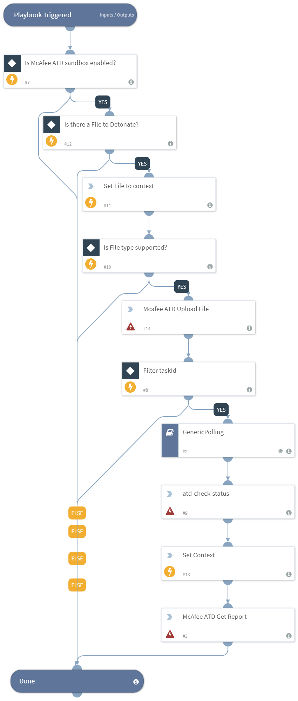

Detonates a File using the McAfee Advanced Threat Defense sandbox.

Advanced Threat Defense supports the following File Types:

32-bit Portable Executables (PE)files; 64-bit PE+files exe, sys, dll, com, scr, cpl, ocx, cgi.

Microsoft Office Suite documents:

doc, dotm, docx, dotx, xls, ppam, xlsx, pps, xlsb, ppsx, xlsm, ppsm, ppt, ppt, pptx, pptm, rtf, shs, xltm, sldm, xltx, sldx, xlam, thmx, docm, xar.

Just Systems Ichitaro documents:

jtd, jtdc.

Adobe

pdf, swf.

Compressed files:

gz, 7z, tgz, msi, zip, lzh, cab, lzma, rar.

Android application package:

apk, Java, JAR, CLASS, Java Script, Java bin files.

Image files:

jpeg, png, gif.

Other file types:

cmd, ace, bat, arj, vbs, chm, xml, lnk, url, mof, htm, ocx, html, potm, eml, potx, msg, ps1, vb, reg, vba, wsc, vbe, wsf, vbs, wsh.

## Dependencies
This playbook uses the following sub-playbooks, integrations, and scripts.

### Sub-playbooks
* GenericPolling

### Integrations
This playbook does not use any integrations.

### Scripts
* Set

### Commands
* atd-file-upload
* atd-get-report
* atd-check-status

## Playbook Inputs
---

| **Name** | **Description** | **Default Value** | **Source** | **Required** |
| --- | --- | --- | --- | --- |
| File | The file to detonate. The file is taken from the context. | None | File | Optional |
| Interval | How often the polling command should run (in minutes). | 1 | - | Optional |
| Timeout | How much time to wait before a timeout occurs (in minutes). | 15 |-  | Optional |

## Playbook Outputs
---

| **Path** | **Description** | **Type** |
| --- | --- | --- |
| ATD.Task.taskId | The task ID of the sample uploaded. | string |
| ATD.Task.jobId | The job ID of the sample uploaded. | string |
| ATD.Task.messageId | The message ID relevant to the sample uploaded. | string |
| ATD.Task.srcIp | The source IPv4 address. | string |
| ATD.Task.destIp | The destination IPv4 address. | string |
| ATD.Task.MD5 | The MD5 hash of the sample uploaded. | string |
| ATD.Task.SHA1 | The SHA1 hash of the sample uploaded. | string |
| ATD.Task.SHA256 | The SHA256 hash of the sample uploaded. | string |
| File.Name | The filename (only in case of report type=json). | string |
| File.Type | The file type. For example, "PE" (only in case of report type=json). | string |
| File.Size | The file size (only in case of report type=json). | number |
| File.MD5 | The MD5 hash of the file (only in case of report type=json). | string |
| File.SHA1 | The SHA1 hash of the file (only in case of report type=json). | string |
| File.SHA256 | The SHA256 hash of the file (only in case of report type=json). | string |
| File.EntryID | The entry ID of the sample. | string |
| File.Malicious.Vendor | The vendor that made the decision that the file is malicious. | string |
| File.Malicious.Description | The reason for the vendor to make the decision that the file is malicious. | string |
| DBotScore.Indicator | The indicator that was tested (only in case of report type=json). | string |
| DBotScore.Type | The type of the indicator (only in case of report type=json). | string |
| DBotScore.Vendor | The vendor used to calculate the score (only in case of report type=json). | string |
| DBotScore.Score | The actual score (only in case of report type=json). | number |
| IP.Address | The IP addresses's relevant to the sample. | string |
| InfoFile.EntryID | The EntryID of the report file. | string |
| InfoFile.Extension | The extension of the report file. | string |
| InfoFile.Name | The name of the report file. | string |
| InfoFile.Info | The info of the report file. | string |
| InfoFile.Size | The size of the report file. | number |
| InfoFile.Type | The type of the report file. | string |
| File | The file object. | unknown |
| File.Malicious | The file malicious object. | unknown |
| DBotScore | The DBotScore object. | unknown |
| InfoFile | The report file object. | unknown |

## Playbook Image
---

