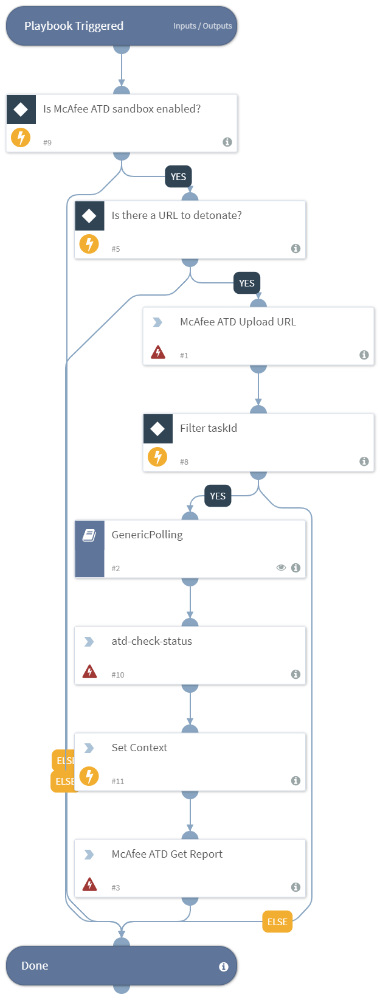

Detonates a URL using the McAfee Advanced Threat Defense Sandbox integration.

## Dependencies
This playbook uses the following sub-playbooks, integrations, and scripts.

### Sub-playbooks
* GenericPolling

### Integrations
This playbook does not use any integrations.

### Scripts
* Set

### Commands
* atd-check-status
* atd-get-report
* atd-file-upload

## Playbook Inputs
---

| **Name** | **Description** | **Default Value** | **Source** | **Required** |
| --- | --- | --- | --- | --- |
| URL | The URL to detonate. | Data | URL | Optional |
| Interval | The polling frequency. How often the polling command should run (in minutes). | 1 | - | Optional |
| Timeout | How much time to wait before a timeout occurs (in minutes). | 15 | - | Optional |

## Playbook Outputs
---

| **Path** | **Description** | **Type** |
| --- | --- | --- |
| ATD.Task.taskId | The task ID of the sample uploaded. | string |
| ATD.Task.jobId | The job ID of the sample uploaded. | string |
| ATD.Task.messageId | The message ID relevant to the sample uploaded. | string |
| ATD.Task.url | The URL detonated. | string |
| ATD.Task.srcIp | The source IPv4 address. | string |
| ATD.Task.destIp | The destination IPv4 address. | string |
| ATD.Task.MD5 | The MD5 hash of the sample uploaded. | string |
| ATD.Task.SHA1 | The SHA1 hash of the sample uploaded. | string |
| ATD.Task.SHA256 | The SHA256 hash of the sample uploaded. | string |
| File.Name | The filename (only in case of report type=json). | string |
| File.Type | The file type. For example, "PE" (only in case of report type=json). | string |
| File.MD5 | The MD5 hash of the file (only in case of report type=json). | string |
| File.SHA1 | The SHA1 hash of the file (only in case of report type=json). | string |
| File.SHA256 | The SHA256 hash of the file (only in case of report type=json). | string |
| File.EntryID | The entry ID of the sample. | string |
| DBotScore.Indicator | The indicator that was tested (only in case of report type=json). | string |
| DBotScore.Type | The type of the indicator (only in case of report type=json). | string |
| DBotScore.Vendor | The vendor used to calculate the score (only in case of report type=json). | string |
| DBotScore.Score | The actual score (only in case of report type=json). | number |
| IP.Address | The IP addresses's relevant to the sample. | string |
| InfoFile.EntryID | The EntryID of the report file. | string |
| InfoFile.Extension | The extension of the report file. | string |
| InfoFile.Name | The name of the report file. | string |
| InfoFile.Info | The info of the report file. | string |
| InfoFile.Size | The size of the report file. | number |
| InfoFile.Type | The type of the report file. | string |
| File | The file object. | unknown |
| File.Malicious | The file's malicious object. | unknown |
| DBotScore | The DBotScore object. | unknown |
| InfoFile | The report file object. | unknown |
| URL.Malicious | The URL malicious object. | unknown |

## Playbook Image
---

