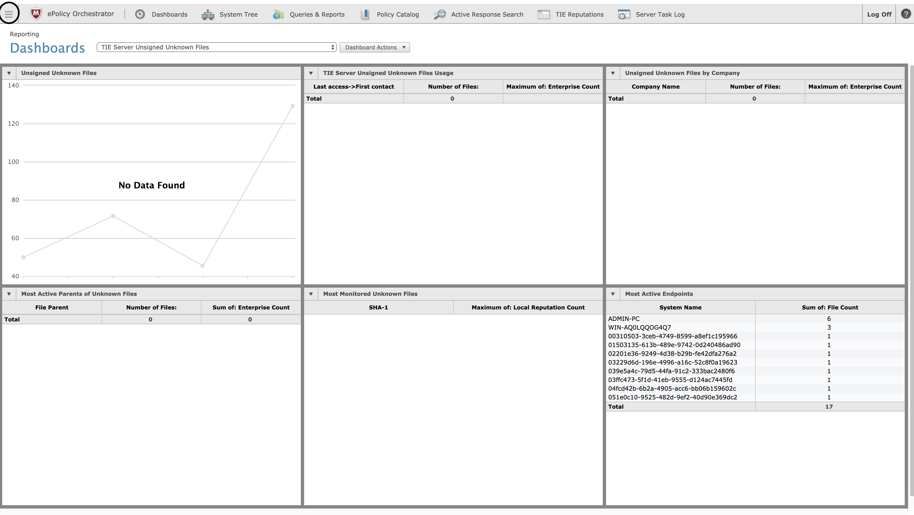
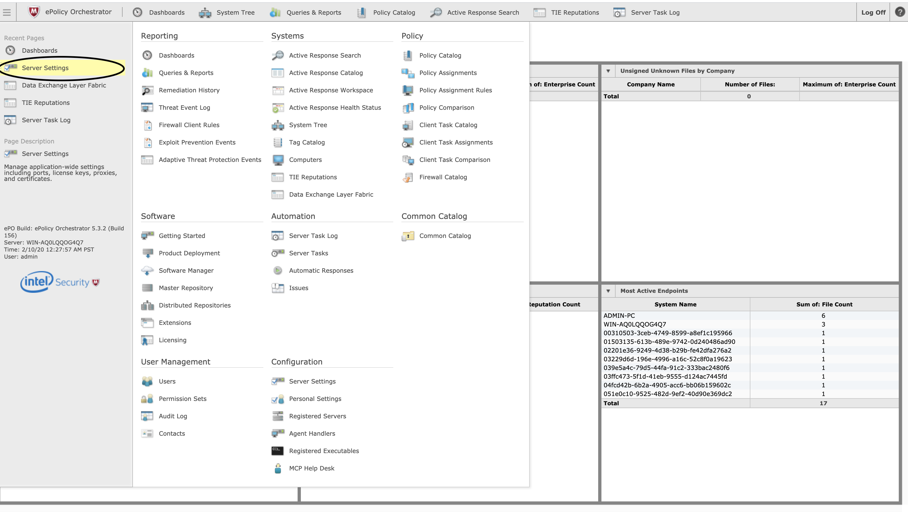
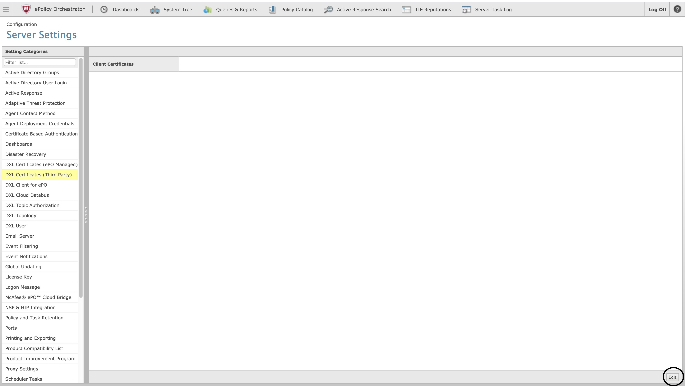
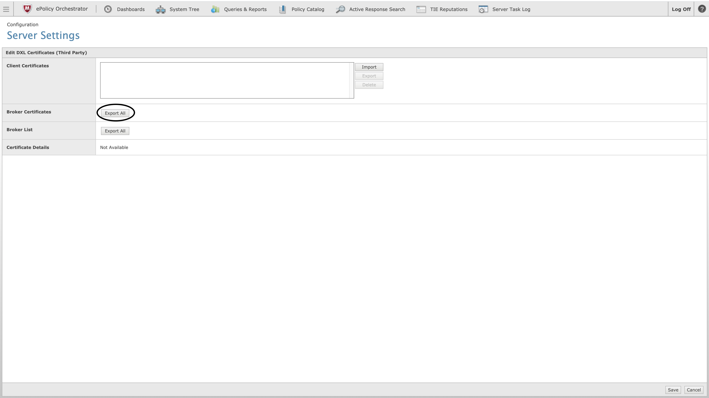
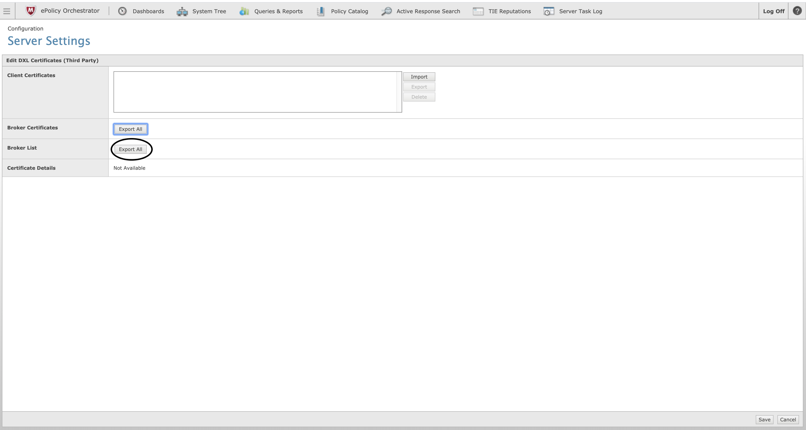
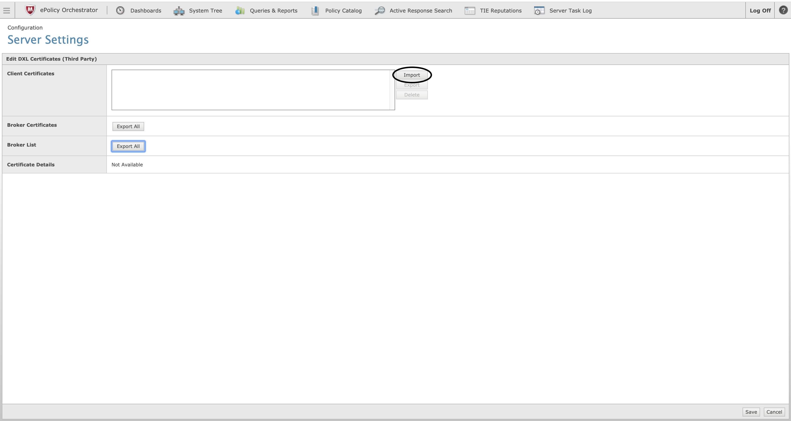
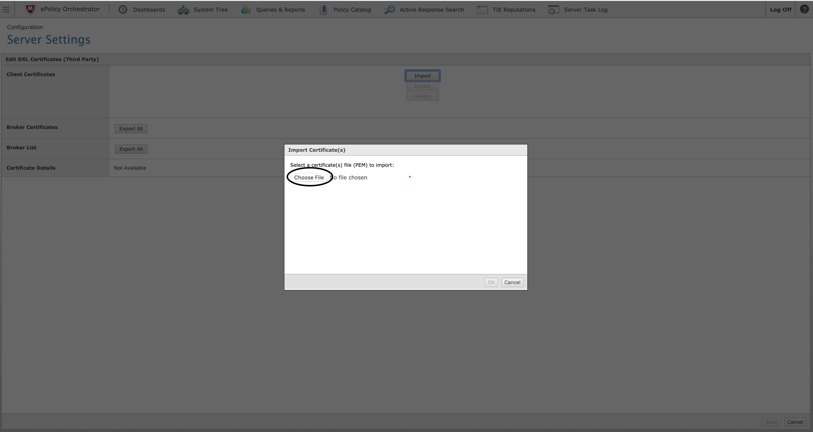
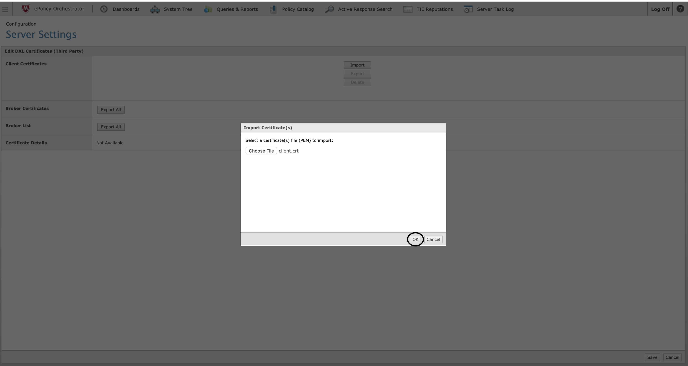
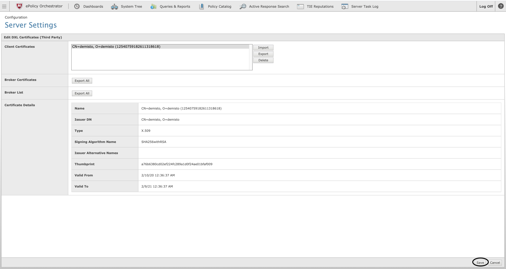

Use the McAfee DXL integration to connect and optimize security actions across multiple vendor products.

## How to Create the RSA Key Pair
Before you configure the ePO server, you need to generate the RSA key pair. Make sure that **openssl** is installed.
1. Open a new directory.
2. Download the [sh script](https://github.com/demisto/content/blob/master/Packs/McAfee_DXL/doc_files/create_keys.sh) and move it to the new directory.
3. Run the script.
4. Complete the required fields, except the challenge password and the optional company name (leave empty).  
The certificate (**client.crt**) is valid for 365 days (you can change the value in the script).

After the script finishes running, you should have the following files.
        - **client.key** (private key)
        - **client.crt** (public key)
        - **client.csr** (certificate request that is not required for the configuration flow)

## Configure the ePO Server
To configure the ePO server, you need to upload the public key.

1. In ePO server go to **Menu > Server Settings**.
    
    
2. Under DXL certificates (Third Party) click **Edit**.
    
3. download the brokers certificate.
    
4. Download the brokers list.
    
5. Click **Import** and select the **client.crt** file.
    
    
    
6. Click **Save**.
    
7. Test the integration (it may take a few minutes until the key is enabled).

## Configure McAfee DXL on Cortex XSOAR

1. Navigate to **Settings** > **Integrations** > **Servers & Services**.
2. Search for McAfee DXL.
3. Click **Add instance** to create and configure a new integration instance.

| **Parameter** | **Description** | **Required** |
| --- | --- | --- |
| broker_ca_bundle | Broker CA certificates content (see `brokercerts.crt` in the instructions). | True |
| cert_file | Client certificates content (see `client.crt` in the instructions). | True |
| private_key | Client private key content (e.g. `client.key`) | True |
| broker_urls | Brokers URLs (comma separated list in the form of [ssl://]&lt;hostname&gt;[:port]). Get the hostname & port from the `brokerlist.properties` file in the instructions. Note that the broker should be reachable from the Cortex XSOAR server. | True |
| push_ip_topic | The topic for which to publish the 'dxl-push-ip'. | False |
| push_url_topic | The topic for which to publish the 'dxl-push-url'. | False |
| push_domain_topic | The topic for which to publish the 'dxl-push-domain'. | False |
| push_hash_topic | The topic for which to publish the 'dxl-push-hash'. | False |

4. Click **Test** to validate the URLs, token, and connection.
## Commands
You can execute these commands from the Cortex XSOAR CLI, as part of an automation, or in a playbook.
After you successfully execute a command, a DBot message appears in the War Room with the command details.
### 1. Send an event to DXL
***
Sends the specified event to the DXL fabric.
##### Base Command

`dxl-send-event`
##### Input

| **Argument Name** | **Description** | **Required** |
| --- | --- | --- |
| topic | The topic for which to publish the message. | Required | 
| payload | The event payload. | Required | 


##### Context Output

There is no context output for this command.

##### Command Example
```dxl-send-event topic="TOPIC_NAME" payload="The message"```

##### Human Readable Output

Successfully sent event

### 2. Push an IP address to DXL
***
Pushes an IP address to the DXL fabric.

##### Base Command

`dxl-push-ip`
##### Input

| **Argument Name** | **Description** | **Required** |
| --- | --- | --- |
| ip | The IP address to push to the DXL fabric. | Required | 
| trust_level | The new trust level for the IP address. Can be: "NOT_SET", "KNOWN_MALICIOUS", "MOST_LIKELY_MALICIOUS", "UNKNOWN", "MIGHT_BE_TRUSTED", "MOST_LIKELY_TRUSTED", "KNOWN_TRUSTED", or "KNOWN_TRUSTED_INSTALLER". | Required | 
| topic | The topic for which to publish the 'dxl-push-ip'. | Optional | 


##### Context Output

There is no context output for this command.

##### Command Example
```dxl-push-ip ip="104.196.188.170" trust_level="KNOWN_TRUSTED" topic="IP_LISTENER"```

##### Human Readable Output

Successfully pushed ip 104.196.188.170 with trust level KNOWN_TRUSTED


### 3. Push the URL to DXL
***
Pushes the URL to the DXL fabric.

##### Base Command

`dxl-push-url`
##### Input

| **Argument Name** | **Description** | **Required** |
| --- | --- | --- |
| url | The URL to push to the DXL fabric. | Required | 
| trust_level | The new trust level for the URL. Can be: "NOT_SET", "KNOWN_MALICIOUS", "MOST_LIKELY_MALICIOUS", "UNKNOWN", "MIGHT_BE_TRUSTED", "MOST_LIKELY_TRUSTED", "KNOWN_TRUSTED", or "KNOWN_TRUSTED_INSTALLER". | Required | 
| topic | The topic for which to publish the 'dxl-push-url'. | Optional | 


##### Context Output

There is no context output for this command.

##### Command Example
```dxl-push-url url="https://www.demisto.com" trust_level="KNOWN_TRUSTED" topic="URL_LISTENER"```

##### Human Readable Output

Successfully pushed URL https://www.demisto.com with trust level KNOWN_TRUSTED

### 4. Push a domain to DXL
***
Pushes a domain to the DXL fabric
##### Base Command

`dxl-push-domain`
##### Input

| **Argument Name** | **Description** | **Required** |
| --- | --- | --- |
| domain | The domain to push to the DXL fabric. | Required | 
| trust_level | The new trust level for the domain. Can be: "NOT_SET", "KNOWN_MALICIOUS", "MOST_LIKELY_MALICIOUS", "UNKNOWN", "MIGHT_BE_TRUSTED", "MOST_LIKELY_TRUSTED", "KNOWN_TRUSTED", or "KNOWN_TRUSTED_INSTALLER". | Required | 
| topic | The topic for which to publish the 'dxl-push-domain'. | Optional | 


##### Context Output

There is no context output for this command.

##### Command Example
```dxl-push-domain domain="demisto.com" trust_level="KNOWN_TRUSTED" topic="DOMAIN_LISTENER"```

##### Human Readable Output

Successfully pushed domain demisto.com with trust level KNOWN_TRUSTED

### 5. Push a file hash to DXL
***
Pushes a file hash to the DXL fabric.
##### Base Command

`dxl-push-hash`
##### Input

| **Argument Name** | **Description** | **Required** |
| --- | --- | --- |
| hash | The hash to push to the DXL fabric. | Required | 
| trust_level | The new trust level for the domain. Can be: "NOT_SET", "KNOWN_MALICIOUS", "MOST_LIKELY_MALICIOUS", "UNKNOWN", "MIGHT_BE_TRUSTED", "MOST_LIKELY_TRUSTED", "KNOWN_TRUSTED", or "KNOWN_TRUSTED_INSTALLER". | Required | 
| topic | The topic for which to publish the 'dxl-push-hash'. | Optional | 


##### Context Output

There is no context output for this command.

##### Command Example
```dxl-push-hash hash="HASH_TO_SEND" trust_level="KNOWN_TRUSTED" topic="HASH_LISTENER"```

##### Human Readable Output

Successfully pushed hash HASH_TO_SEND with trust level KNOWN_TRUSTED
