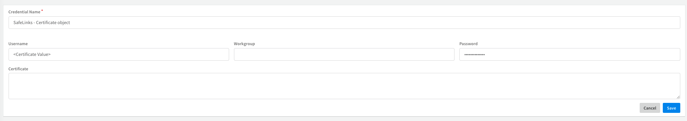

## O365 Defender Safe Links

### App authentication
To use this integration, you need to add a new Azure App Registration in the Azure Portal.
1. To create the application, follow the instructions in this [guide](https://docs.microsoft.com/en-us/powershell/exchange/app-only-auth-powershell-v2?view=exchange-ps).
2. Run the **CreateCertificate** script from the `EWS` pack in Cortex XSOAR to acquire the certificate. You can also provide your own certificate or perform the instructions in the following Microsoft article: [Generate a self-signed certificate](https://docs.microsoft.com/en-us/powershell/exchange/app-only-auth-powershell-v2?view=exchange-ps#step-3-generate-a-self-signed-certificate).
3. Attach the .cer file to your Azure App. See the following [article](https://docs.microsoft.com/en-us/powershell/exchange/app-only-auth-powershell-v2?view=exchange-ps#step-4-attach-the-certificate-to-the-azure-ad-application) for an example.
4. Copy the contents of the .txt file and paste it in the Certificate parameter of the integration's instance.

#### Required Permissions
* In the Azure Application you created give the following application permission:

        Office 365 Exchange Online -> Exchange.ManageAsApp - Application
* To create, modify, and delete Safe Links policies, you need to be a member of the `Organization Management` or `Security Administrator` role groups.
* To manage permissions in the Microsoft Defender XDR portal, go to `Permissions & roles` or https://security.microsoft.com/securitypermissions. You need to be a global administrator or a member of the Organization Management role group in the Microsoft Defender XDR portal. Specifically, the Role Management role allows users to view, create, and modify role groups in the Microsoft Defender XDR portal, and by default, that role is assigned only to the Organization Management role group.
* See [Permissions in the Microsoft Defender XDR portal](https://docs.microsoft.com/en-us/microsoft-365/security/office-365-security/permissions-microsoft-365-security-center?view=o365-worldwide) for more information.

-------
##### Note
If the credentials object is used, make sure to set the `certificate` value as the `username` property and not as the certificate field

