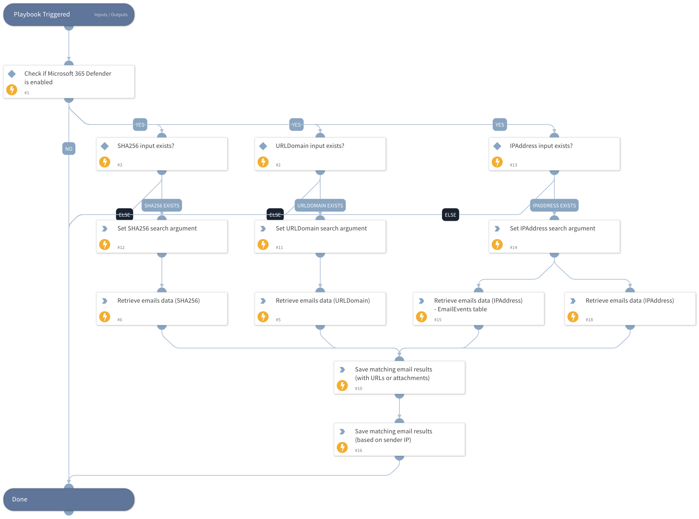

This playbook will retrieve emails data based on the "URLDomain", "SHA256" and "IPAddress" inputs.
**SHA256** - Emails with attachments matching the "SHA256" input will be retrieved.
**URLDomain** - Emails containing URLs (in the body) which the "URLDomain" input is their substring will be retrieved.
**IPAddress** - Emails with "SenderIPv4"/SenderIPv6" or URLs (in the body) matching the "IPAddress" input will be retrieved.

## Dependencies
This playbook uses the following sub-playbooks, integrations, and scripts.

### Sub-playbooks
This playbook does not use any sub-playbooks.

### Integrations
* Microsoft 365 Defender

### Scripts
* SetAndHandleEmpty
* Set
* IsIntegrationAvailable

### Commands
* microsoft-365-defender-advanced-hunting

## Playbook Inputs
---

| **Name** | **Description** | **Default Value** | **Required** |
| --- | --- | --- | --- |
| URLDomain | Domain or URL to search within emails. Can be a single domain or URL or an array of domains or URLs to search. The search will look for the exact Domain or URL. |  | Optional |
| SHA256 | The SHA256 hash file or an array of hashes to search within emails. |  | Optional |
| IPAddress | The source or destination IP address to search. Can be a single address or an array of list of addresses. |  | Optional |
| Timeout | The time limit in seconds for the http request to run. Default is 60. | 60 | Optional |
| SearchTimeframe | Number of days in the past to search in. Default is 7. | 7 | Optional |
| ResultsLimit | Number of retrieved entries.  Enter -1 for unlimited query. 50 is the default. | 50 | Optional |

## Playbook Outputs
---

| **Path** | **Description** | **Type** |
| --- | --- | --- |
| Microsoft365Defender.RetrievedEmails | Email objects containing relevant fields. | string |
| Microsoft365Defender.RetrievedEmails.InternetMessageId | Internet Message ID of the email. | string |
| Microsoft365Defender.RetrievedEmails.SenderFromDomain | Sender domain. | string |
| Microsoft365Defender.RetrievedEmails.EmailDirection | Email direction \(inbound/outbound\). | string |
| Microsoft365Defender.RetrievedEmails.DeliveryLocation | Delivery location. | string |
| Microsoft365Defender.RetrievedEmails.AuthenticationDetails | Authentication details \(SPF, DKIM, DMARC, CompAuth\) | string |
| Microsoft365Defender.RetrievedEmails.DeliveryAction | Delivery action. | string |
| Microsoft365Defender.RetrievedEmails.Subject | Email subject. | string |
| Microsoft365Defender.RetrievedEmails.AttachmentCount | Number of attachments. | string |
| Microsoft365Defender.RetrievedEmails.ThreatNames | Threat names. | string |
| Microsoft365Defender.RetrievedEmails.RecipientEmailAddress | Recipient email address. | string |
| Microsoft365Defender.RetrievedEmails.EmailAction | Email action. | string |
| Microsoft365Defender.RetrievedEmails.EmailLanguage | Email language. | string |
| Microsoft365Defender.RetrievedEmails.SenderFromAddress | Sender address. | string |
| Microsoft365Defender.RetrievedEmails.Timestamp | Timestamp. | string |
| Microsoft365Defender.RetrievedEmails.SenderDisplayName | Sender display name. | string |
| Microsoft365Defender.RetrievedEmails.SenderIPv4 | Sender IPv4 | string |
| Microsoft365Defender.RetrievedEmails.ConfidenceLevel | Confidence level | string |
| Microsoft365Defender.RetrievedEmails.ThreatTypes | Threat types | string |
| Microsoft365Defender.RetrievedEmails.SHA256 | SHA256 of the attachments \(if exist in the email\). | string |
| Microsoft365Defender.RetrievedEmails.Url | Urls found in the email's body. | string |
| Microsoft365Defender.RetrievedEmails.UrlCount | Number of URLs found in the email's body. | string |
| Microsoft365Defender.RetrievedEmails.SenderIPv6 | Sender IPv6. | unknown |

## Playbook Image
---
