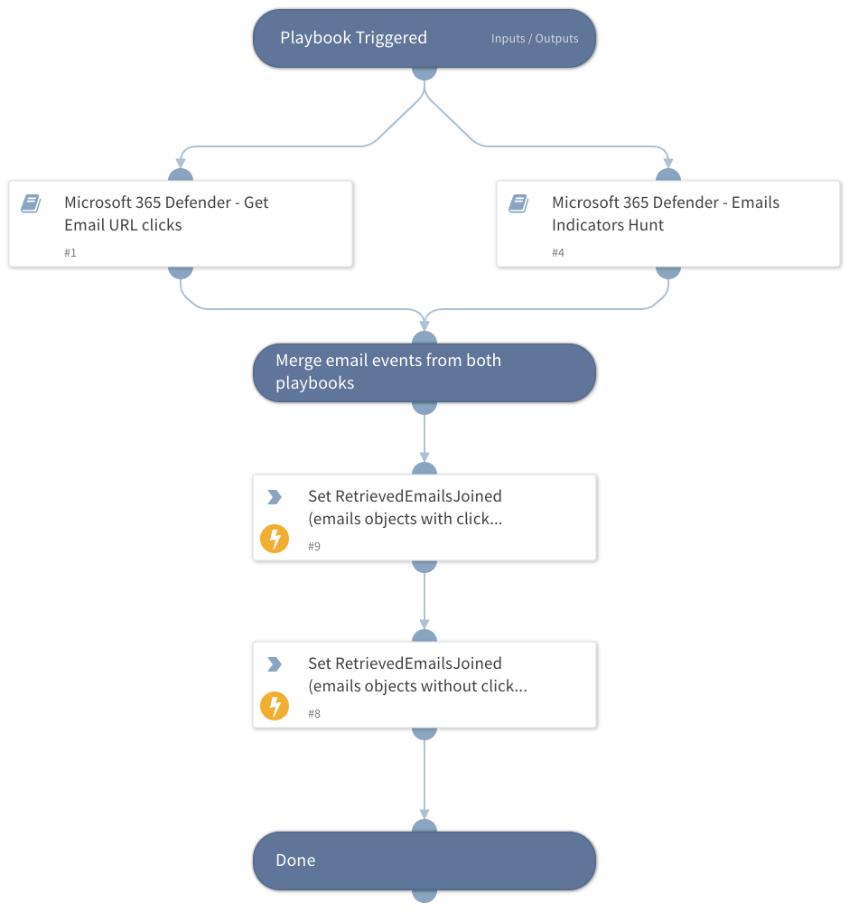

This playbook retrieves email data based on the `URLDomain`, `SHA256`, `IPAddress`, and `MessageID` inputs. The output is a unified object with all of the retrieved emails based on the following sub-playbooks outputs:

- **Microsoft 365 Defender - Get Email URL clicks**:
        Retrieves data based on URL click events.

- **Microsoft 365 Defender - Emails Indicators Hunt**:
        Retrieves data based on several different email events.

Read the playbooks' descriptions in order to get the full details.

## Dependencies
This playbook uses the following sub-playbooks, integrations, and scripts.

### Sub-playbooks
* Microsoft 365 Defender - Get Email URL Clicks
* Microsoft 365 Defender - Emails Indicators Hunt

### Integrations
This playbook does not use any integrations.

### Scripts
* SetAndHandleEmpty

### Commands
This playbook does not use any commands.

## Playbook Inputs
---

| **Name** | **Description** | **Default Value** | **Required** |
| --- | --- | --- | --- |
| URLDomain | Domain or URL to search within emails. Can be a single domain or URL, or an array of domains or URLs to search. |  | Optional |
| SHA256 | The SHA256 hash file or an array of hashes to search within emails. |  | Optional |
| IPAddress | The source or destination IP address to search. Can be a single address or an array of IP addresses. |  | Optional |
| MessageID | Message ID of the email from which the URL was clicked. Note that this can be either of the following 2 values: - The value of the header "Message-ID". - The internal ID of the message within Microsoft's products \(e.g NetworkMessageId\).  Can be a single MessageID or an array of NMessageIDs to search. |  | Optional |
| Timeout | The time limit in seconds for the HTTP request to run.  | 180 | Optional |
| SearchTimeframe | Number of days past to search. | 7 | Optional |
| ResultsLimit | Number of retrieved entries. Enter -1 for unlimited query. | 50 | Optional |
| ListenerMailbox | The mailbox of the listening integration. In case it is provided, the emails found in it will be ignored. |  | Optional |

## Playbook Outputs
---

| **Path** | **Description** | **Type** |
| --- | --- | --- |
| Microsoft365Defender.RetrievedEmails | Email objects containing relevant fields related to URL click events. | string |
| Microsoft365Defender.RetrievedEmails.InternetMessageId | Public-facing identifier for the email that is set by the sending email system. This will be the value of the "Message-ID" header. | string |
| Microsoft365Defender.RetrievedEmails.SenderFromDomain | Sender domain in the FROM header, which is visible to email recipients on their email clients. | string |
| Microsoft365Defender.RetrievedEmails.EmailDirection | Direction of the email relative to your network: Inbound, Outbound, Intra-org. | string |
| Microsoft365Defender.RetrievedEmails.DeliveryLocation | Location where the email was delivered: Inbox/Folder, On-premises/External, Junk, Quarantine, Failed, Dropped, Deleted items. | string |
| Microsoft365Defender.RetrievedEmails.AuthenticationDetails | List of pass or fail verdicts by email authentication protocols like DMARC, DKIM, SPF or a combination of multiple authentication types \(CompAuth\). | string |
| Microsoft365Defender.RetrievedEmails.DeliveryAction | Delivery action of the email: Delivered, Junked, Blocked, or Replaced. | string |
| Microsoft365Defender.RetrievedEmails.Subject | Subject of the email. | string |
| Microsoft365Defender.RetrievedEmails.AttachmentCount | Number of attachments in the email. | number |
| Microsoft365Defender.RetrievedEmails.ThreatNames | Detection name for malware or other threats found. | string |
| Microsoft365Defender.RetrievedEmails.RecipientEmailAddress | Email address of the recipient, or email address of the recipient after distribution list expansion. | string |
| Microsoft365Defender.RetrievedEmails.EmailAction | Final action taken on the email based on filter verdict, policies, and user actions: Move message to junk mail folder, Add X-header, Modify subject, Redirect message, Delete message, Send to quarantine, No action taken, Bcc message. | string |
| Microsoft365Defender.RetrievedEmails.EmailLanguage | Email language. | string |
| Microsoft365Defender.RetrievedEmails.SenderFromAddress | Sender email address in the FROM header, which is visible to email recipients on their email clients. | string |
| Microsoft365Defender.RetrievedEmails.Timestamp | Date and time when the record was generated. | string |
| Microsoft365Defender.RetrievedEmails.SenderDisplayName | Sender display name. | string |
| Microsoft365Defender.RetrievedEmails.SenderIPv4 | IPv4 address of the last detected mail server that relayed the message. | string |
| Microsoft365Defender.RetrievedEmails.ConfidenceLevel | List of confidence levels of any spam or phishing verdicts. For spam, this column shows the spam confidence level \(SCL\), indicating if the email was skipped \(-1\), found to be not spam \(0,1\), found to be spam with moderate confidence \(5,6\), or found to be spam with high confidence \(9\). For phishing, this column displays whether the confidence level is "High" or "Low". | string |
| Microsoft365Defender.RetrievedEmails.ThreatTypes | Verdict from the email filtering stack on whether the email contains malware, phishing, or other threats. | unknown |
| Microsoft365Defender.RetrievedEmails.SHA256 | SHA256 of the attachments \(if exists in the email\). | string |
| Microsoft365Defender.RetrievedEmails.Url | URL that was clicked. | string |
| Microsoft365Defender.RetrievedEmails.UrlCount | Number of embedded URLs in the email. | number |
| Microsoft365Defender.RetrievedEmails.SenderIPv6 | IPv6 address of the last detected mail server that relayed the message. | string |
| Microsoft365Defender.RetrievedEmails.AccountUpn | User principal name \(UPN\) of the account. | string |
| Microsoft365Defender.RetrievedEmails.IsClickedThrough | Indicates whether the user was able to click through to the original URL or not. | number |
| Microsoft365Defender.RetrievedEmails.BulkComplaintLevel | Threshold assigned to email from bulk mailers. A high bulk complain level \(BCL\) means the email is more likely to generate complaints, and thus more likely to be spam. | string |
| Microsoft365Defender.RetrievedEmails.IPAddress | IP address assigned to the device during communication. | string |
| Microsoft365Defender.RetrievedEmails.DetectionMethods | Methods used to detect whether the URL contains or leads to malware, phishing, or other threats. | string |
| Microsoft365Defender.RetrievedEmails.ActionType | Type of activity that triggered the event. | string |
| Microsoft365Defender.RetrievedEmails.UrlChain | List of URLs in the redirection chain. | string |
| Microsoft365Defender.RetrievedEmails.NetworkMessageId | Unique identifier for the email, generated by Office 365. | string |
| Microsoft365Defender.RetrievedEmails.DisplayName | Name of the sender displayed in the address book, typically a combination of a given or first name, a middle initial, and a last name or surname. | string |
| Microsoft365Defender.RetrievedEmails.SenderMailFromDomain | Sender domain in the MAIL FROM header, also known as the envelope sender or the Return-Path address. | string |
| Microsoft365Defender.RetrievedEmails.SenderMailFromAddress | Sender email address in the MAIL FROM header, also known as the envelope sender or the Return-Path address. | string |
| Microsoft365Defender.RetrievedEmails.ClickTimestamp | Date and time when the record was generated \(url click\). | unknown |

## Playbook Image
---

