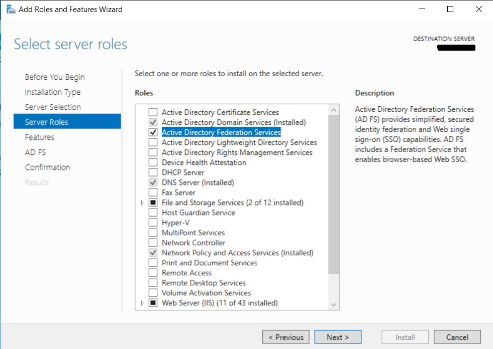
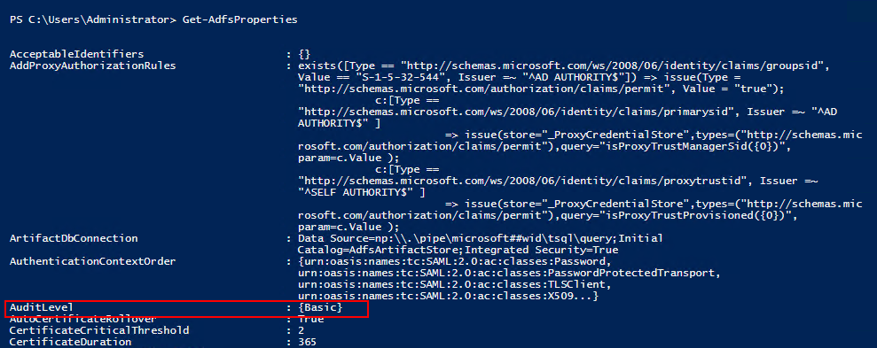
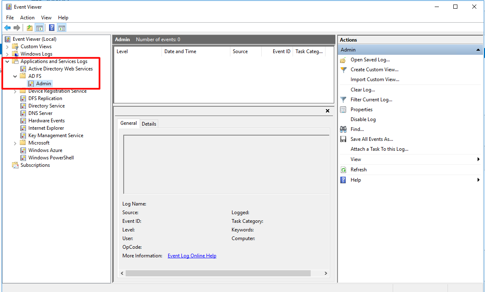
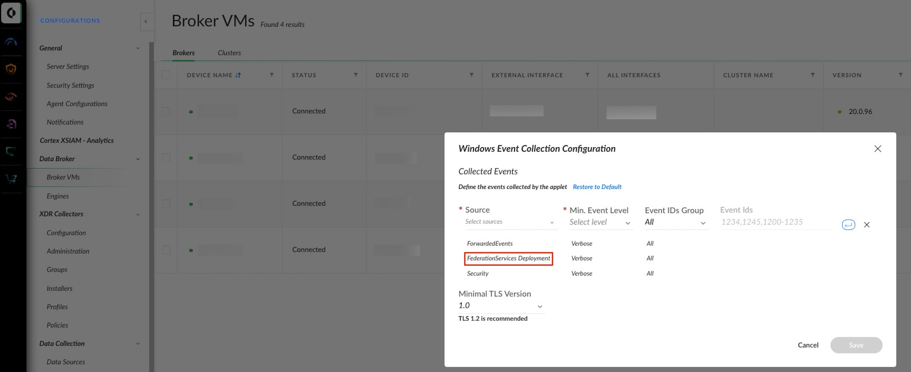

# Microsoft AD FS
​
This pack includes XSIAM content.

​
**Notes:** 
- The logs will be stored in the dataset called *microsoft_adfs_raw*.
- The default content provided in this pack (including Winlogbeat templates) should be used as is.  We cannot support any changes made to this content.

## Configuration on Server Side
#### Validate that AD FS server role is enabled
1. In the **Server Manager**, click **Manage** > **Add Roles and Features**.
2. Click **Server Roles** in the left menu.
3. Validate that **Active Directory Federation Services** is selected and installed.

   
4. To enable logging of AD FS, run the following commands in PowerShell with administrative privileges:
   - ***Set-AdfsProperties -LogLevel Basic*** - This command will enable basic logging of AD FS.
   - ***Get-AdfsProperties*** - This command will validate that the *AuditLevel* is set to *Basic*.

    
5. Additional validation of the logging can be located at the Windows *Event Viewer*:

   1. Run ***eventvwr.msc*** in the search bar.
   2.  In the left directory tree, select **Applications and Services Logs** and validate that *AD FS* exists and *Admin* logs are located in the folder

    

## Collect Events from Vendor
Use the following option to collect events from the vendor:
​
- [Broker VM - Windows Event Collector (Recommended)](#broker-vm)
- [XDRC (XDR Collector)](#xdrc-xdr-collector)
​
​
### Broker VM (Windows Event Collector)
To create or configure the Broker VM, use the information described [here](https://docs-cortex.paloaltonetworks.com/r/Cortex-XDR/Cortex-XDR-Pro-Administrator-Guide/Configure-the-Broker-VM).


To connect and use Windows Event Collector, use the information described [here](https://docs-cortex.paloaltonetworks.com/r/Cortex-XDR/Cortex-XDR-Pro-Administrator-Guide/Activate-the-Windows-Event-Collector).

When configuring the Windows Event Collector (WEC), use the following settings in the **Configurations** > **Broker VMs** > **WEC** > **Collection Configuration** section:
- **Source**: "FederationServices Deployment"
- **Min. Event Level**: "Verbose"
- **Event IDs Group**: "All"

  * Pay attention: Timestamp parsing support is under the assumption that a UTC +0000 format is being used.



### XDRC (XDR Collector)
​
To create or configure the Winlogbeat collector, use the information described [here](https://docs-cortex.paloaltonetworks.com/r/Cortex-XDR/Cortex-XDR-Pro-Administrator-Guide/XDR-Collectors).

As Cortex XSIAM provides a YAML template for Microsoft AD FS Event Logs, you can use the following steps to create a collection profile:

 1. In Cortex XSIAM, select **Settings** → **Configurations** → **XDR Collectors** → **Profiles** → **+Add Profile** → **Windows**.
 2. Select **Winlogbeat**, then click **Next**.
 3. Configure the General Information parameters:
   - Profile Name — Specify a unique Profile Name to identify the profile. The name can contain only letters, numbers, or spaces, and must be no more than 30 characters. The name you choose will be visible from the list of profiles when you configure a policy.

   - Add description here — (Optional) Provide additional context for the purpose or business reason that explains why you are creating the profile.

 4. Configure the settings for the profile selected in Step 2. To add the "Microsoft AD FS" template, select it and click **Add**.

**Note:** The AD FS XDR Collector supports **AD FS** and **ADFS Auditing** logs (provider_name).

#### Winlogbeat Configuration File
```
winlogbeat.event_logs: 
  - name: AD FS Auditing
    processors:
      - add_fields:
          fields:
            vendor: microsoft
            product: adfs
  - name: AD FS/Admin
    processors:
      - add_fields:
          fields:
            vendor: microsoft
            product: adfs
```