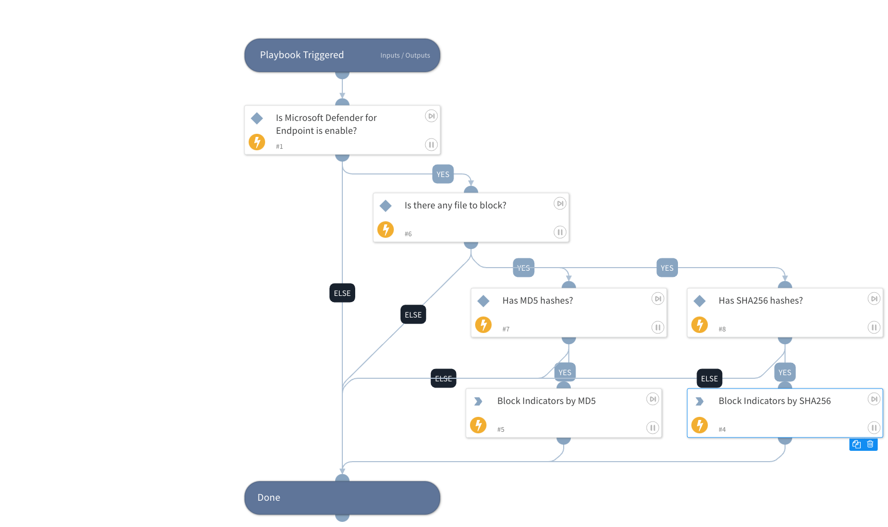

This playbook receives an MD5 or a SHA256 hash and adds it to the block list in Microsoft Defender for Endpoint. 
The playbook uses the integration "Microsoft Defender for Endpoint".

## Dependencies

This playbook uses the following sub-playbooks, integrations, and scripts.

### Sub-playbooks

This playbook does not use any sub-playbooks.

### Integrations

MicrosoftDefenderAdvancedThreatProtection

### Scripts

IsIntegrationAvailable

### Commands

microsoft-atp-sc-indicator-create

## Playbook Inputs

---

| **Name** | **Description** | **Default Value** | **Required** |
| --- | --- | --- | --- |
| Severity  | The severity of the malicious behavior identified by the data within the indicator, where High is the most severe and Informational is not severe at all. |  | Optional |
| IndicatorDescription | Brief description \(100 characters or less\) of the threat represented by the indicator. | Added by Cortex XSOAR | Required |
| IndicatorTitle | The indicator alert title in Defender. | Added by Cortex XSOAR | Required |
| GenerateAlert | Whether to generate an alert or not. The default is true. | true | Optional |
| Hash | In this input you can insert either MD5 or SHA256 to block. |  | Optional |

## Playbook Outputs

---
There are no outputs for this playbook.

## Playbook Image

---

