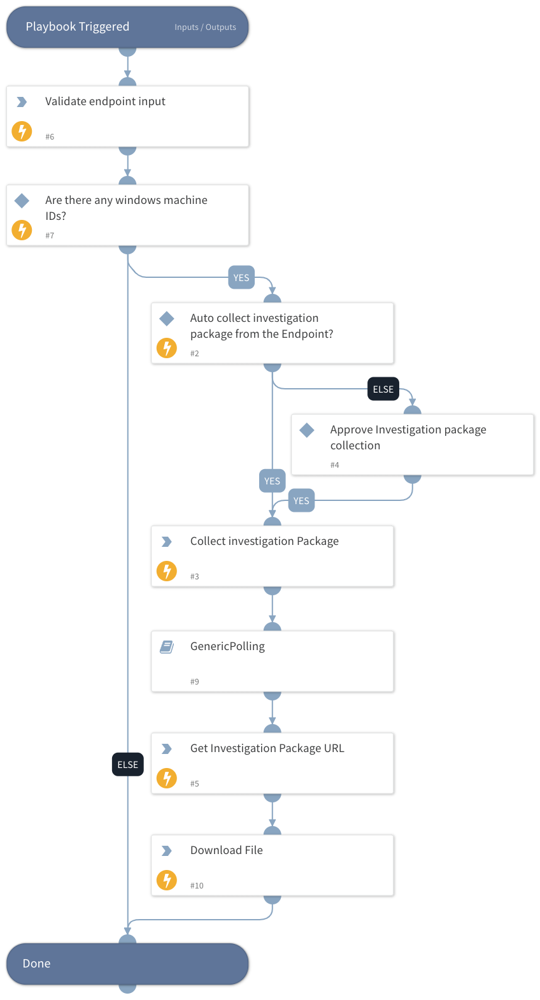

This playbook simplifies retrieving investigation packages to Cortex XSOAR from supported machines (See https://docs.microsoft.com/en-us/microsoft-365/security/defender-endpoint/collect-investigation-package?view=o365-worldwide).  
The playbook receives information about the target devices (host name, IP, and device ID), validates the devices exist, and retrieves the collection package from those machines into the Cortex XSOAR console.  
**Note:**  
This action may take time, the average package size is around ~15 MB. 

## Dependencies
This playbook uses the following sub-playbooks, integrations, and scripts.

### Sub-playbooks
This playbook does not use any sub-playbooks.

### Integrations
Microsoft Defender Advanced Threat Protection

### Scripts
This playbook does not use any scripts.

### Commands
* endpoint
* microsoft-atp-request-and-download-investigation-package

## Playbook Inputs
---

| **Name** | **Description** | **Default Value** | **Required** |
| --- | --- | --- | --- |
| AutoCollectinvestigationPackege | Choose True to skip user validation on retrieving the investigation pack within the provided assets. | True | Optional |
| Hostnames | A comma-separated list of host names. |  | Optional |
| MachineIDs | A comma-separated list of machine IDs. |  | Optional |
| IPs | A comma-separated list of machine IPs. |  | Optional |

## Playbook Outputs
---

| **Path** | **Description** | **Type** |
| --- | --- | --- |
| MicrosoftATP.MachineAction | Microsoft Defender For Endpoint machine action details. | unknown |

## Playbook Image
---

