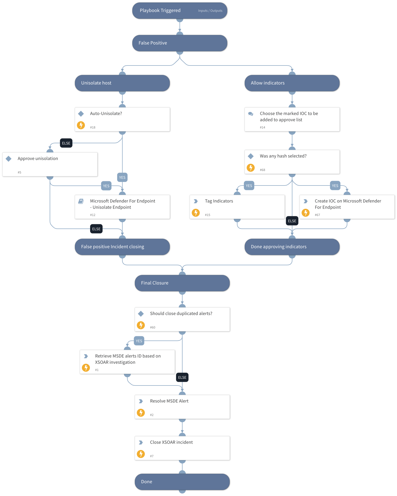

This Playbook handles a false-positive incident closure for Microsoft defender for endpoint 

## Dependencies
This playbook uses the following sub-playbooks, integrations, and scripts.

### Sub-playbooks
* Microsoft Defender For Endpoint - Unisolate Endpoint

### Integrations
* MicrosoftDefenderAdvancedThreatProtection

### Scripts
* SearchIncidentsV2

### Commands
* closeInvestigation
* setIndicators
* microsoft-atp-sc-indicator-create
* microsoft-atp-update-alert

## Playbook Inputs
---

| **Name** | **Description** | **Default Value** | **Required** |
| --- | --- | --- | --- |
| DupAlertIDsToBeClosed | XSOAR Investigation IDs to be closed  |  | Optional |
| Comment | Add comment to close an incident on the Microsoft Defender For Endpoint side | XSOAR Incident #${incident.id} | Optional |
| Reason | Provide a reason for closing the incident. Please choose on of the following suggestions: "NotAvailable"/"Apt,Malware"/"SecurityPersonnel"/"SecurityTesting"/"UnwantedSoftware"/"Other" |  | Optional |
| Classification | Choose From - "Unknown" / "TruePositive" / "FalsePositive" |  | Optional |
| AllowTag | Specify the approving tag name for found indicators. | AllowTag | Optional |
| AutoUnisolation | Indicates if automatic un-isolation is allowed     True/False | False | Optional |
| CloseDuplicate | Determine if the duplicate incidents should be closed as well in Microsoft Defender Instance. The playbook will look for the world "Close" in this input. |  | Optional |
| HostID | The ID of the host for running an un-isolation process. | ${incident.deviceid} | Optional |
| FileSha256 | Enter the File Sha256 you would like to block. | ${incident.filesha256} | Optional |

## Playbook Outputs
---
There are no outputs for this playbook.

## Playbook Image
---
