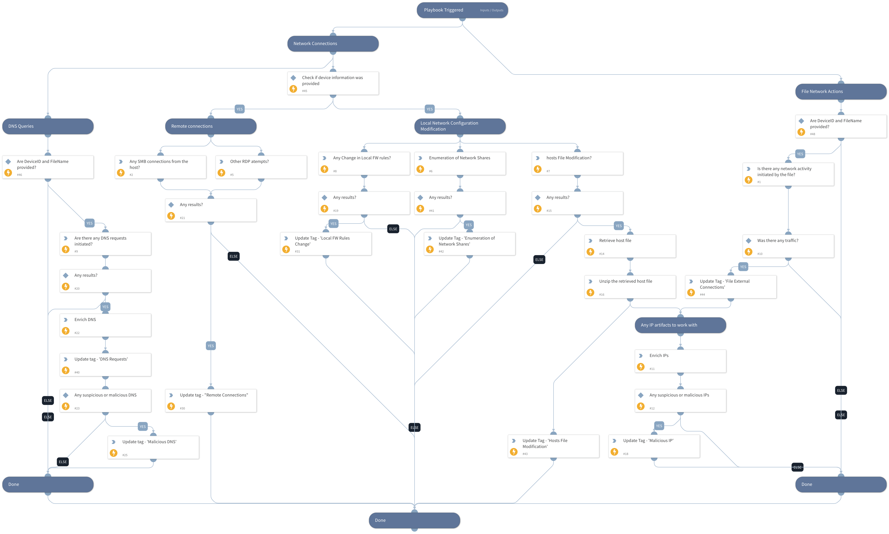

This playbook is part of the 'Malware Investigation And Response' pack. For more information, refer to https://xsoar.pan.dev/docs/reference/packs/malware-investigation-and-response.
This playbook uses the Microsoft Defender For Endpoint Advanced Hunting feature to hunt for host network activity.

## Dependencies
This playbook uses the following sub-playbooks, integrations, and scripts.

### Sub-playbooks
This playbook does not use any sub-playbooks.

### Integrations
* MicrosoftDefenderAdvancedThreatProtection

### Scripts
* UnzipFile

### Commands
* microsoft-atp-advanced-hunting-persistence-evidence
* microsoft-atp-advanced-hunting-network-connections
* setIncident
* domain
* microsoft-atp-advanced-hunting-lateral-movement-evidence
* ip
* microsoft-atp-live-response-get-file

## Playbook Inputs
---

| **Name** | **Description** | **Default Value** | **Required** |
| --- | --- | --- | --- |
| DeviceName | A comma-separated list of host names to hunt. | incident.hostnames | Optional |
| DeviceID | A comma-separated list of device IDs to hunt. | incident.agentsid | Optional |
| FileSha256 | A comma-separated list of file SHA256 hashes to hunt. | incident.filesha256 | Optional |

## Playbook Outputs
---

| **Path** | **Description** | **Type** |
| --- | --- | --- |
| MicrosoftATP.HuntNetworkConnections.Result | The query results for Hunt Network Connections. | unknown |
| MicrosoftATP.HuntNetworkConnections.Result.external_addresses | The query results for external_addresses query_purpose. | unknown |
| MicrosoftATP.HuntNetworkConnections.Result.dns_query | The query results for dns_query query_purpose. | unknown |
| MicrosoftATP.HuntNetworkConnections.Result.encoded_commands | The query results for encoded_commands query_purpose. | unknown |
| MicrosoftATP.HuntLateralMovementEvidence.Result | The query results for Hunt Lateral Movement Evidence. | unknown |
| MicrosoftATP.HuntLateralMovementEvidence.Result.network_connections | The query results for network_connections query_purpose. | unknown |
| MicrosoftATP.HuntLateralMovementEvidence.Result.smb_connections | The query results for smb_connections query_purpose. | unknown |
| MicrosoftATP.HuntLateralMovementEvidence.Result.credential_dumping | The query results for credential_dumping query_purpose. | unknown |
| MicrosoftATP.HuntLateralMovementEvidence.Result.management_connection | The query results for management_connection query_purpose. | unknown |
| MicrosoftATP.HuntPersistenceEvidence.Result | The query results for Hunt Persistence Evidence. | unknown |
| MicrosoftATP.HuntPersistenceEvidence.Result.scheduled_job | The query results for scheduled_job query_purpose. | unknown |
| MicrosoftATP.HuntPersistenceEvidence.Result.registry_entry | The query results for registry_entry query_purpose. | unknown |
| MicrosoftATP.HuntPersistenceEvidence.Result.startup_folder_changes | The query results for startup_folder_changes query_purpose. | unknown |
| MicrosoftATP.HuntPersistenceEvidence.Result.new_service_created | The query results for new_service_created query_purpose. | unknown |
| MicrosoftATP.HuntPersistenceEvidence.Result.service_updated | The query results for service_updated query_purpose. | unknown |
| MicrosoftATP.HuntPersistenceEvidence.Result.file_replaced | The query results for file_replaced query_purpose. | unknown |
| MicrosoftATP.HuntPersistenceEvidence.Result.new_user | The query results for new_user query_purpose. | unknown |
| MicrosoftATP.HuntPersistenceEvidence.Result.new_group | The query results for new_group query_purpose. | unknown |
| MicrosoftATP.HuntPersistenceEvidence.Result.group_user_change | The query results for group_user_change query_purpose. | unknown |
| MicrosoftATP.HuntPersistenceEvidence.Result.local_firewall_change | The query results for local_firewall_change query_purpose. | unknown |
| MicrosoftATP.HuntPersistenceEvidence.Result.host_file_change | The query results for host_file_change query_purpose. | unknown |

## Playbook Image
---
