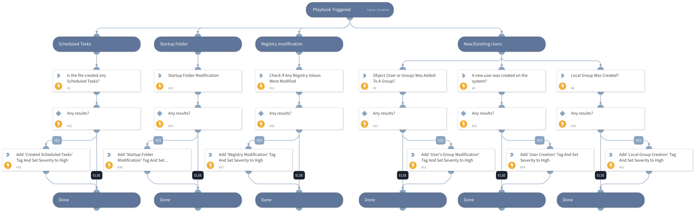

This playbook is part of the 'Malware Investigation And Response' pack. For more information, refer to https://xsoar.pan.dev/docs/reference/packs/malware-investigation-and-response.
This playbook uses the Microsoft Defender For Endpoint Advanced Hunting feature to hunt for host persistence evidence.

## Dependencies
This playbook uses the following sub-playbooks, integrations, and scripts.

### Sub-playbooks
This playbook does not use any sub-playbooks.

### Integrations
* MicrosoftDefenderAdvancedThreatProtection

### Scripts
This playbook does not use any scripts.

### Commands
* setIncident
* microsoft-atp-advanced-hunting-persistence-evidence

## Playbook Inputs
---

| **Name** | **Description** | **Default Value** | **Required** |
| --- | --- | --- | --- |
| FileSha256 | A comma-separated list of file SHA256 hashes to hunt. | incident.filesha256 | Optional |
| DeviceName | A comma-separated list of host names to hunt. | incident.hostnames | Optional |
| FileName | A comma-separated list of file names to hunt. | incident.filenames | Optional |
| DeviceID | A comma-separated list of a device IDs to hunt. | incident.agentsid | Optional |

## Playbook Outputs
---

| **Path** | **Description** | **Type** |
| --- | --- | --- |
| MicrosoftATP.HuntPersistenceEvidence.Result | The query results for Hunt Persistence Evidence. | unknown |
| MicrosoftATP.HuntPersistenceEvidence.Result.scheduled_job | The query results for scheduled_job query_purpose. | unknown |
| MicrosoftATP.HuntPersistenceEvidence.Result.registry_entry | The query results for registry_entry query_purpose. | unknown |
| MicrosoftATP.HuntPersistenceEvidence.Result.startup_folder_changes | The query results for startup_folder_changes query_purpose. | unknown |
| MicrosoftATP.HuntPersistenceEvidence.Result.new_service_created | The query results for new_service_created query_purpose. | unknown |
| MicrosoftATP.HuntPersistenceEvidence.Result.service_updated | The query results for service_updated query_purpose. | unknown |
| MicrosoftATP.HuntPersistenceEvidence.Result.file_replaced | The query results for file_replaced query_purpose. | unknown |
| MicrosoftATP.HuntPersistenceEvidence.Result.new_user | The query results for new_user query_purpose. | unknown |
| MicrosoftATP.HuntPersistenceEvidence.Result.new_group | The query results for new_group query_purpose. | unknown |
| MicrosoftATP.HuntPersistenceEvidence.Result.group_user_change | The query results for group_user_change query_purpose. | unknown |
| MicrosoftATP.HuntPersistenceEvidence.Result.local_firewall_change | The query results for local_firewall_change query_purpose. | unknown |
| MicrosoftATP.HuntPersistenceEvidence.Result.host_file_change | The query results for host_file_change query_purpose. | unknown |

## Playbook Image
---
