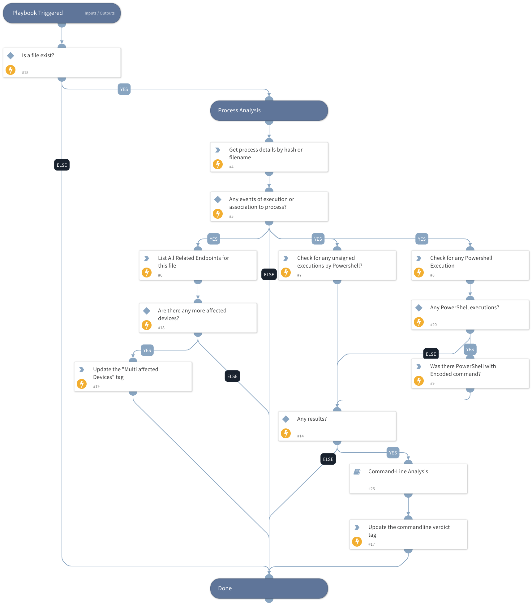

This playbook is part of the 'Malware Investigation And Response' pack. For more information, refer to https://xsoar.pan.dev/docs/reference/packs/malware-investigation-and-response.
This playbook uses the Microsoft Defender For Endpoint Advanced Hunting feature to hunt for host PowerShell executions.

## Dependencies
This playbook uses the following sub-playbooks, integrations, and scripts.

### Sub-playbooks
* Command-Line Analysis

### Integrations
* MicrosoftDefenderAdvancedThreatProtection

### Scripts
This playbook does not use any scripts.

### Commands
* microsoft-atp-advanced-hunting-process-details
* microsoft-atp-advanced-hunting-network-connections
* microsoft-atp-get-file-related-machines
* setIncident

## Playbook Inputs
---

| **Name** | **Description** | **Default Value** | **Required** |
| --- | --- | --- | --- |
| DeviceName | A comma-separated list of host names to hunt. | incident.hostnames | Optional |
| FileName | A comma-separated list of file names to hunt. | incident.filenames | Optional |
| DeviceID | A comma-separated list of device IDs to hunt. | incident.agentsid | Optional |
| FileMd5 | A comma-separated list of file MD5 hashes to hunt. | incident.filemd5 | Optional |
| FileSha256 | A comma-separated list of file SHA256 hashes to hunt. | incident.filesha256 | Optional |
| FileSha1 | A comma-separated list of file SHA1 hashes to hunt. | incident.filesha1 | Optional |

## Playbook Outputs
---

| **Path** | **Description** | **Type** |
| --- | --- | --- |
| MicrosoftATP.HuntProcessDetails.Result | The query results for Process Details. | unknown |
| MicrosoftATP.HuntProcessDetails.Result.parent_process | The query results for parent_process query_purposeThe query results. | unknown |
| MicrosoftATP.HuntProcessDetails.Result.grandparent_process | The query results for grandparent_process query_purpose. | unknown |
| MicrosoftATP.HuntProcessDetails.Result.process_details | The query results for process_details query_purpose. | unknown |
| MicrosoftATP.HuntProcessDetails.Result.beaconing_evidence | The query results for beaconing_evidence query_purpose. | unknown |
| MicrosoftATP.HuntProcessDetails.Result.powershell_execution_unsigned_files | The query results for powershell_execution_unsigned_files query_purpose. | unknown |
| MicrosoftATP.HuntProcessDetails.Result.process_excecution_powershell | The query results for process_excecution_powershell query_purpose. | unknown |
| MicrosoftATP.FileMachine.Machines | The Query results for getting a collection of machines with a given file SHA1 hash. | unknown |
| MicrosoftATP.FileMachine.Machines.ID | The machine ID. | unknown |
| MicrosoftATP.FileMachine.Machines.ComputerDNSName | The machine DNS name. | unknown |
| MicrosoftATP.FileMachine.Machines.FirstSeen | The first date and time the machine was observed by Microsoft Defender ATP. | unknown |
| MicrosoftATP.FileMachine.Machines.LastSeen | The last date and time the machine was observed by Microsoft Defender ATP. | unknown |
| MicrosoftATP.FileMachine.Machines.OSPlatform | The operating system platform. | unknown |
| MicrosoftATP.FileMachine.Machines.OSVersion | The operating system version. | unknown |
| MicrosoftATP.FileMachine.Machines.OSBuild | Operating system build number. | unknown |
| MicrosoftATP.FileMachine.Machines.LastIPAddress | The last IP on the machine. | unknown |
| MicrosoftATP.FileMachine.Machines.LastExternalIPAddress | The last machine IP to access the internet. | unknown |
| MicrosoftATP.FileMachine.Machines.HelathStatus | The machine health status. | unknown |
| MicrosoftATP.FileMachine.Machines.RBACGroupID | The machine RBAC group ID. | unknown |
| MicrosoftATP.FileMachine.Machines.RBACGroupName | The machine RBAC group name. | unknown |
| MicrosoftATP.FileMachine.Machines.RiskScore | The machine risk score. | unknown |
| MicrosoftATP.FileMachine.Machines.ExposureLevel | The machine exposure score. | unknown |
| MicrosoftATP.FileMachine.Machines.IsAADJoined | True if machine is AAD joined, False otherwise. | unknown |
| MicrosoftATP.FileMachine.Machines.AADDeviceID | The AAD Device ID. | unknown |
| MicrosoftATP.FileMachine.Machines.MachineTags | Set of machine tags. | unknown |
| MicrosoftATP.Machine | Results for device information. | unknown |
| MicrosoftATP.Machine.OSProcessor | The operating system processor. | unknown |
| MicrosoftATP.FileMachine | Results for File information on a device. | unknown |
| MicrosoftATP.FileMachine.File | The machine related file hash. | unknown |
| MicrosoftATP.HuntNetworkConnections.Result | The query results for Hunt Network Connections. | unknown |
| MicrosoftATP.HuntNetworkConnections.Result.external_addresses | The query results for external_addresses query_purpose. | unknown |
| MicrosoftATP.HuntNetworkConnections.Result.dns_query | The query results for dns_query query_purpose. | unknown |
| MicrosoftATP.HuntNetworkConnections.Result.encoded_commands | The query results for encoded_commands query_purpose. | unknown |
| MatchRegex | The regex found in the command line | unknown |
| Indicators | Indicators extracted from the command line | unknown |
| commandline | The command line | unknown |
| CommandlineVerdict | The command line verdict | unknown |

## Playbook Image
---
