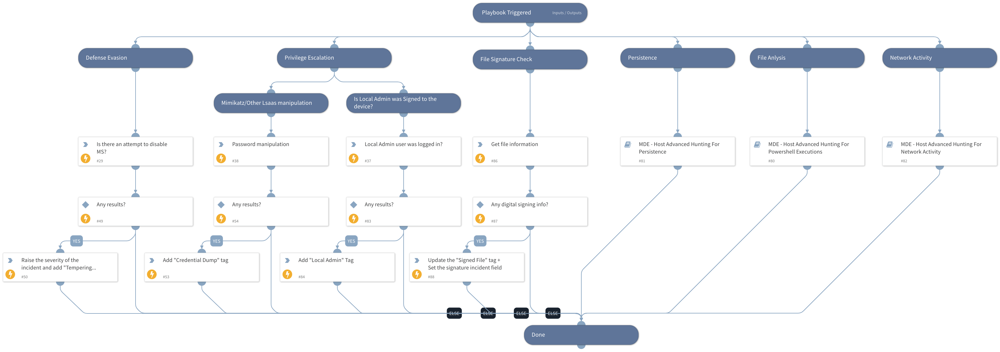

This playbook is part of the 'Malware Investigation And Response' pack. For more information, refer to https://xsoar.pan.dev/docs/reference/packs/malware-investigation-and-response.
This playbook uses the Microsoft Defender For Endpoint Advanced Hunting feature based on the provided inputs.

## Dependencies
This playbook uses the following sub-playbooks, integrations, and scripts.

### Sub-playbooks
* MDE - Host Advanced Hunting For Powershell Executions
* MDE - Host Advanced Hunting For Network Activity
* MDE - Host Advanced Hunting For Persistence

### Integrations
* MicrosoftDefenderAdvancedThreatProtection

### Scripts
This playbook does not use any scripts.

### Commands
* microsoft-atp-get-file-info
* microsoft-atp-advanced-hunting-tampering
* microsoft-atp-advanced-hunting-lateral-movement-evidence
* microsoft-atp-advanced-hunting
* setIncident
* microsoft-atp-advanced-hunting-privilege-escalation

## Playbook Inputs
---

| **Name** | **Description** | **Default Value** | **Required** |
| --- | --- | --- | --- |
| FileSha1 | A comma-separated list of file SHA1 hashes to hunt. |  | Optional |
| FileSha256 | A comma-separated list of file Sha256 hashes to hunt. |  | Optional |
| IP | A comma-separated list of IPs to hunt. |  | Optional |
| DeviceName | A comma-separated list of host names to hunt. |  | Optional |
| FileName | A comma-separated list of file names to hunt. |  | Optional |
| DeviceID | A comma-separated list of device ID to hunt. |  | Optional |
| FileMd5 | A comma-separated list of file MD5 hashes to hunt. |  | Optional |
| QueryBatch | Define the custom queries you would like to run as a part of the 'MDE - Host Advanced Hunting' playbook. This input will be passed to the 'query_batch' argument in the '\!microsoft-atp-advanced-hunting' command. For more information and examples, check the command's hints. |  | Optional |

## Playbook Outputs
---

| **Path** | **Description** | **Type** |
| --- | --- | --- |
| MicrosoftATP.HuntTampering | The query results for hunt tampering. | unknown |
| MicrosoftATP.HuntTampering.Result | The query results. | unknown |
| MicrosoftATP.HuntPrivilegeEscalation | The query results for hunt privilege escalation. | unknown |
| MicrosoftATP.HuntPrivilegeEscalation.Result | The query results. | unknown |
| MicrosoftATP.HuntLateralMovementEvidence.Result | The query results for hunt lateral movement evidence. | unknown |
| MicrosoftATP.HuntLateralMovementEvidence.Result.network_connections | Query results from the Microsoft Defender For Endpoint Advanced Hunting on network connections. | unknown |
| MicrosoftATP.HuntLateralMovementEvidence.Result.smb_connections | Query Results from the Microsoft Defender For Endpoint Advanced Hunting on SMB connections. | unknown |
| MicrosoftATP.HuntLateralMovementEvidence.Result.credential_dumping | Query results from the Microsoft Defender For Endpoint Advanced Hunting on credential dumping. | unknown |
| MicrosoftATP.HuntLateralMovementEvidence.Result.management_connection | Query results from the Microsoft Defender For Endpoint Advanced Hunting on management connections. | unknown |
| MicrosoftATP.HuntPersistenceEvidence | Query results from the Microsoft Defender For Endpoint Advanced Hunting for hunt lateral movement evidence. | unknown |
| MicrosoftATP.HuntPersistenceEvidence.Result | Query results from the Microsoft Defender For Endpoint Advanced Hunting for hunt persistence evidence. | unknown |
| MicrosoftATP.HuntPersistenceEvidence.Result.scheduled_job | Query results from the Microsoft Defender For Endpoint Advanced Hunting for scheduled jobs. | unknown |
| MicrosoftATP.HuntPersistenceEvidence.Result.registry_entry | Query results from the Microsoft Defender For Endpoint Advanced Hunting for registry entries. | unknown |
| MicrosoftATP.HuntPersistenceEvidence.Result.startup_folder_changes | Query results from the Microsoft Defender For Endpoint Advanced Hunting for startup folder changes. | unknown |
| MicrosoftATP.HuntPersistenceEvidence.Result.new_service_created | Query results from the Microsoft Defender For Endpoint Advanced Hunting for created new services. | unknown |
| MicrosoftATP.HuntPersistenceEvidence.Result.service_updated | Query results from the Microsoft Defender For Endpoint Advanced Hunting for updated services. | unknown |
| MicrosoftATP.HuntPersistenceEvidence.Result.file_replaced | Query results from the Microsoft Defender For Endpoint Advanced Hunting for replaced files. | unknown |
| MicrosoftATP.HuntPersistenceEvidence.Result.new_user | Query results from the Microsoft Defender For Endpoint Advanced Hunting for new users. | unknown |
| MicrosoftATP.HuntPersistenceEvidence.Result.new_group | Query results from the Microsoft Defender For Endpoint Advanced Hunting for new groups. | unknown |
| MicrosoftATP.HuntPersistenceEvidence.Result.group_user_change | Query results from the Microsoft Defender For Endpoint Advanced Hunting for changes in group users. | unknown |
| MicrosoftATP.HuntPersistenceEvidence.Result.local_firewall_change | Query results from the Microsoft Defender For Endpoint Advanced Hunting for changes in the local firewall. | unknown |
| MicrosoftATP.HuntPersistenceEvidence.Result.host_file_change | Query results from the Microsoft Defender For Endpoint Advanced Hunting for changes in the host file. | unknown |
| MicrosoftATP.File | File information from Microsoft ATP. | unknown |

## Playbook Image
---

