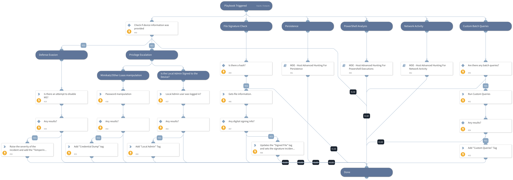

This playbook will use the Microsoft Defender For Endpoint feature - Advanced Hunting. The hunt will be done based on provided inputs.

## Dependencies
This playbook uses the following sub-playbooks, integrations, and scripts.

### Sub-playbooks
* 1da35988-954b-489f-8973-89a62b0cc89c
* 23621c27-b05b-4630-8017-d6f1c2b4a15e
* 5a158ad1-7561-43de-8662-87706a82f2ae

### Integrations
* MicrosoftDefenderAdvancedThreatProtection

### Scripts
This playbook does not use any scripts.

### Commands
* microsoft-atp-advanced-hunting-privilege-escalation
* setIncident
* microsoft-atp-advanced-hunting-tampering
* microsoft-atp-advanced-hunting-lateral-movement-evidence
* microsoft-atp-get-file-info

## Playbook Inputs
---

| **Name** | **Description** | **Default Value** | **Required** |
| --- | --- | --- | --- |
| FileSha1 | Enter File Sha1 to hunt on. Can be a comma-separated list. |  | Optional |
| FileSha256 | Enter File Sha256 to hunt on. Can be a comma-separated list. |  | Optional |
| IP | Enter an IP to hunt on.  Can be a comma-separated list. |  | Optional |
| DeviceName | Enter a Hostname to hunt on.  Can be a comma-separated list. |  | Optional |
| FileName | Enter a File name to hunt on.  Can be a comma-separated list. |  | Optional |
| DeviceID | Enter a device ID to hunt on.  Can be a comma-separated list. |  | Optional |
| FileMd5 | Enter File MD5 to hunt on. Can be a comma-separated list. |  | Optional |

## Playbook Outputs
---
There are no outputs for this playbook.

## Playbook Image
---
