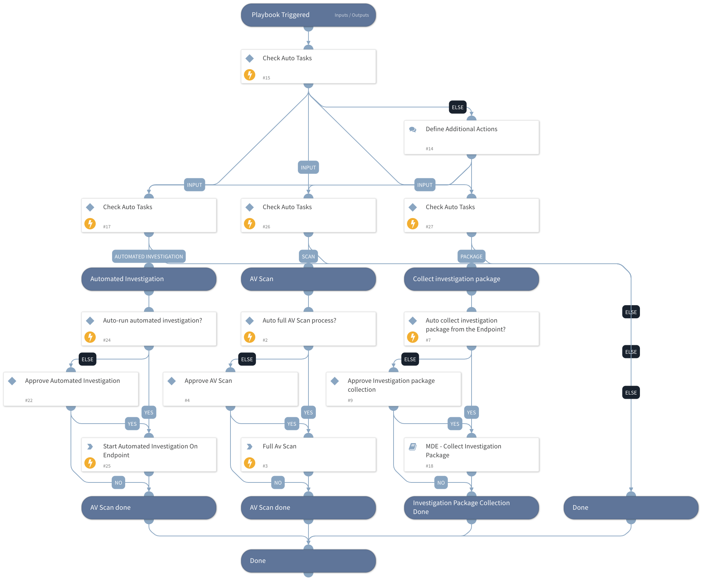

This playbook is part of the 'Malware Investigation And Response' pack. For more information, refer to https://xsoar.pan.dev/docs/reference/packs/malware-investigation-and-response.
This playbook supports investigation actions for the analyst, including:  
- Running a full AV scan for a specific endpoint.
- Requesting an investigation package (a zip file containing forensic data with a size of ~ 15MB) from an endpoint.
- Requesting to run automatic investigation on an endpoint.

## Dependencies
This playbook uses the following sub-playbooks, integrations, and scripts.

### Sub-playbooks
Microsoft Defender For Endpoint - Collect investigation package

### Integrations
MicrosoftDefenderAdvancedThreatProtection

### Scripts
This playbook does not use any scripts.

### Commands
* microsoft-atp-run-antivirus-scan
* microsoft-atp-start-investigation

## Playbook Inputs
---

| **Name** | **Description** | **Default Value** | **Required** |
| --- | --- | --- | --- |
| Task | Option for input \( can be entered as comma-separated values\): \`Full Scan\` - Fully Scan the provided endpoint/s \`Collect Investigation Package\` - Collect investigation package from endpoint/s \(only for supported devices\) \`Automated Investigation\` - Run Automated Investigation on the provided endpoint |  | Optional |
| EndpointsID | Provide a list of endpoints for the Scan and Collection of investigation Package to be run on. |  | Optional |
| AutoCollectinvestigationPackege | True/Fasle | True | Optional |
| AutoAVScan | True/Fasle | True | Optional |
| AutoAutomatedInvestigation | True/Fasle | True | Optional |

## Playbook Outputs
---
There are no outputs for this playbook.

## Playbook Image
---

