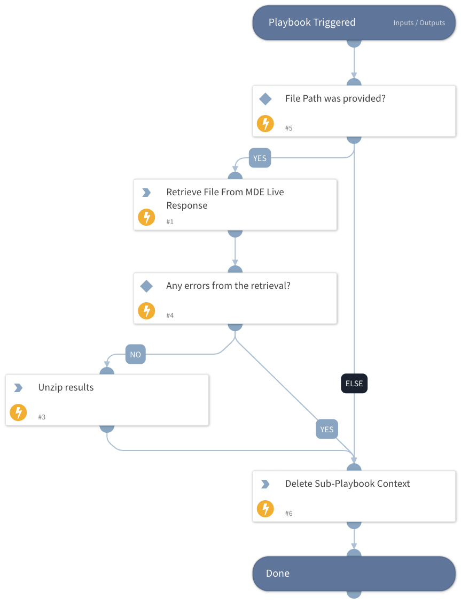

This playbook is part of the ‘Malware Investigation And Response’ pack. For more information, refer to https://xsoar.pan.dev/docs/reference/packs/malware-investigation-and-response.
This playbook uses the Live Response feature to retrieve a file from an endpoint.
The playbook supports a supplied machine id as an input. Otherwise, it will take the Device ID incident field.
The playbook supports only one element to be retrieved for each task (if needed more then one - use the playbook loop feature).

## Dependencies

This playbook uses the following sub-playbooks, integrations, and scripts.

### Sub-playbooks

This playbook does not use any sub-playbooks.

### Integrations

* MicrosoftDefenderAdvancedThreatProtection

### Scripts

* isError
* UnzipFile

### Commands

* microsoft-atp-live-response-get-file

## Playbook Inputs

---

| **Name** | **Description** | **Default Value** | **Required** |
| --- | --- | --- | --- |
| paths | The file paths to be provided. |  | Optional |
| MachineID | The ID of the machine. |  | Optional |

## Playbook Outputs

---

| **Path** | **Description** | **Type** |
| --- | --- | --- |
| ExtractedFiles | A list of file names that were extracted from the ZIP file. | Unknown |
| MicrosoftATP.LiveResponseAction.status | The machine action status. | unknown |

## Playbook Image

---

