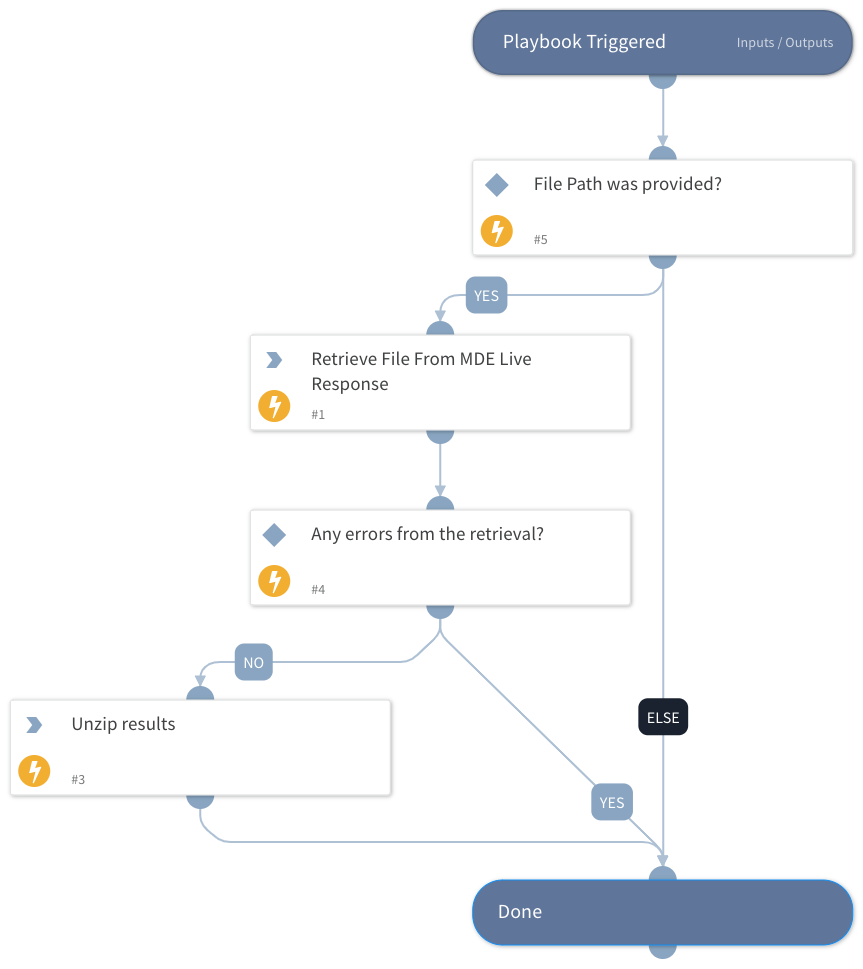

This playbook uses the Live Response feature to retrieve a file from an endpoint.

Note that the endpoint id will be set from the incident field "Device ID".

## Dependencies
This playbook uses the following sub-playbooks, integrations, and scripts.

### Sub-playbooks
This playbook does not use any sub-playbooks.

### Integrations
MicrosoftDefenderAdvancedThreatProtection

### Scripts
* isError
* UnzipFile

### Commands
microsoft-atp-live-response-get-file

## Playbook Inputs
---

| **Name** | **Description** | **Default Value** | **Required** |
| --- | --- | --- | --- |
| paths | File paths to be provided. |  | Optional |

## Playbook Outputs
---
There are no outputs for this playbook.

## Playbook Image
---

