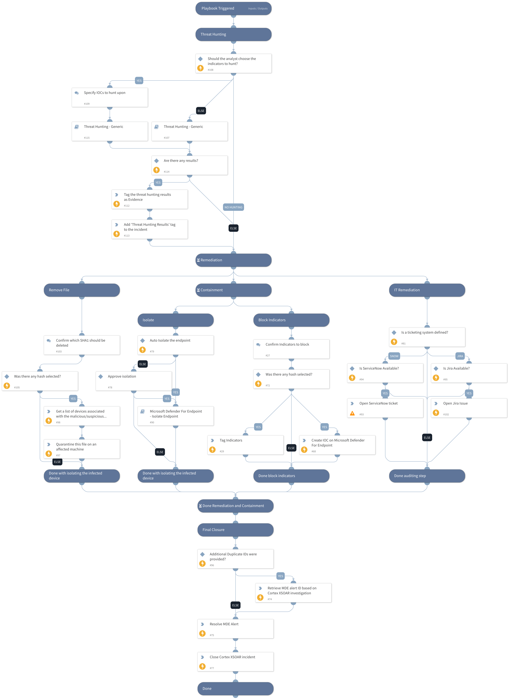

This playbook is part of the 'Malware Investigation And Response' pack. For more information, refer to https://xsoar.pan.dev/docs/reference/packs/malware-investigation-and-response.
This Playbook handles closing a true positive incident for Microsoft Defender for Endpoint.

## Dependencies
This playbook uses the following sub-playbooks, integrations, and scripts.

### Sub-playbooks
* Threat Hunting - Generic
* Microsoft Defender For Endpoint - Isolate Endpoint

### Integrations
* MicrosoftDefenderAdvancedThreatProtection

### Scripts
* SearchIncidentsV2
* AddEvidence
* IsIntegrationAvailable
* ServiceNowCreateIncident

### Commands
* microsoft-atp-stop-and-quarantine-file
* jira-create-issue
* setIncident
* closeInvestigation
* setIndicators
* microsoft-atp-update-alert
* microsoft-atp-sc-indicator-create
* microsoft-atp-get-file-related-machines

## Playbook Inputs
---

| **Name** | **Description** | **Default Value** | **Required** |
| --- | --- | --- | --- |
| DupAlertIDsToBeClosed | The Cortex XSOAR investigation IDs to be closed.  |  | Optional |
| Comment | Add a comment to close an incident on the Microsoft Defender For Endpoint side. | XSOAR Incident #${incident.id} | Optional |
| Reason | Provide a reason for closing the incident. Choose one of the following: "NotAvailable"/"Apt,Malware"/"SecurityPersonnel"/"SecurityTesting"/"UnwantedSoftware"/"Other" |  | Optional |
| Classification | Choose From - "Unknown" / "TruePositive" / "FalsePositive" |  | Optional |
| TicketDescription | Specify the ticket description for this section.  |  | Optional |
| BlockTag | Specify the banning tag name for the found indicators. | BlockTag | Optional |
| TicketProjectName | If you are using Jira, specify the Jira Project Key here \(can be retrieved from the Jira console\). |  | Optional |
| TicketingSystemToUse | The name of the ticketing system to use, for example Jira or ServiceNow. |  | Optional |
| AutoIsolation | Whether host isolation is allowed. | False | Optional |
| CloseDuplicate | Whether duplicate incidents should be closed as well in the Microsoft Defender for Endpoint integration instance. The playbook looks for the world "Close" in this input. |  | Optional |
| HostID | The ID of the host for running an isolation process. | ${incident.deviceid} | Optional |
| FileSha256 | Enter the File SHA256 you want to block. | ${incident.filesha256} | Optional |
| FileSha1 | Enter the File SHA1 you want to remove from your protected endpoints. | ${incident.filesha1} | Optional |
| ManuallyChooseIOCForHunting | This input will provide you the ability to select IOCs to be hunted using the Threat Hunting - generic playbook. If false, it will hunt for all IOCs detected in the incident. Note: You can also insert "No Threat Hunting" to skip the Threat Hunting stage. | True | Optional |
| IP | IP value to be hunt on | IP | Optional |
| MD5 | MD5 file value to be hunt upon. | File.MD5 | Optional |
| URL_or_Domain | URL or domain to be hunt upon. | Domain.Name | Optional |

## Playbook Outputs
---
There are no outputs for this playbook.

## Playbook Image
---

