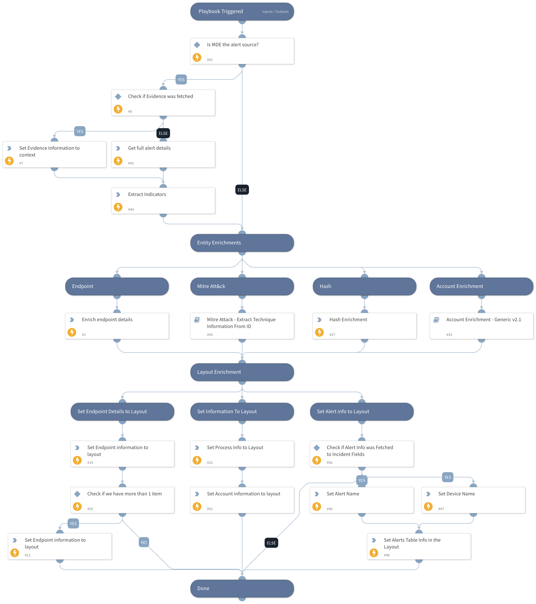

This playbook is part of the 'Malware Investigation And Response' pack. For more information, refer to https://xsoar.pan.dev/docs/reference/packs/malware-investigation-and-response.
This playbook enriches Microsoft Defender For Endpoint alerts. The enrichment is done on the involved endpoint and Mitre technique ID information, and it sets the 'Malware-Investigation and Response' layout.

## Dependencies
This playbook uses the following sub-playbooks, integrations, and scripts.

### Sub-playbooks
* Malware Investigation and Response - Set Alerts Grid
* Mitre Attack - Extract Technique Information From ID

### Integrations
* MicrosoftDefenderAdvancedThreatProtection

### Scripts
* SetAndHandleEmpty
* isError

### Commands
* setIncident
* microsoft-atp-get-alert-by-id
* file
* endpoint

## Playbook Inputs
---

| **Name** | **Description** | **Default Value** | **Required** |
| --- | --- | --- | --- |
| DidAlertOriginateFromSIEM | Whether the incident is fetched through a SIEM product.  | No | Optional |
| AlertID | The Microsoft Defender For Endpoint alert ID. | ${incident.externalsystemid} | Optional |

## Playbook Outputs
---

| **Path** | **Description** | **Type** |
| --- | --- | --- |
| MITREATTACK | The full MITRE data for the attack pattern. | string |
| AttackPattern | An array of attack patterns name and IDs. | string |
| MicrosoftATP.Alert | Microsoft Defender For Endpoint alert information. | unknown |
| Endpoint | The endpoint information. | unknown |

## Playbook Image
---
