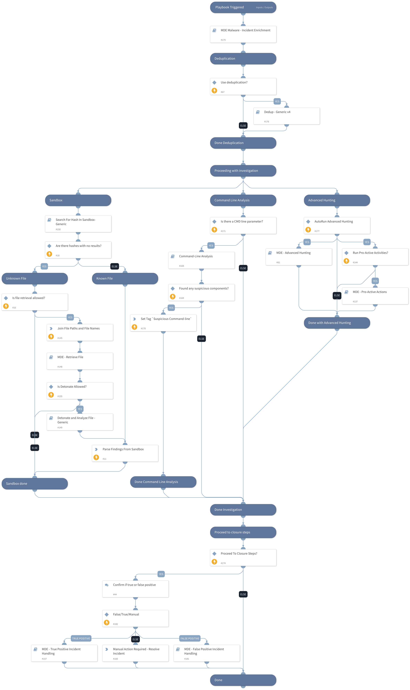

This playbook is part of the 'Malware Investigation And Response' pack. For more information, refer to https://xsoar.pan.dev/docs/reference/packs/malware-investigation-and-response.
This playbook investigates Microsoft Defender For Endpoint malware alerts. It uses - Microsoft Defender For Endpoint Advanced Hunting - Command Line Analysis - Deduplication - Sandbox hash search and detonation - Proactive investigation actions (AV scan, investigation package collection, running automated investigation on an endpoint) - Microsoft Defender For Endpoint alert enrichment - Incident handling (true/false positive)

## Dependencies
This playbook uses the following sub-playbooks, integrations, and scripts.

### Sub-playbooks
* Detonate and Analyze File - Generic
* MDE Malware - Incident Enrichment
* Search For Hash In Sandbox - Generic
* MDE - Retrieve File
* Dedup - Generic v4
* MDE - Host Advanced Hunting
* MDE - True Positive Incident Handling
* MDE - Pro-Active Actions
* MDE - False Positive Incident Handling
* Command-Line Analysis

### Integrations
This playbook does not use any integrations.

### Scripts
* ZipStrings
* InvestigationDetailedSummaryParse
* InvestigationSummaryParse

### Commands
* setIncident

## Playbook Inputs
---

| **Name** | **Description** | **Default Value** | **Required** |
| --- | --- | --- | --- |
| TicketingSystemToUse | The ticketing system to use. Possible Options: SNOW or Jira  \*SNOW == ServiceNow \(Used in case incident classified as True Positive\). |  | Optional |
| RetrieveFile | Whether file retrieval from the endpoint is allowed. | True | Optional |
| DetonateFile | Whether file detonation is allowed on the sandbox. | True | Optional |
| EnableDeduplication | "Whether the deduplication playbook will be used." | True | Optional |
| BenignTagName | The name of the tag to apply for allowed indicators. | BenignTagName | Optional |
| RunInvestigationActivities | Choose True to automatically run investigation activities \(this relies on the \`ActionTask\` input\). | True | Optional |
| AdvancedHunting | Choose True to run Advance Hunting queries through your Microsoft Defender For Endpoint instance. Note - it may take some time. | True | Optional |
| DeduphandleSimilar | Defines how to handle similar incidents.  Possible values: "Link", "Close", "Link and Close". Note: Closing incidents requires defining the "CloseSimilar" input as well.   Also, incidents found by similar indicators or fields will be closed if their similarity score is above the CloseSimilar value. | Link and Close | Optional |
| DedupCloseSimilar | Defines the threshold of similarity to close a similar incident. All similar incidents with similarity above this value will be closed. For example, if CloseSimilar is set to .8 and an incident has a similarity score of .9, the incident will be closed. The value should be between 0 and 1 \[0=low similarity , 1=identical\]. | 0.9 | Optional |
| EnableClosureSteps | Whether to use closure steps or close the incident automatically. | True | Optional |
| TicketProjectName | If using Jira, specify the Jira Project Key \(can be retrieved from the Jira console\). |  | Optional |
| AutoCollectinvestigationPackege | Choose True to autorun collecting the investigation package from an endpoint. | True | Optional |
| ActionTask | Option for input \(can be comma-separated values\): \`Full Scan\` - Fully scan the provided endpoints \`Collect Investigation Package\` - Collect investigation package from endpoints \(only for supported devices\) \`Automated Investigation\` - Run Automated Investigation on the provided endpoint If empty, the actions should be checked manually. |  | Optional |
| AutoAVScan | Choose True to autorun a Full AV Scan on your endpoint. | True | Optional |
| AutoAutomatedInvestigation | Choose True to autorun automated investigation on your endpoint. | True | Optional |
| MaliciousTagName | The tag to assign for indicators to block. | MaliciousTagName | Optional |
| AutoUnisolation | Whether automatic un-isolation is allowed. | False | Optional |
| DidAlertOriginateFromSIEM | Whether an alert originated from a SIEM. If 'Yes', the incident enrichment flow does not run. | No | Optional |
| DedupSimilarTextField | A comma-separated list of incident text fields to take into account when computing similarity. For example command line or URL. | agnetsid,users,agentsid,CMDline,Hostnames,filenames,filepaths | Optional |
| AutoIsolation | Whether endpoint auto isolation is allowed. | False | Optional |
| DedupMinimunIncidentSimilarity | Retain incidents with a similarity score greater than the MinimunIncidentSimilarity. Value should be between 0 to 1 \[0=low similarity, 1=identical\] | 0.2 | Optional |
| DedupLimit | The maximum number of incidents to query and set to context data. | 200 | Optional |
| QueryBatch | Define the custom queries you would like to run as a part of the 'MDE - Host Advanced Hunting' playbook. This input will be passed to the 'query_batch' argument in the '\!microsoft-atp-advanced-hunting' command. For more information and examples, check the command's hints. |  | Optional |

## Playbook Outputs
---
There are no outputs for this playbook.

## Playbook Image
---

