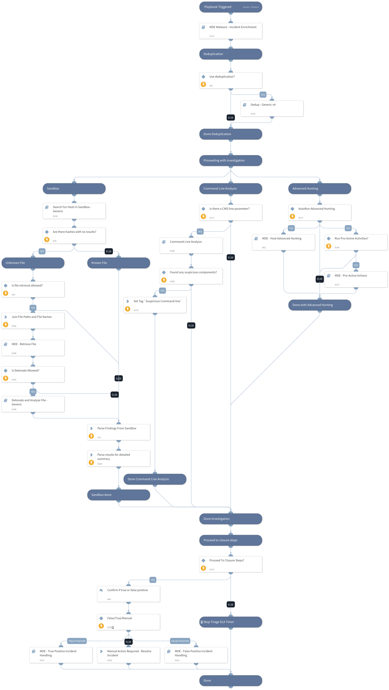

This playbook investigates Microsoft Defender For Endpoint malware alerts. It uses: 
- Microsoft Defender For Endpoint Advanced Hunting
- Command Line Analysis
- Deduplication
- Sandbox hash search and detonation
- Proactive investigation actions: AV scan, investigation package collection, running automated investigation on an endpoint
- Microsoft Defender For Endpoint alert enrichment
- Incident handling (true/false positive)

## Dependencies
This playbook uses the following sub-playbooks, integrations, and scripts.

### Sub-playbooks
* Detonate and Analyze File - Generic
* MDE - Retrieve File
* Search For Hash In Sandbox - Generic
* MDE Malware - Incident Enrichment
* Command-Line Analysis
* MDE - True Positive Incident Handling
* MDE - Host Advanced Hunting
* Dedup - Generic v4
* MDE - False Positive Incident Handling
* MDE - Pro-Active Actions

### Integrations
This playbook does not use any integrations.

### Scripts
* ZipStrings
* MalwareFindingsParse

### Commands
* setIncident

## Playbook Inputs
---

| **Name** | **Description** | **Default Value** | **Required** |
| --- | --- | --- | --- |
| TicketingSystemToUse | Possible Options: SNOW or Jira  \*SNOW == ServiceNow |  | Optional |
| RetrieveFile | Whether file retrieval from the endpoint is allowed. | True | Optional |
| DetonateFile | Whether file detonation is allowed on the sandbox. | True | Optional |
| EnableDeduplication | Whether the deduplication playbook will be used. | True | Optional |
| BenignTagName | The name of the tag to apply for allowed indicators. | BenignTagName | Optional |
| RunInvestigationActivities | Choose True to automatically run investigation activities (this relies on the `ActionTask` input ). | True | Optional |
| AdvancedHunting | Choose True to run Advance Hunting queries through your Microsoft Defender For Endpoint instance. Note - It may take some time. | True | Optional |
| DeduphandleSimilar | Defines how to handle similar incidents.  Possible values: "Link", "Close", "Link and Close". Note: Closing incidents requires defining the "CloseSimilar" input as well. Also, incidents found by similar indicators or fields will be closed if their similarity score is above the CloseSimilar value.  | Link and Close | Optional |
| DedupCloseSimilar | Defines the threshold of similarity to close a similar incident. All similar incidents with similarity above this value will be closed. For example, if CloseSimilar is set to .8 and an incident has a similarity score of .9, the incident will be closed. The value should be between 0 to 1 \[0=low similarity , 1=identical\] | 0.9 | Optional |
| EnableClosureSteps | Whether to use closure steps or close the incident automatically | True | Optional |
| TicketProjectName | If using Jira, specify the Jira Project Key (can be retrieved from the Jira console). |  | Optional |
| AutoCollectinvestigationPackege | Choose True to autorun collecting the investigation package from an endpoint. | False | Optional |
| ActionTask | Option for input (can be comma-separated values): \`Full Scan\` - Fully scan the provided endpoints \`Collect Investigation Package\` - Collect investigation package from endpoints (only for supported devices) \`Automated Investigation\` - Run Automated Investigation on the provided endpoint If empty, the actions should be checked manually. |  | Optional |
| AutoAVScan | Choose True to autorun a Full AV Scan on your endpoint. | False | Optional |
| AutoAutomatedInvestigation | Choose True to autorun automated investigation on your endpoint. | False | Optional |
| MaliciousTagName | The tag to assign indicators to block. | MaliciousTagName | Optional |
| AutoUnisolation | Indicates if automatic un-isolation is allowed     True/False | False | Optional |
| DidAlertOriginateFromSIEM | In case the alert originated from SIEM no need to run the Incident enrichment flow. | No | Optional |
| DedupSimilarTextField | A comma-separated list of incident text fields to take into account when computing similarity. For example command line or URL. | Optional |
| AutoIsolation | Whether endpoint auto isolation is allowed. | False | Optional |
| DedupMinimunIncidentSimilarity | Retain incidents with a similarity score greater than the MinimunIncidentSimilarity. 
    Value should be between 0 to 1 [0=low similarity, 1=identical] | 0.2 | Optional |
| DedupLimit | The maximum number of incidents to query and set to context data. Default is: 200 | 200 | Optional |

## Playbook Outputs
---
There are no outputs for this playbook.

## Playbook Image
---

