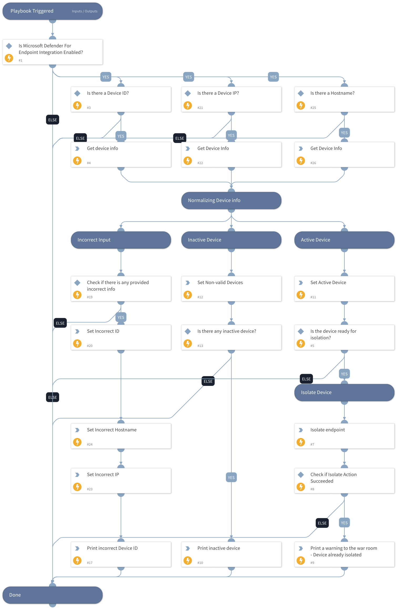

This playbook accepts an endpoint ID, IP, or host name and isolates it using the Microsoft Defender For Endpoint integration.

## Dependencies
This playbook uses the following sub-playbooks, integrations, and scripts.

### Sub-playbooks
This playbook does not use any sub-playbooks.

### Integrations
* MicrosoftDefenderAdvancedThreatProtection

### Scripts
* SetAndHandleEmpty
* isError
* IsIntegrationAvailable
* Print

### Commands
* endpoint
* microsoft-atp-isolate-machine

## Playbook Inputs
---

| **Name** | **Description** | **Default Value** | **Required** |
| --- | --- | --- | --- |
| Device_id | The device ID to isolate. For more information about the device, you can use the following commands: \!microsoft-atp-get-machine-details \!microsoft-atp-get-machines |  | Optional |
| Hostname | The host name you want to isolate. |  | Optional |
| Device_IP | The device IP you want to isolate. |  | Optional |
| Isolation_type | Optional Values: Full/Selective. Default is Full.  For more information see Microsoft documentation:   https://docs.microsoft.com/en-us/microsoft-365/security/defender-endpoint/respond-machine-alerts?view=o365-worldwide\#isolate-devices-from-the-network | Full | Optional |

## Playbook Outputs
---

| **Path** | **Description** | **Type** |
| --- | --- | --- |
| MicrosoftATP.MachineAction.ID | The machine action ID. | string |
| MicrosoftATP.IsolateList | The machine IDs that were isolated. | string |
| MicrosoftATP.NonIsolateList | The machine IDs that will not be isolated. | string |
| MicrosoftATP.IncorrectIDs | Incorrect device IDs entered. | string |
| MicrosoftATP.IncorrectHostnames | Incorrect device host names entered. | string |
| MicrosoftATP.IncorrectIPs | Incorrect device IPs entered. | string |

## Playbook Image
---
