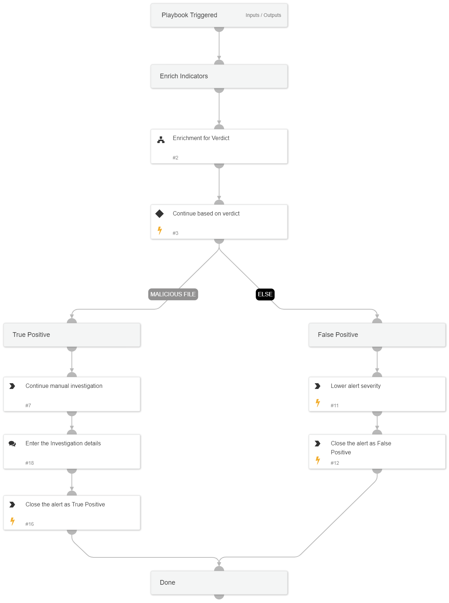

This playbook investigates “Malware detected by Microsoft Defender for Endpoint” by gathering Hash and User information and performing remediation based on the information gathered and received from the enrichment.

Used Sub-playbooks:
* Enrichment for Verdict

To link this playbook to the relevant alerts automatically, we recommend using the following filters when configuring the playbook triggers: Alert Source = Correlation AND Alert Name = Malware detected by Microsoft Defender for Endpoint

## Dependencies
This playbook uses the following sub-playbooks, integrations, and scripts.

### Sub-playbooks
Enrichment for Verdict

### Integrations
This playbook does not use any integrations.

### Scripts
This playbook does not use any scripts.

### Commands
* closeInvestigation
* setAlert

## Playbook Inputs
---
There are no inputs for this playbook.

## Playbook Outputs
---
There are no outputs for this playbook.

## Playbook Image
---

