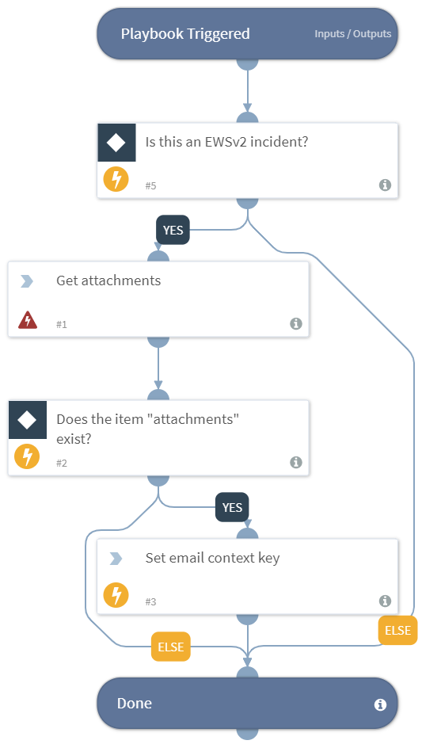

Processes an EWS email.

## Dependencies
This playbook uses the following sub-playbooks, integrations, and scripts.

### Sub-playbooks
This playbook does not use any sub-playbooks.

### Integrations
* EWS v2

### Scripts
* Set

### Commands
* ews-get-attachment

## Playbook Inputs
---

| **Name** | **Description** | **Default Value** | **Source** | **Required** |
| --- | --- | --- | --- | --- |
| EmailID | The EWS Email ID. | labels.Email/ID | incident | Optional |

## Playbook Outputs
---

| **Path** | **Description** | **Type** |
| --- | --- | --- |
| Email | The email object. | unknown |
| Email.To | The email "to" addresses.  | string |
| Email.CC | The email "cc" addresses. | string |
| Email.From | The email "from" sender. | string |
| Email.Subject | The email subject. | string |
| Email subject | The email "html" body if exists. | string |
| Email.Text | The email "text" body if exists. | string |
| Email.Headers | The full email headers as a single string. | string |
| Email.Attachments | The list of attachment names in the email. | string |
| Email.Format | The format of the email if available. | string |
| File | The email's attachment. | unknown |

## Playbook Image
---

