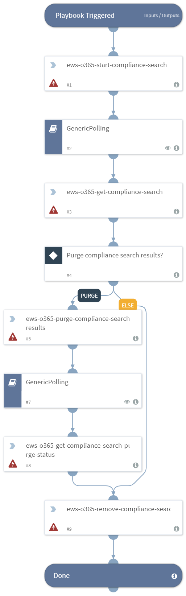

Runs a compliance search on Office 365 and deletes the results.

## Dependencies
This playbook uses the following sub-playbooks, integrations, and scripts.

### Sub-playbooks
* GenericPolling

### Integrations
* EWS v2

### Scripts
This playbook does not use any scripts.

### Commands
* ews-o365-purge-compliance-search-results
* ews-o365-get-compliance-search
* ews-o365-start-compliance-search
* ews-o365-remove-compliance-search

## Playbook Inputs
---

| **Name** | **Description** |  **Required** |
| --- | --- | --- | 
| Query | The compliance search query. |  Required |

## Playbook Outputs
---
There are no outputs for this playbook.

## Playbook Image
---

## Known Limitations
---
* Due to a Microsoft limitation, you can perform a search and purge operation on a maximum of 50,000 mailboxes. To work around this limitation, configure multiple instances of the integration each with different permission filtering so that the number of mailboxes in each instance does not exceed 50,000.
