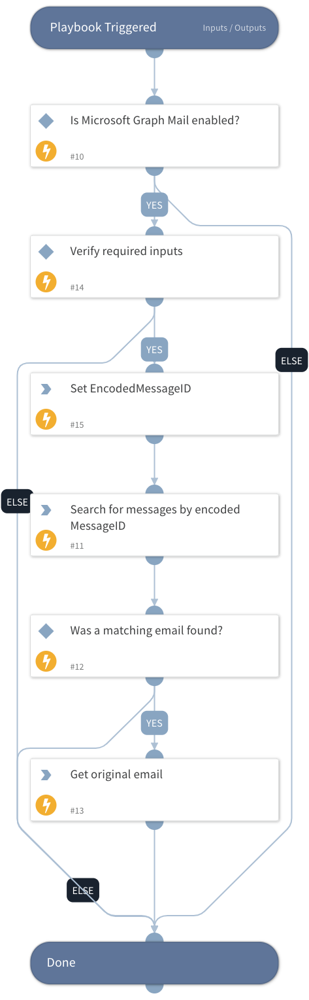

Use this playbook to retrieve the original email in the thread as eml file when the reporting user forwarded the original email not as an attachment.

You must have the necessary permissions in the Microsoft Graph Mail integration as described here:
      * https://docs.microsoft.com/en-us/graph/api/message-get
      * https://docs.microsoft.com/en-us/graph/api/user-list-messages

## Dependencies
This playbook uses the following sub-playbooks, integrations, and scripts.

### Sub-playbooks
This playbook does not use any sub-playbooks.

### Integrations
* MicrosoftGraphMail

### Scripts
This playbook does not use any scripts.

### Commands
* msgraph-mail-get-email-as-eml
* msgraph-mail-list-emails

## Playbook Inputs
---

| **Name** | **Description** | **Default Value** | **Required** |
| --- | --- | --- | --- |
| Mailbox | Email address of the reporting user. | incident.emailfrom | Optional |
| InReplyTo | The InReplyTo header in the forwarded email. | incident.phishingreporteremailheaders.headervalue | Optional |
| ThreadTopic | The ThreadTopic header in the forwarded email. | incident.phishingreporteremailheaders.headervalue | Optional |
| OriginalMessageID | The original message id. In case it is provided, the original email will be retrieved based on its value. |  | Optional |

## Playbook Outputs
---

| **Path** | **Description** | **Type** |
| --- | --- | --- |
| File | The original email as eml file. | unknown |

## Playbook Image
---
