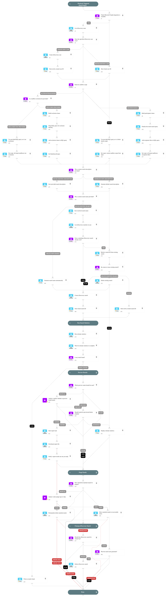

This playbook performs the following steps:
  1. Checks that the Microsoft Graph integration is available and active.
  2. Lists existing eDiscovery cases and finds the specified case, or creates it if missing.
  3. Composes the KQL content query based on the mailbox scope (recipientsOnly, allTenantMailboxes, or other).
  4. Creates a new eDiscovery search with the composed query, or reuses an existing search based on the force input.
  5. Runs an estimate statistics operation to count emails matching the query.
  6. Waits for the estimate operation to complete and checks whether any emails were found.
  7. Optionally previews the results (statistics summary or full export), based on the preview input.
  8. Purges the matching emails (Hard delete / Soft delete / manual analyst approval).
  9. Cleans up the eDiscovery search based on the cleanup input.

## Dependencies

This playbook uses the following sub-playbooks, integrations, and scripts.

### Sub-playbooks

This playbook does not use any sub-playbooks.

### Integrations

* MicrosoftGraphSecurity

### Scripts

* IsIntegrationAvailable
* Print
* Set

### Commands

* msg-create-ediscovery-case
* msg-create-ediscovery-search
* msg-delete-ediscovery-search
* msg-export-result-ediscovery-data
* msg-get-last-estimate-statistics-operation
* msg-list-case-operation
* msg-list-ediscovery-cases
* msg-list-ediscovery-searchs
* msg-purge-ediscovery-data
* msg-run-estimate-statistics

## Playbook Inputs

---

| **Name** | **Description** | **Default Value** | **Required** |
| --- | --- | --- | --- |
| case | eDiscovery case to use. Looked up by name; created if missing. | XSOAR Auto Phishing | Required |
| mailbox_scope | One of: recipientsOnly, allTenantMailboxes, allCaseCustodians, allCaseNoncustodialDataSources, allTenantSites. Drives data_source_scopes and KQL composition. | recipientsOnly | Optional |
| mailbox_exclusion | CSV of mailboxes to exclude. Honored only when mailbox_scope=allTenantMailboxes. |  | Optional |
| kql | KQL query identifying the emails to search/delete. Additional clauses are composed around it depending on mailbox_scope. |  | Required |
| recipients | CSV of email addresses. Required when mailbox_scope=recipientsOnly. Optional when mailbox_scope=allCaseCustodians. |  | Optional |
| search_name | When provided, plays into the force semantics \(force=true delete-and-recreate, force=false reuse\). When omitted, an auto-name like XSOAR-Search-$\{incident.id\}-$\{ts\} is generated. |  | Optional |
| description | eDiscovery search description. Defaults to "Created by XSOAR for incident $\{incident.id\}" when empty. |  | Optional |
| force | Only meaningful when search_name is provided. true ⇒ delete-and-recreate. false ⇒ reuse existing. | false | Optional |
| preview | "true" / "false" / empty=manual. Whether to pause for analyst review before delete. | true | Optional |
| preview_mode | "statistics" \(count \+ size from estimate\) or "export" \(run export job, download report\). | statistics | Optional |
| export_format | File format for the export when preview_mode=export. "msg" produces individual .msg files inside a ZIP \(preferred for analyst review\). "pst" produces a single PST archive. Ignored when preview_mode=statistics. | msg | Optional |
| delete_type | "Hard" / "Soft" / empty=manual \(also lets analyst pick Skip\). |  | Optional |
| cleanup | "auto" / "true" / "false". auto ⇒ delete the search only if it was auto-generated. | auto | Optional |

## Playbook Outputs

---
There are no outputs for this playbook.

## Playbook Image

---

