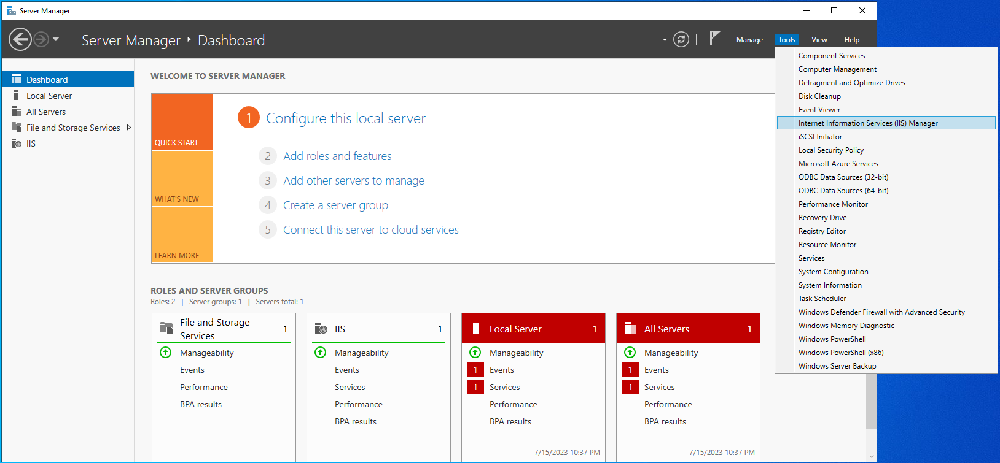
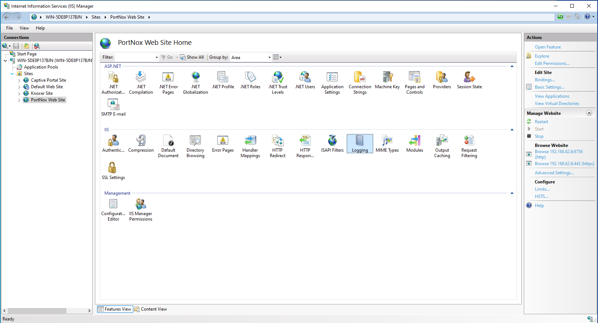
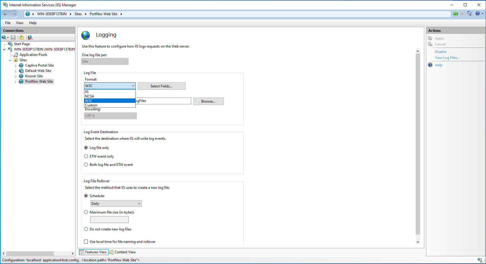
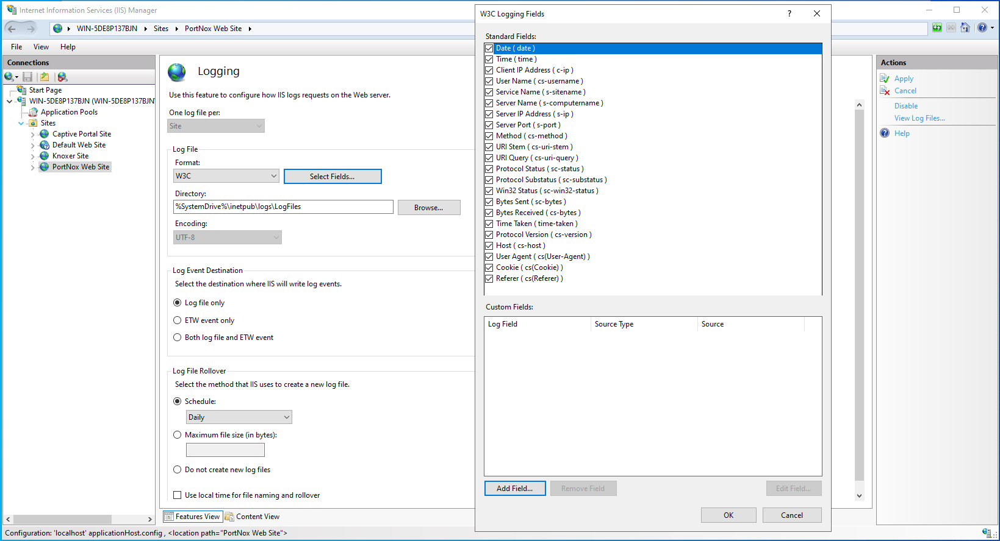

# Microsoft IIS Web Server

## Configuration on Microsoft IIS

Follow the steps below on Microsoft IIS to configure IIS logging at the [site level](https://learn.microsoft.com/en-us/iis/manage/provisioning-and-managing-iis/configure-logging-in-iis#configure-logging-at-the-site-level) using the UI.   
For configuring logging [Per-site](https://learn.microsoft.com/en-us/iis/manage/provisioning-and-managing-iis/configure-logging-in-iis#configure-per-site-logging-at-the-server-level) or [Per-server](https://learn.microsoft.com/en-us/iis/manage/provisioning-and-managing-iis/configure-logging-in-iis#configure-per-server-logging-at-the-server-level) at the server level, refer to the Microsoft [Configure Logging in IIS](https://learn.microsoft.com/en-us/iis/manage/provisioning-and-managing-iis/configure-logging-in-iis) docs. 

1. Open the IIS Manager.


1. Under the *Connections* tree view on the left, select the requested website for logging.

2. In *Features View*, click **Logging**.
   

3. In the *Log File* section under *Format*, select **W3C**.
   

4. Click **Select Fields** and ensure all the standard fields are selected.


### Supported Log Formats
The XDM normalization included in this pack is supported only for the *W3C* format, for logs with the following field list structures: 

####  Access Log 
``` bash
  date time s-sitename s-computername s-ip cs-method cs-uri-stem cs-uri-query s-port cs-username c-ip cs-version cs(User-Agent) cs(Cookie) cs(Referer) cs-host sc-status sc-substatus sc-win32-status sc-bytes cs-bytes time-taken
```
#### Error Log

``` bash
  date time c-ip c-port s-ip s-port cs-version cs-method cs-uri sc-status s-siteid s-reason s-queuename
```

``` bash
  date time c-ip c-port s-ip s-port cs-version cs-method cs-uri streamid sc-status s-siteid s-reason s-queuename
```

``` bash
  date time c-ip c-port s-ip s-port cs-version cs-method cs-uri streamid streamid_ex sc-status s-siteid s-reason s-queuename transport
```


## Configuration on Cortex XSIAM 

### XDRC (XDR Collector) Filebeat Configuration

You will need to use the information described [here](https://docs-cortex.paloaltonetworks.com/r/Cortex-XDR/Cortex-XDR-Documentation/XDR-Collector-datasets) for Filebeat.

When configuring the *Filebeat Configuration File* (inside the relevant profile under the *XDR Collectors Profiles*) for the IIS collector instance, you can either use the sample configuration file below or select the predefined *IIS* template, and update it as necessary.  

#### IIS Filebeat Configuration File Sample

```yaml
filebeat.modules:
- module: iis
  access:
    enabled: true
    var.paths: ["C:/inetpub/**logs**/LogFiles/*/*.log"]
  error:
    enabled: true
    var.paths: ["C:/Windows/System32/LogFiles/HTTPERR/*.log"]
```