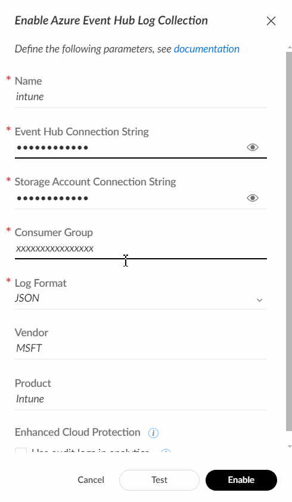

# Microsoft Intune

This pack includes Cortex XSIAM content.

Note: The logs will be stored in the dataset named *msft_intune_raw*. 
To filter a query to focus only on Microsoft Intune logs, use the following filters:
- In XQL queries, use: *|filter _collector_name=<Name_of_Intune_Instance_from_Azure_Event_Hub_Configuration>*
- In Datamodel queries, use: *|xdm.observer.name=<Name_of_Intune_Instance_from_Azure_Event_Hub_Configuration>*

## Collect Events from Vendor

In order to use the collector, you need to use the following option:
- [Microsoft Intune](#microsoft-intune)
  - [Collect Events from Vendor](#collect-events-from-vendor)
    - [Azure Event Hub Integration](#azure-event-hub-integration)

To collect logs from Microsoft Intune, use the information described [here](https://learn.microsoft.com/en-us/mem/intune/fundamentals/review-logs-using-azure-monitor) to configure log streaming from Microsoft Intune to Azure Event Hub.

* Pay attention: Timestamp parsing is available for the default UTC (+0000) format for Microsoft Intune.

### Azure Event Hub Integration

To create or configure the Azure Event Hub collector (to collect the logs you sent to Azure Event Hub), use the information described [here](https://docs-cortex.paloaltonetworks.com/r/Cortex-XSIAM/Cortex-XSIAM-Administrator-Guide/Ingest-Logs-from-Microsoft-Azure-Event-Hub).
