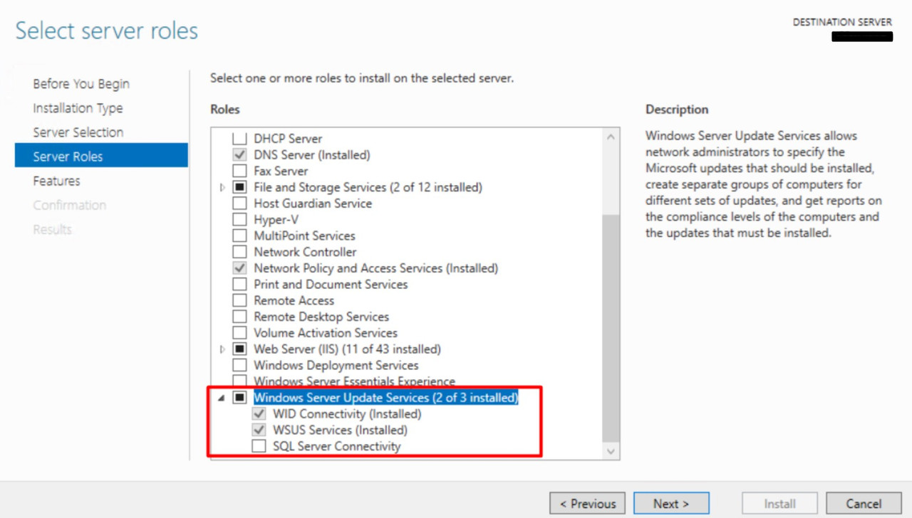

# Microsoft WSUS

This pack includes XSIAM content.
## Configuration on the Server Side
#### Validation that WSUS server role is enabled:
 - In the Server Manager, click **Manage** > **Add Roles and Features**.
 - Click **Server Roles** in the left menu.
 - Scroll down and validate that *Windows Server Update Services* is selected.
 - Validate that the following are selected and installed:
    - *WID Connectivity*    
    - *WSUS Services*

   
## Collect Events from Vendor
In order to use the collector, you need to use the following option to collect events from the vendor:
- [XDRC (XDR Collector)](#xdrc-xdr-collector)
You will need to configure the vendor and product for this specific collector.

* Pay attention: Timestamp parsing is supported in UTC (+0000) timezone for the **yyyy-mm-dd HH:MM:SS.3ms UTC** format.

## Filebeat Collection
In order to use the collector, you need to use the following option to collect events from the vendor:
- [XDRC (XDR Collector)](#xdrc-xdr-collector)
You will need to configure the vendor and product for this specific collector.
### XDRC (XDR Collector)
You will need to use the information described [here](https://docs.paloaltonetworks.com/cortex/cortex-xdr/cortex-xdr-pro-admin/cortex-xdr-collectors/xdr-collector-datasets#id7f0fcd4d-b019-4959-a43a-40b03db8a8b2).

You can configure the vendor and product by replacing [vendor]_[product]_raw with msft_wsus_raw.

When configuring the instance, you should use a YAML file that configures the vendor and product, as seen in the configuration below for the Microsoft WSUS product.

Copy and paste the contents of the following YAML in the *Filebeat Configuration File* section (inside the relevant profile under the *XDR Collectors Profile*s).
#### Filebeat Configuration file:
```
filebeat.inputs:
- type: filestream
  paths:
    - C:\Program Files\Update Services\LogFiles\Change.log
    - C:\Program Files\Update Services\LogFiles\SoftwareDistribution.log
processors:
- add_fields:
    fields:
        vendor: msft
        product: WSUS
```
