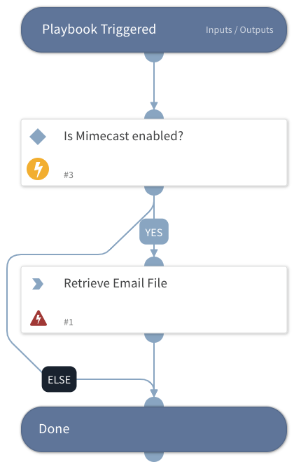

This playbook retrieves a specified EML/MSG file directly from Mimecast.

## Dependencies
This playbook uses the following sub-playbooks, integrations, and scripts.

### Sub-playbooks
This playbook does not use any sub-playbooks.

### Integrations
MimecastV2

### Scripts
This playbook does not use any scripts.

### Commands
mimecast-get-message

## Playbook Inputs
---

| **Name** | **Description** | **Default Value** | **Required** |
| --- | --- | --- | --- |
| MessageID | The message ID provided by Mimecast. |  | Optional |

## Playbook Outputs
---

| **Path** | **Description** | **Type** |
| --- | --- | --- |
| Mimecast.Message.ID | The message ID. | Unknown |
| Mimecast.Message.Subject | The message subject. | Unknown |
| Mimecast.Message.HeaderDate | The date of the message as defined in the message headers. | Unknown |
| Mimecast.Message.Size | The message size. | Unknown |
| Mimecast.Message.From | The message sender as defined in the message header. | Unknown |
| Mimecast.Message.ReplyTo | The value of the Reply-To header. | Unknown |
| Mimecast.Message.EnvelopeFrom | The message sender as defined in the message envelope. | Unknown |
| Mimecast.Message.Processed | The date the message was processed by Mimecast in ISO 8601 format. | Unknown |
| Mimecast.Message.HasHtmlBody | Whether the message has an HTML body part. | Unknown |
| Mimecast.Message.To.EmailAddress | The message recipient. | Unknown |
| Mimecast.Message.CC.EmailAddress | Each CC recipient of the message. | Unknown |
| Mimecast.Message.Headers.Name | The header's name. | Unknown |
| Mimecast.Message.Headers.Values | The header's value. | Unknown |
| Mimecast.Message.Attachments.FileName | The message attachment's file name. | Unknown |
| Mimecast.Message.Attachments.SHA256 | The message attachment's SHA256. | Unknown |
| Mimecast.Message.Attachments.ID | The message attachment's ID. | Unknown |
| Mimecast.Message.Attachments.Size | The message attachment's file size. | Unknown |

## Playbook Image
---

