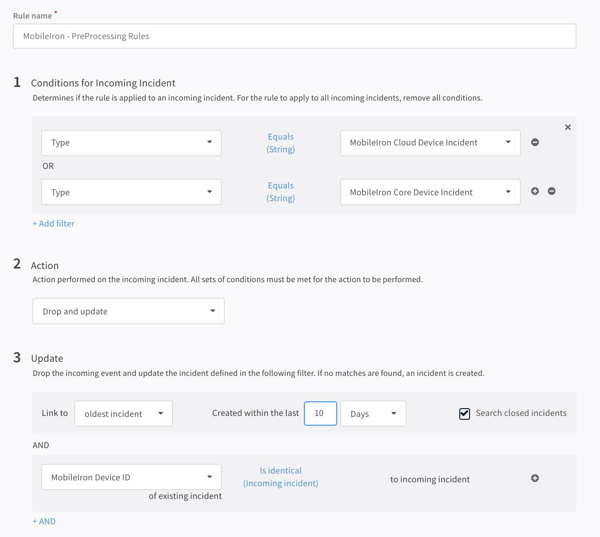

# MobileIron CORE Integration

This integration was created and tested with version *11.0.0* of MobileIronCORE

## MobileIron Core - Getting Started

1. Log in to the MobileIron Core Admin console.
2. Open the `Users` top section.
3. Click on the `create local user` button. It is recommended to create a new user for the Cortex XSOAR integration specifically and not reuse
an existing one.
4. Make sure you enter all the details and keep note of the User ID (ex. demisto-api-user) and the password specifically.
5. Click on the `Admins` top section.
6. Add the user you just created as an admin to the instance.
6. When setting up the Cortex XSOAR integration use User ID as the username and the password you defined as the MobileIron tenant credentials
7. Click the `Test` button and ensure the connection can be established.

Refer to the API documentation at the MobileIron community for more details on setting up the API user.

### MobileIron Core - Spaces

If you are dividing the devices into different spaces, it is important to make sure the integration
points to the correct `Device Admin Space ID`.
 
In most cases, this is set to the value *1* for the global space ID.

### Setting up pre-processing rules

If you are using the fetch incidents option it is advisable to set-up a pre-processing rule in order
to filter out any duplicates that might show up as part of the command. 

- Inside the Cortex XSOAR admin go to Settings -> Integrations -> Pre-Processing Rules.
- In *Step 1* add a rule for *Type* equals *MobileIron Core Device Incident*.
- In *Step 2* select *Drop and Update*.
- In *Step 3* select *Link to oldest incident* created within the last *15 days* and check the checkbox next to 
*Search closed incidents*. 
- Add an *AND* statement and enter *MobileIron Device ID* of existing incident is identical to the one of the 
incoming incident.
- Save.

Here is an example image of the rule

 

## Configure MobileIronCORE on Cortex XSOAR

1. Navigate to **Settings** > **Integrations** > **Servers & Services**.
2. Search for MobileIronCORE.
3. Click **Add instance** to create and configure a new integration instance.

    | **Parameter** | **Description** | **Required** |
    | --- | --- | --- |
    | url | Server URL \(ex. https://core.mobileiron.com \) | True |
    | admin_space_id | Admin Space ID \(ex. 1 for the global space ID.\) | True |
    | credentials | API User Credentials | True |
    | max_fetch | Maximum number of incidents per fetch | False |
    | incidentType | Incident type | False |
    | insecure | Trust any certificate \(not secure\) | False |
    | proxy | Use system proxy settings | False |
    | fetch_interval | Fetch Interval \(in minutes\) | True |
    | isFetch | Fetch incidents | False |

4. Click **Test** to validate the URLs, token, and connection.
## Commands
You can execute these commands from the Cortex XSOAR CLI, as part of an automation, or in a playbook.
After you successfully execute a command, a DBot message appears in the War Room with the command details.
### mobileiron-core-send-message
***
Sends a message to the particular device based on the device ID.


#### Base Command

`mobileiron-core-send-message`
#### Input

| **Argument Name** | **Description** | **Required** |
| --- | --- | --- |
| device_id | The ID of the device to send a message to. | Required | 
| subject | The subject of the email. | Required | 
| message | The message of the email. | Required | 
| message_type | The type of message to send. Possible values are: "pns", "sms" and "email". | Required | 


### mobileiron-core-update-os
***
Updates the operating system on the particular device based on the device ID.


#### Base Command

`mobileiron-core-update-os`
#### Input

| **Argument Name** | **Description** | **Required** |
| --- | --- | --- |
| device_id | The ID of the device on which to update the operating system. | Required | 


### mobileiron-core-unlock-device-only
***
Unlocks the particular device based on the device ID.


#### Base Command

`mobileiron-core-unlock-device-only`
#### Input

| **Argument Name** | **Description** | **Required** |
| --- | --- | --- |
| device_id | The ID of the device to unlock. | Required | 


### mobileiron-core-enable-voice-roaming
***
Enables voice roaming on the particular device based on the device ID.


#### Base Command

`mobileiron-core-enable-voice-roaming`
#### Input

| **Argument Name** | **Description** | **Required** |
| --- | --- | --- |
| device_id | The ID of the device on which to enable voice roaming. | Required | 


### mobileiron-core-disable-voice-roaming
***
Disables voice roaming on the particular device based on the device ID.


#### Base Command

`mobileiron-core-disable-voice-roaming`
#### Input

| **Argument Name** | **Description** | **Required** |
| --- | --- | --- |
| device_id | The ID of the device on which to disable voice roaming. | Required | 


### mobileiron-core-enable-data-roaming
***
Enables data roaming on the particular device based on the device ID.


#### Base Command

`mobileiron-core-enable-data-roaming`
#### Input

| **Argument Name** | **Description** | **Required** |
| --- | --- | --- |
| device_id | The ID of the device on which to enable data roaming. | Required | 


### mobileiron-core-disable-data-roaming
***
Disables data roaming on the particular device based on the device ID.


#### Base Command

`mobileiron-core-disable-data-roaming`
#### Input

| **Argument Name** | **Description** | **Required** |
| --- | --- | --- |
| device_id | The ID of the device on which to disable data roaming. | Required | 


### mobileiron-core-enable-personal-hotspot
***
Enables a personal hotspot on the particular device based on the device ID.


#### Base Command

`mobileiron-core-enable-personal-hotspot`
#### Input

| **Argument Name** | **Description** | **Required** |
| --- | --- | --- |
| device_id | The ID of the device on which to enable a personal hotspot. | Required | 


### mobileiron-core-disable-personal-hotspot
***
Disables a personal hotspot on the particular device based on the device ID.


#### Base Command

`mobileiron-core-disable-personal-hotspot`
#### Input

| **Argument Name** | **Description** | **Required** |
| --- | --- | --- |
| device_id | The ID of the device on which to disable a personal hotspot. | Required | 


### mobileiron-core-unlock-app-connect-container
***
Unlocks an app connect container on the particular device based on the device ID.


#### Base Command

`mobileiron-core-unlock-app-connect-container`
#### Input

| **Argument Name** | **Description** | **Required** |
| --- | --- | --- |
| device_id | The ID of the device on which to unlock an app connect container. | Required | 


### mobileiron-core-retire-device
***
Retires a device based on the device ID.


#### Base Command

`mobileiron-core-retire-device`
#### Input

| **Argument Name** | **Description** | **Required** |
| --- | --- | --- |
| device_id | The ID of the device to retire. | Required | 


### mobileiron-core-wipe-device
***
Wipes a device based on the device ID.


#### Base Command

`mobileiron-core-wipe-device`
#### Input

| **Argument Name** | **Description** | **Required** |
| --- | --- | --- |
| device_id | ID of the device to wipe. | Required | 


### mobileiron-core-force-checkin
***
Forces check in to the device based on the device ID.


#### Base Command

`mobileiron-core-force-checkin`
#### Input

| **Argument Name** | **Description** | **Required** |
| --- | --- | --- |
| device_id | ID of the device on which to force check in. | Required | 


### mobileiron-core-get-devices-data
***
Gets a list of devices matching the provided query.

#### Base Command

`mobileiron-core-get-devices-data`
#### Input

| **Argument Name** | **Description** | **Required** |
| --- | --- | --- |
| query | The query used to filter the list of devices. Default is common.status = "ACTIVE". | Required | 
| additional_fields | Comma-separated list of fields to query from the API. | Optional | 
| max_fetch | The maximum number of items to return. | Optional | 


#### Context Output

| **Path** | **Type** | **Description** |
| --- | --- | --- |
| MobileIronCore.Device.common_model | String | Model of the device that was fetched. | 
| MobileIronCore.Device.common_os_version | String | Operating system version of the device that was fetched. | 
| MobileIronCore.Device.common_platform | String | Platform name of the device that was fetched. | 
| MobileIronCore.Device.common_status | String | Status of the device that was fetched. | 
| MobileIronCore.Device.common_imei | String | International Mobile Equipment Identity (IMEI) of the device that was fetched. | 
| MobileIronCore.Device.common_platform | String | Platform of the device that was fetched. | 
| MobileIronCore.Device.common_security_state | String | Security state of the device that was fetched. | 
| MobileIronCore.Device.user_display_name | String | Display name of the device that was fetched. | 
| MobileIronCore.Device.common_last_connected_at | Date | Date the device that was fetched was last connected. | 
| MobileIronCore.Device.common_uuid | String | Device UUID of the device that was fetched. | 
| MobileIronCore.Device.common_quarantined | Boolean | Whether the device was quarantined. | 
| MobileIronCore.Device.common_id | Number | ID of the device that was fetched. | 
| MobileIronCore.Device.common_imsi | String | International mobile subscriber identity (IMSI) of the device that was fetched. | 
| MobileIronCore.Device.common_owner | String | Owner of the device that was fetched. | 
| MobileIronCore.Device.user_email_address | String | User email address of the device that was fetched. | 
| MobileIronCore.Device.common_manufacturer | String | Manufacturer of the device that was fetched. | 
| MobileIronCore.Device.common_compliant | Boolean | Whether the device that was fetched is compliant. | 
| MobileIronCore.Device.user_user_id | String | User ID of the device that was fetched. | 
| MobileIronCore.Device.common_registration_date | Date | Registration date of the device that was fetched. | 
| MobileIronCore.Device.common_wifi_mac_address | String | WiFi MAC address of the device that was fetched. | 
| MobileIronCore.Device.common_noncompliance_reasons | String | Non-compliance reasons for the device that was fetched. | 
| MobileIronCore.Device.ios_iPhone_UDID | String | iPhone UDID of the device that was fetched. | 
| MobileIronCore.Device.ios_iPhone_MAC_ADDRESS_EN0 | String | IPhone MAC address EN0 of the device that was fetched. | 
| MobileIronCore.Device.ios_Current_MCC | String | Current MCC of the device that was fetched. | 
| MobileIronCore.Device.common_current_country_code | String | Current country code of the device that was fetched. | 
| MobileIronCore.Device.user_sam_account_name | String | SAM account name of the device that was fetched. | 
| MobileIronCore.Device.common_current_country_name | String | Current country nameCurrent country name of the device that was fetched. | 
| MobileIronCore.Device.common_home_country_name | String | Home country name of the device that was fetched. | 
| MobileIronCore.Device.common_home_country_code | String | Home country code of the device that was fetched. | 
| MobileIronCore.Device.common_device_is_compromised | Boolean | Whether the device that was fetched was compromised. | 
| MobileIronCore.Device.common_SerialNumber | String | Device serial number of the device that was fetched. | 
| MobileIronCore.Device.common_mdm_managed | Boolean | Whether the device that was fetched is MDM managed. | 


#### Command Example
```!mobileiron-core-get-devices-data```

#### Context Example
```json
{
    "MobileIronCore": {
        "Device": [
            {
              "common_wifi_mac_address": "",
              "common_noncompliance_reasons": [
                "DEVICE_ADMIN_DEACTIVE"
              ],
              "ios_iPhone_UDID": "",
              "common_device_is_compromised": false,
              "common_SerialNumber": "",
              "common_mdm_managed": false,
              "common_model": "Pixel",
              "common_os_version": "10.0",
              "common_status": "ACTIVE",
              "common_imei": "",
              "common_platform": "Android",
              "common_security_state": "Ok",
              "user_display_name": "*****",
              "common_last_connected_at": "2020-11-09T07:38:22.000Z",
              "common_uuid": "",
              "common_quarantined": false,
              "common_id": 3,
              "common_imsi": "*****",
              "common_owner": "COMPANY",
              "user_email_address": "*****",
              "common_manufacturer": "Google",
              "common_compliant": false,
              "user_user_id": "*****",
              "common_registration_date": "2020-10-29T14:11:39.000Z"
            }
        ]
    }
}
```


### mobileiron-core-get-device-by-uuid
***
Gets a single device based on the device UUID.


#### Base Command

`mobileiron-core-get-device-by-uuid`
#### Input

| **Argument Name** | **Description** | **Required** |
| --- | --- | --- |
| device_uuid | The UUID of the device to fetch. | Required | 
| additional_fields | Comma-separated list of fields to query from the API. | Optional | 


#### Context Output

| **Path** | **Type** | **Description** |
| --- | --- | --- |
| MobileIronCore.Device.common_model | String | Model of the device that was fetched. | 
| MobileIronCore.Device.common_os_version | String | Operating system version of the device that was fetched. | 
| MobileIronCore.Device.common_platform | String | Platform name of the device that was fetched. | 
| MobileIronCore.Device.common_status | String | Status of the device that was fetched. | 
| MobileIronCore.Device.common_imei | String | International Mobile Equipment Identity (IMEI) of the device that was fetched. | 
| MobileIronCore.Device.common_platform | String | Platform of the device that was fetched. | 
| MobileIronCore.Device.common_security_state | String | Security state of the device that was fetched. | 
| MobileIronCore.Device.user_display_name | String | Display name of the device that was fetched. | 
| MobileIronCore.Device.common_last_connected_at | Date | Date the device that was fetched was last connected. | 
| MobileIronCore.Device.common_uuid | String | Device UUID of the device that was fetched. | 
| MobileIronCore.Device.common_quarantined | Boolean | Whether the device was quarantined. | 
| MobileIronCore.Device.common_id | Number | ID of the device that was fetched. | 
| MobileIronCore.Device.common_imsi | String | International mobile subscriber identity (IMSI) of the device that was fetched. | 
| MobileIronCore.Device.common_owner | String | Owner of the device that was fetched. | 
| MobileIronCore.Device.user_email_address | String | User email address of the device that was fetched. | 
| MobileIronCore.Device.common_manufacturer | String | Manufacturer of the device that was fetched. | 
| MobileIronCore.Device.common_compliant | Boolean | Whether the device that was fetched is compliant. | 
| MobileIronCore.Device.user_user_id | String | User ID of the device that was fetched. | 
| MobileIronCore.Device.common_registration_date | Date | Registration date of the device that was fetched. | 
| MobileIronCore.Device.common_wifi_mac_address | String | WiFi MAC address of the device that was fetched. | 
| MobileIronCore.Device.common_noncompliance_reasons | String | Non-compliance reasons for the device that was fetched. | 
| MobileIronCore.Device.ios_iPhone_UDID | String | iPhone UDID of the device that was fetched. | 
| MobileIronCore.Device.ios_iPhone_MAC_ADDRESS_EN0 | String | IPhone MAC address EN0 of the device that was fetched. | 
| MobileIronCore.Device.ios_Current_MCC | String | Current MCC of the device that was fetched. | 
| MobileIronCore.Device.common_current_country_code | String | Current country code of the device that was fetched. | 
| MobileIronCore.Device.user_sam_account_name | String | SAM account name of the device that was fetched. | 
| MobileIronCore.Device.common_current_country_name | String | Current country nameCurrent country name of the device that was fetched. | 
| MobileIronCore.Device.common_home_country_name | String | Home country name of the device that was fetched. | 
| MobileIronCore.Device.common_home_country_code | String | Home country code of the device that was fetched. | 
| MobileIronCore.Device.common_device_is_compromised | Boolean | Whether the device that was fetched was compromised. | 
| MobileIronCore.Device.common_SerialNumber | String | Device serial number of the device that was fetched. | 
| MobileIronCore.Device.common_mdm_managed | Boolean | Whether the device that was fetched is MDM managed. |


#### Command Example
```!mobileiron-core-get-device-by-uuid device_uuid=9b0da853-9f9b-483c-97ef-f4b5457299cf```

#### Context Example
```json
{
    "MobileIronCore": {
        "Device": {
          "common_wifi_mac_address": "",
          "common_noncompliance_reasons": [
            "DEVICE_ADMIN_DEACTIVE"
          ],
          "ios_iPhone_UDID": "",
          "common_device_is_compromised": false,
          "common_SerialNumber": "",
          "common_mdm_managed": false,
          "common_model": "Pixel",
          "common_os_version": "10.0",
          "common_status": "ACTIVE",
          "common_imei": "",
          "common_platform": "Android",
          "common_security_state": "Ok",
          "user_display_name": "*****",
          "common_last_connected_at": "2020-11-09T07:38:22.000Z",
          "common_uuid": "",
          "common_quarantined": false,
          "common_id": 3,
          "common_imsi": "*****",
          "common_owner": "COMPANY",
          "user_email_address": "*****",
          "common_manufacturer": "Google",
          "common_compliant": false,
          "user_user_id": "*****",
          "common_registration_date": "2020-10-29T14:11:39.000Z"
        }
    }
}
```

### mobileiron-core-get-device-by-serial
***
Gets a single device based on the device serial number.

#### Base Command

`mobileiron-core-get-device-by-serial`
#### Input

| **Argument Name** | **Description** | **Required** |
| --- | --- | --- |
| device_serial | The serial number of the device to fetch. | Required | 
| additional_fields | Comma-separated list of fields to query from the API. | Optional | 


#### Context Output

| **Path** | **Type** | **Description** |
| --- | --- | --- |
| MobileIronCore.Device.common_model | String | Model of the device that was fetched. | 
| MobileIronCore.Device.common_os_version | String | Operating system version of the device that was fetched. | 
| MobileIronCore.Device.common_platform | String | Platform name of the device that was fetched. | 
| MobileIronCore.Device.common_status | String | Status of the device that was fetched. | 
| MobileIronCore.Device.common_imei | String | International Mobile Equipment Identity (IMEI) of the device that was fetched. | 
| MobileIronCore.Device.common_platform | String | Platform of the device that was fetched. | 
| MobileIronCore.Device.common_security_state | String | Security state of the device that was fetched. | 
| MobileIronCore.Device.user_display_name | String | Display name of the device that was fetched. | 
| MobileIronCore.Device.common_last_connected_at | Date | Date the device that was fetched was last connected. | 
| MobileIronCore.Device.common_uuid | String | Device UUID of the device that was fetched. | 
| MobileIronCore.Device.common_quarantined | Boolean | Whether the device was quarantined. | 
| MobileIronCore.Device.common_id | Number | ID of the device that was fetched. | 
| MobileIronCore.Device.common_imsi | String | International mobile subscriber identity (IMSI) of the device that was fetched. | 
| MobileIronCore.Device.common_owner | String | Owner of the device that was fetched. | 
| MobileIronCore.Device.user_email_address | String | User email address of the device that was fetched. | 
| MobileIronCore.Device.common_manufacturer | String | Manufacturer of the device that was fetched. | 
| MobileIronCore.Device.common_compliant | Boolean | Whether the device that was fetched is compliant. | 
| MobileIronCore.Device.user_user_id | String | User ID of the device that was fetched. | 
| MobileIronCore.Device.common_registration_date | Date | Registration date of the device that was fetched. | 
| MobileIronCore.Device.common_wifi_mac_address | String | WiFi MAC address of the device that was fetched. | 
| MobileIronCore.Device.common_noncompliance_reasons | String | Non-compliance reasons for the device that was fetched. | 
| MobileIronCore.Device.ios_iPhone_UDID | String | iPhone UDID of the device that was fetched. | 
| MobileIronCore.Device.ios_iPhone_MAC_ADDRESS_EN0 | String | IPhone MAC address EN0 of the device that was fetched. | 
| MobileIronCore.Device.ios_Current_MCC | String | Current MCC of the device that was fetched. | 
| MobileIronCore.Device.common_current_country_code | String | Current country code of the device that was fetched. | 
| MobileIronCore.Device.user_sam_account_name | String | SAM account name of the device that was fetched. | 
| MobileIronCore.Device.common_current_country_name | String | Current country nameCurrent country name of the device that was fetched. | 
| MobileIronCore.Device.common_home_country_name | String | Home country name of the device that was fetched. | 
| MobileIronCore.Device.common_home_country_code | String | Home country code of the device that was fetched. | 
| MobileIronCore.Device.common_device_is_compromised | Boolean | Whether the device that was fetched was compromised. | 
| MobileIronCore.Device.common_SerialNumber | String | Device serial number of the device that was fetched. | 
| MobileIronCore.Device.common_mdm_managed | Boolean | Whether the device that was fetched is MDM managed. |


#### Command Example
```!mobileiron-core-get-device-by-serial device_serial=EXAMPLE```


#### Context Example
```json
{
    "MobileIronCore": {
        "Device": {
          "common_wifi_mac_address": "",
          "common_noncompliance_reasons": [
            "DEVICE_ADMIN_DEACTIVE"
          ],
          "ios_iPhone_UDID": "",
          "common_device_is_compromised": false,
          "common_SerialNumber": "",
          "common_mdm_managed": false,
          "common_model": "Pixel",
          "common_os_version": "10.0",
          "common_status": "ACTIVE",
          "common_imei": "",
          "common_platform": "Android",
          "common_security_state": "Ok",
          "user_display_name": "*****",
          "common_last_connected_at": "2020-11-09T07:38:22.000Z",
          "common_uuid": "",
          "common_quarantined": false,
          "common_id": 3,
          "common_imsi": "*****",
          "common_owner": "COMPANY",
          "user_email_address": "*****",
          "common_manufacturer": "Google",
          "common_compliant": false,
          "user_user_id": "*****",
          "common_registration_date": "2020-10-29T14:11:39.000Z"
        }
    }
}
```

### mobileiron-core-get-device-by-mac
***
Gets a single device based on the device WiFi MAC address.


#### Base Command

`mobileiron-core-get-device-by-mac`

#### Input

| **Argument Name** | **Description** | **Required** |
| --- | --- | --- |
| device_mac | MAC address of the device to fetch. | Required | 
| additional_fields | Comma-separated list of fields to query from the API. | Optional | 


#### Context Output

| **Path** | **Type** | **Description** |
| --- | --- | --- |
| MobileIronCore.Device.common_model | String | Model of the device that was fetched. | 
| MobileIronCore.Device.common_os_version | String | Operating system version of the device that was fetched. | 
| MobileIronCore.Device.common_platform | String | Platform name of the device that was fetched. | 
| MobileIronCore.Device.common_status | String | Status of the device that was fetched. | 
| MobileIronCore.Device.common_imei | String | International Mobile Equipment Identity (IMEI) of the device that was fetched. | 
| MobileIronCore.Device.common_platform | String | Platform of the device that was fetched. | 
| MobileIronCore.Device.common_security_state | String | Security state of the device that was fetched. | 
| MobileIronCore.Device.user_display_name | String | Display name of the device that was fetched. | 
| MobileIronCore.Device.common_last_connected_at | Date | Date the device that was fetched was last connected. | 
| MobileIronCore.Device.common_uuid | String | Device UUID of the device that was fetched. | 
| MobileIronCore.Device.common_quarantined | Boolean | Whether the device was quarantined. | 
| MobileIronCore.Device.common_id | Number | ID of the device that was fetched. | 
| MobileIronCore.Device.common_imsi | String | International mobile subscriber identity (IMSI) of the device that was fetched. | 
| MobileIronCore.Device.common_owner | String | Owner of the device that was fetched. | 
| MobileIronCore.Device.user_email_address | String | User email address of the device that was fetched. | 
| MobileIronCore.Device.common_manufacturer | String | Manufacturer of the device that was fetched. | 
| MobileIronCore.Device.common_compliant | Boolean | Whether the device that was fetched is compliant. | 
| MobileIronCore.Device.user_user_id | String | User ID of the device that was fetched. | 
| MobileIronCore.Device.common_registration_date | Date | Registration date of the device that was fetched. | 
| MobileIronCore.Device.common_wifi_mac_address | String | WiFi MAC address of the device that was fetched. | 
| MobileIronCore.Device.common_noncompliance_reasons | String | Non-compliance reasons for the device that was fetched. | 
| MobileIronCore.Device.ios_iPhone_UDID | String | iPhone UDID of the device that was fetched. | 
| MobileIronCore.Device.ios_iPhone_MAC_ADDRESS_EN0 | String | IPhone MAC address EN0 of the device that was fetched. | 
| MobileIronCore.Device.ios_Current_MCC | String | Current MCC of the device that was fetched. | 
| MobileIronCore.Device.common_current_country_code | String | Current country code of the device that was fetched. | 
| MobileIronCore.Device.user_sam_account_name | String | SAM account name of the device that was fetched. | 
| MobileIronCore.Device.common_current_country_name | String | Current country nameCurrent country name of the device that was fetched. | 
| MobileIronCore.Device.common_home_country_name | String | Home country name of the device that was fetched. | 
| MobileIronCore.Device.common_home_country_code | String | Home country code of the device that was fetched. | 
| MobileIronCore.Device.common_device_is_compromised | Boolean | Whether the device that was fetched was compromised. | 
| MobileIronCore.Device.common_SerialNumber | String | Device serial number of the device that was fetched. | 
| MobileIronCore.Device.common_mdm_managed | Boolean | Whether the device that was fetched is MDM managed. | 


#### Command Example
```!mobileiron-core-get-device-by-mac device_mac=EXAMPLE```


#### Context Example
```json
{
    "MobileIronCore": {
        "Device": {
          "common_wifi_mac_address": "",
          "common_noncompliance_reasons": [
            "DEVICE_ADMIN_DEACTIVE"
          ],
          "ios_iPhone_UDID": "",
          "common_device_is_compromised": false,
          "common_SerialNumber": "",
          "common_mdm_managed": false,
          "common_model": "Pixel",
          "common_os_version": "10.0",
          "common_status": "ACTIVE",
          "common_imei": "",
          "common_platform": "Android",
          "common_security_state": "Ok",
          "user_display_name": "*****",
          "common_last_connected_at": "2020-11-09T07:38:22.000Z",
          "common_uuid": "",
          "common_quarantined": false,
          "common_id": 3,
          "common_imsi": "*****",
          "common_owner": "COMPANY",
          "user_email_address": "*****",
          "common_manufacturer": "Google",
          "common_compliant": false,
          "user_user_id": "*****",
          "common_registration_date": "2020-10-29T14:11:39.000Z"
        }
    }
}
```

### mobileiron-core-get-device-by-ip
***
Gets a single device based on the device IP address.

#### Base Command

`mobileiron-core-get-device-by-ip`
#### Input

| **Argument Name** | **Description** | **Required** |
| --- | --- | --- |
| device_ip | IP address of the device to fetch. | Required | 
| additional_fields | Comma-separated list of fields to query from the API. | Optional | 


#### Context Output

| **Path** | **Type** | **Description** |
| --- | --- | --- |
| MobileIronCore.Device.common_model | String | Model of the device that was fetched. | 
| MobileIronCore.Device.common_os_version | String | Operating system version of the device that was fetched. | 
| MobileIronCore.Device.common_platform | String | Platform name of the device that was fetched. | 
| MobileIronCore.Device.common_status | String | Status of the device that was fetched. | 
| MobileIronCore.Device.common_imei | String | International Mobile Equipment Identity (IMEI) of the device that was fetched. | 
| MobileIronCore.Device.common_platform | String | Platform of the device that was fetched. | 
| MobileIronCore.Device.common_security_state | String | Security state of the device that was fetched. | 
| MobileIronCore.Device.user_display_name | String | Display name of the device that was fetched. | 
| MobileIronCore.Device.common_last_connected_at | Date | Date the device that was fetched was last connected. | 
| MobileIronCore.Device.common_uuid | String | Device UUID of the device that was fetched. | 
| MobileIronCore.Device.common_quarantined | Boolean | Whether the device was quarantined. | 
| MobileIronCore.Device.common_id | Number | ID of the device that was fetched. | 
| MobileIronCore.Device.common_imsi | String | International mobile subscriber identity (IMSI) of the device that was fetched. | 
| MobileIronCore.Device.common_owner | String | Owner of the device that was fetched. | 
| MobileIronCore.Device.user_email_address | String | User email address of the device that was fetched. | 
| MobileIronCore.Device.common_manufacturer | String | Manufacturer of the device that was fetched. | 
| MobileIronCore.Device.common_compliant | Boolean | Whether the device that was fetched is compliant. | 
| MobileIronCore.Device.user_user_id | String | User ID of the device that was fetched. | 
| MobileIronCore.Device.common_registration_date | Date | Registration date of the device that was fetched. | 
| MobileIronCore.Device.common_wifi_mac_address | String | WiFi MAC address of the device that was fetched. | 
| MobileIronCore.Device.common_noncompliance_reasons | String | Non-compliance reasons for the device that was fetched. | 
| MobileIronCore.Device.ios_iPhone_UDID | String | iPhone UDID of the device that was fetched. | 
| MobileIronCore.Device.ios_iPhone_MAC_ADDRESS_EN0 | String | IPhone MAC address EN0 of the device that was fetched. | 
| MobileIronCore.Device.ios_Current_MCC | String | Current MCC of the device that was fetched. | 
| MobileIronCore.Device.common_current_country_code | String | Current country code of the device that was fetched. | 
| MobileIronCore.Device.user_sam_account_name | String | SAM account name of the device that was fetched. | 
| MobileIronCore.Device.common_current_country_name | String | Current country nameCurrent country name of the device that was fetched. | 
| MobileIronCore.Device.common_home_country_name | String | Home country name of the device that was fetched. | 
| MobileIronCore.Device.common_home_country_code | String | Home country code of the device that was fetched. | 
| MobileIronCore.Device.common_device_is_compromised | Boolean | Whether the device that was fetched was compromised. | 
| MobileIronCore.Device.common_SerialNumber | String | Device serial number of the device that was fetched. | 
| MobileIronCore.Device.common_mdm_managed | Boolean | Whether the device that was fetched is MDM managed. | 


#### Command Example
```!mobileiron-core-get-device-by-ip device_id=IP```


#### Context Example
```json
{
    "MobileIronCore": {
        "Device": {
          "common_wifi_mac_address": "",
          "common_noncompliance_reasons": [
            "DEVICE_ADMIN_DEACTIVE"
          ],
          "ios_iPhone_UDID": "",
          "common_device_is_compromised": false,
          "common_SerialNumber": "",
          "common_mdm_managed": false,
          "common_model": "Pixel",
          "common_os_version": "10.0",
          "common_status": "ACTIVE",
          "common_imei": "",
          "common_platform": "Android",
          "common_security_state": "Ok",
          "user_display_name": "*****",
          "common_last_connected_at": "2020-11-09T07:38:22.000Z",
          "common_uuid": "",
          "common_quarantined": false,
          "common_id": 3,
          "common_imsi": "*****",
          "common_owner": "COMPANY",
          "user_email_address": "*****",
          "common_manufacturer": "Google",
          "common_compliant": false,
          "user_user_id": "*****",
          "common_registration_date": "2020-10-29T14:11:39.000Z"
        }
    }
}
```


