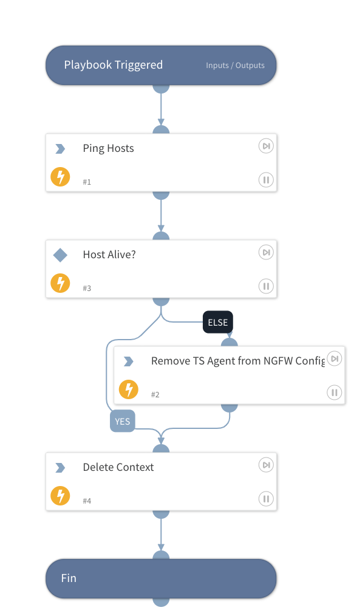

Check if TS Agent server is offline and deregister it from the NGFW

## Dependencies
This playbook uses the following sub-playbooks, integrations, and scripts.

### Sub-playbooks
This playbook does not use any sub-playbooks.

### Integrations
This playbook does not use any integrations.

### Scripts
* DeleteContext
* Ping

### Commands
* panorama

## Playbook Inputs
---

| **Name** | **Description** | **Default Value** | **Required** |
| --- | --- | --- | --- |
| TSAgent | The TSAgent Object |  | Optional |

## Playbook Outputs
---
There are no outputs for this playbook.

## Playbook Image
---

